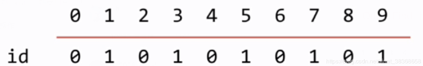
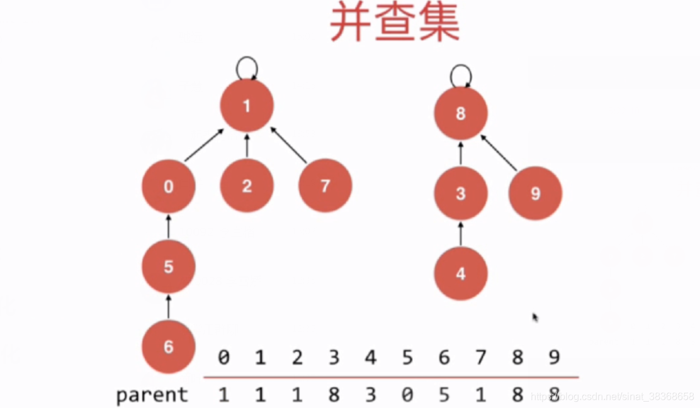

# 并查集 Union-Find

## 1. 并查集

- 一种很不一样的树形结构
- 作用 : 回答连接问题
- 连接问题：网络中节点间的连接状态：网络是个抽象的概念：用户之间形成的网络
  数学中的集合类实现
- 连接问题和路径问题：连接问题比路径问题要回答的问题

## 2. Quick Find

**对于一组数据，主要支持两个操作**

- union（p，q）
- find（p）
  **用来回答一个问题**
- isConnected（p，q）

**并查集的基本数据表示：数组**



```typescript
// UF1.ts
export class UnionFind {
  private id: number[];
  private count: number;

  constructor(n: number) {
    if (n <= 0) throw new Error('n must be positive');
    this.count = n;
    this.id = new Array(n);
    for (let i = 0; i < n; i++) {
      this.id[i] = i; // 初始每个元素的根是自己
    }
  }

  // 查找 p 所在集合的标识（O(1)）
  find(p: number): number {
    if (p < 0 || p >= this.count) {
      throw new Error(`Index ${p} out of bounds [0, ${this.count - 1}]`);
    }
    return this.id[p];
  }

  // 判断 p 和 q 是否连通（O(1)）
  isConnected(p: number, q: number): boolean {
    return this.find(p) === this.find(q);
  }

  // 合并 p 和 q 所在集合（O(n)）
  unionElements(p: number, q: number): void {
    const pID = this.find(p);
    const qID = this.find(q);

    if (pID === qID) return;

    // 将所有 pID 的元素改为 qID
    for (let i = 0; i < this.count; i++) {
      if (this.id[i] === pID) {
        this.id[i] = qID;
      }
    }
  }
}
```

## 3. Quick Union

**将每一个元素，看作是一个节点**



```typescript
// UF2.ts
export class UnionFind {
  private parent: number[];
  private count: number;

  constructor(count: number) {
    if (count <= 0) throw new Error('Count must be positive');
    this.count = count;
    this.parent = new Array(count);
    // 初始化：每个节点的父节点是自己
    for (let i = 0; i < count; i++) {
      this.parent[i] = i;
    }
  }

  // 查找 p 所在集合的根节点（向上遍历直到 parent[p] === p）
  find(p: number): number {
    if (p < 0 || p >= this.count) {
      throw new Error(`Index ${p} out of bounds [0, ${this.count - 1}]`);
    }
    while (p !== this.parent[p]) {
      p = this.parent[p];
    }
    return p;
  }

  // 判断 p 和 q 是否连通（是否在同一棵树中）
  isConnected(p: number, q: number): boolean {
    return this.find(p) === this.find(q);
  }

  // 合并 p 和 q 所在的集合
  unionElements(p: number, q: number): void {
    const pRoot = this.find(p);
    const qRoot = this.find(q);

    if (pRoot === qRoot) return;

    // 将 p 的根指向 q 的根（简单合并）
    this.parent[pRoot] = qRoot;
  }
}
```

