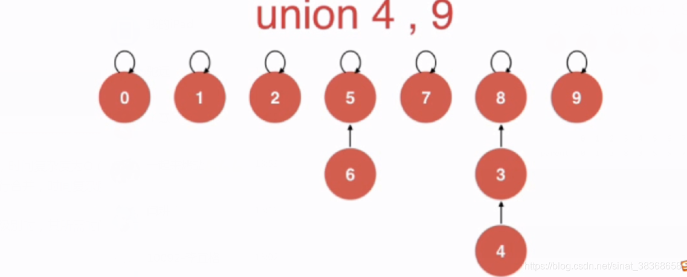
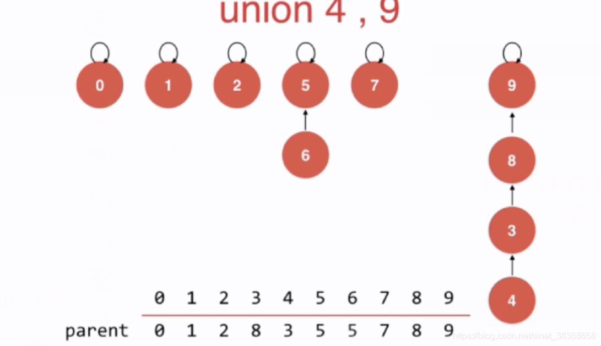
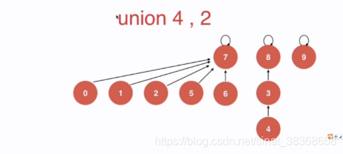
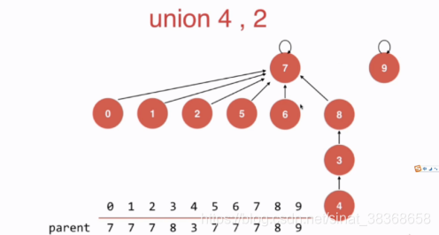
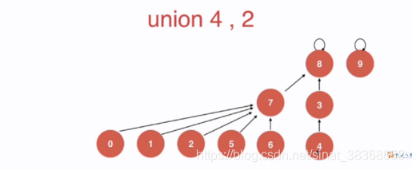
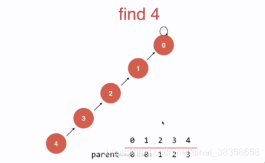
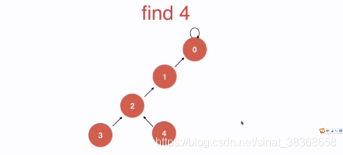
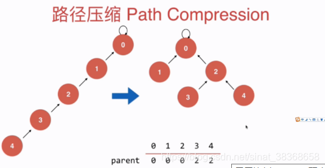
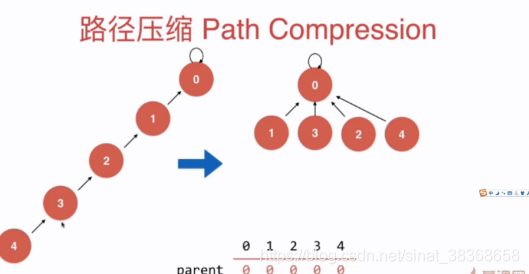

# 并查集 Union-Find

## 1. 并查集

- 一种很不一样的树形结构
- 作用 : 回答连接问题
- 连接问题：网络中节点间的连接状态：网络是个抽象的概念：用户之间形成的网络
  数学中的集合类实现
- 连接问题和路径问题：连接问题比路径问题要回答的问题

## 2. Quick Find

**对于一组数据，主要支持两个操作**

- union（p，q）
- find（p）
  **用来回答一个问题**
- isConnected（p，q）

**并查集的基本数据表示：数组**


```typescript
// UF1.ts
export class UnionFind1 {
  private id: number[];
  private count: number;

  constructor(n: number) {
    if (n <= 0) throw new Error('n must be positive');
    this.count = n;
    this.id = new Array(n);
    for (let i = 0; i < n; i++) {
      this.id[i] = i; // 初始每个元素的根是自己
    }
  }

  // 查找 p 所在集合的标识（O(1)）
  find(p: number): number {
    if (p < 0 || p >= this.count) {
      throw new Error(`Index ${p} out of bounds [0, ${this.count - 1}]`);
    }
    return this.id[p];
  }

  // 判断 p 和 q 是否连通（O(1)）
  isConnected(p: number, q: number): boolean {
    return this.find(p) === this.find(q);
  }

  // 合并 p 和 q 所在集合（O(n)）
  unionElements(p: number, q: number): void {
    const pID = this.find(p);
    const qID = this.find(q);

    if (pID === qID) return;

    // 将所有 pID 的元素改为 qID
    for (let i = 0; i < this.count; i++) {
      if (this.id[i] === pID) {
        this.id[i] = qID;
      }
    }
  }
}
```

## 3. Quick Union

**用树结构实现并查集，将每一个元素，看作是一个节点**


```typescript
// UF2.ts
export class UnionFind2 {
  private parent: number[];
  private count: number;

  constructor(count: number) {
    if (count <= 0) throw new Error('Count must be positive');
    this.count = count;
    this.parent = new Array(count);
    // 初始化：每个节点的父节点是自己
    for (let i = 0; i < count; i++) {
      this.parent[i] = i;
    }
  }

  // 查找 p 所在集合的根节点（向上遍历直到 parent[p] === p）
  find(p: number): number {
    if (p < 0 || p >= this.count) {
      throw new Error(`Index ${p} out of bounds [0, ${this.count - 1}]`);
    }
    while (p !== this.parent[p]) {
      p = this.parent[p];
    }
    return p;
  }

  // 判断 p 和 q 是否连通（是否在同一棵树中）
  isConnected(p: number, q: number): boolean {
    return this.find(p) === this.find(q);
  }

  // 合并 p 和 q 所在的集合
  unionElements(p: number, q: number): void {
    const pRoot = this.find(p);
    const qRoot = this.find(q);

    if (pRoot === qRoot) return;

    // 将 p 的根指向 q 的根（简单合并）
    this.parent[pRoot] = qRoot;
    this.count--;
  }
}
```

| 特性             | QuickFind          | QuickUnion         |
| ---------------- | ------------------ | ------------------ |
| **数据结构**     | 扁平数组（集合ID） | 树（父指针）       |
| **`find` 速度**  | ⚡ **O(1)**         | 🐢 O(n)（最坏）     |
| **`union` 速度** | 🐢 **O(n)**         | ⚡ O(1) + find 成本 |
| **空间**         | O(n)               | O(n)               |
| **主要问题**     | 合并太慢           | 树不平衡 → 查询慢  |

为了解决树不平衡带来的查询慢的问题，可以进行两个关键优化：

### 基于size的优化(Union By Size)





现有的方案中`unionElements(int p,int q)` 中总是将p的根节点指向q，容易形成一个高度很高的树（例如上图的union（4,9的操作））

**如何解决这个问题？**：**在每一个集合中都记录其集合中元素的个数，在union操作时总是将集合元素少的集合的根节点指向元素多的集合的根节点**，这样能更高概率的形成一颗层数比较低的树。

```typescript
// UF3.ts
export class UnionFind3 {
  private parent: number[];
  private size: number[]; // size[i] 表示以 i 为根的集合中的元素个数
  private count: number;

  constructor(count: number) {
    this.count = count;
    this.parent = new Array(count);
    this.size = new Array(count);
    
    // 初始化：每个节点是自己的父节点，大小为1
    for (let i = 0; i < count; i++) {
      this.parent[i] = i;
      this.size[i] = 1;
    }
  }

  // 查找 p 的根节点
  find(p: number): number {
    if (p < 0 || p >= this.count) {
      throw new Error(`Index ${p} out of bounds [0, ${this.count - 1}]`);
    }
    while (p !== this.parent[p]) {
      p = this.parent[p];
    }
    return p;
  }

  // 判断 p 和 q 是否连通
  isConnected(p: number, q: number): boolean {
    return this.find(p) === this.find(q);
  }

  // 合并 p 和 q 所在的集合（按大小合并）
  unionElements(p: number, q: number): void {
    const pRoot = this.find(p);
    const qRoot = this.find(q);

    if (pRoot === qRoot) return;

    // 将小树合并到大树下
    if (this.size[pRoot] < this.size[qRoot]) {
      this.parent[pRoot] = qRoot;
      this.size[qRoot] += this.size[pRoot];
    } else {
      this.parent[qRoot] = pRoot; 
      this.size[pRoot] += this.size[qRoot];
    }

    this.count--;
  }
}
```

现在效率已经有明显提升，但对于极端的情况，仍有可能让UF3效率变低，例如：



根据UF3的方案，8所在集合元素个数小，若把8的根节点指向7，这棵树的层数为4（如下）



但是若把7指向8，明显的，树的层数降为3（如下）



所以仅依靠集合的**大小size**来判断由谁指向谁并不是完全正确的。
更准确的是，根据两个集合的**层数rank**来判断

### 基于Rank的优化（Union  by Rank）

**即 基于rank的优化
rank[i]表示根节点为i的树的高度**

```typescript
// UF4.ts
export class UnionFind4 {
  private parent: number[];
  private rank: number[]; // rank[i] 表示以 i 为根的树的高度（层数）
  private count: number;

  constructor(count: number) {
    if (count <= 0) throw new Error('Count must be positive');
    this.count = count;
    this.parent = new Array(count);
    this.rank = new Array(count);
    
    // 初始化：每个节点是自己的父节点，rank 为 1
    for (let i = 0; i < count; i++) {
      this.parent[i] = i;
      this.rank[i] = 1; 
    }
  }

  // 查找 p 的根节点
  find(p: number): number {
    if (p < 0 || p >= this.count) {
      throw new Error(`Index ${p} out of bounds [0, ${this.count - 1}]`);
    }
    while (p !== this.parent[p]) {
      p = this.parent[p];
    }
    return p;
  }

  // 判断 p 和 q 是否连通
  isConnected(p: number, q: number): boolean {
    return this.find(p) === this.find(q);
  }

  // 合并 p 和 q 所在的集合（按秩合并）
  unionElements(p: number, q: number): void {
    const pRoot = this.find(p);
    const qRoot = this.find(q);

    if (pRoot === qRoot) return;

    // 按秩合并：将低秩树合并到高秩树下
    if (this.rank[pRoot] < this.rank[qRoot]) {
      this.parent[pRoot] = qRoot;
    } else if (this.rank[qRoot] < this.rank[pRoot]) {
      this.parent[qRoot] = pRoot; 
    } else {
      // 秩相等时，任选一个作为根，并将其秩 +1
      this.parent[pRoot] = qRoot;
      this.rank[qRoot] += 1;
    }

    this.count--;
  }
}
```

对于百万级数目，虽然他的速率优化的不多，但这种方案能有效的避免一些极端数据的情况，效果总体来说更好。

### 路径压缩（Path Compression）

并查集的最后一个优化，在之前的三个方案中，优化都集中在union中，但其实在find中，也可以进行优化







```typescript
  // 查找 p 的根节点（路径压缩）
  find(p: number): number {
    while (p !== this.parent[p]) {
      this.parent[p] = this.parent[this.parent[p]];//在这里路径压缩！！
      p = this.parent[p];
    }
    return p;
  }
```

树的层数大大减少了

还有更好的路径压缩方式：



```typescript
  // 查找 p 的根节点（递归路径压缩）
  find(p: number): number {
    if (p !== this.parent[p]) {
      this.parent[p] =find(this.parent[p]);//version2 路径压缩
    }
    return this.parent[p]
  }
```

总结：并查集的操作，时间复杂度近乎是O（1）的。

