# 队列

队列Queue

* 队列也是一种线性结构
* 普通队列，循环队列
* FIFO：先进先出，只能从一端（队尾）添加元素，只能从另一端（队首）取出元素

## 1. 数组队列

数组队列的复杂度分析

```typescript
ArrayQueue<E>
void enqueue(E)  O(1) 均摊
E deque() O(n) 
E getFront() O(1)
number getSize() O(1)
boolean isEmpty O(1)
```

注：出队操作时，每一次把数组的第一个元素（索引为0拿出后），后面所有的元素都要向前移，但如果数组承载的元素是百万级，出队要进行百万级的时间消耗，这样会耗费很长的时间。

如何改进使得出队和入队的循环复杂度都为O（1）？**循环队列**

## 2. 循环队列

删除后不挪动其他元素，基于这样的思想，我们记录队首是谁。
当队首的元素移出后，我们只需要更改front（即head）的指向就行了，即front++

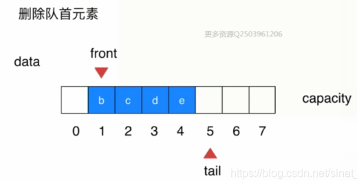

**front指向第一个元素，tail指向最后一个元素的下一个位置。**

**入队**

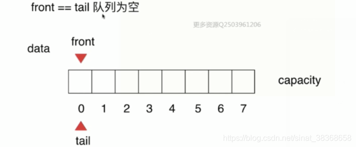

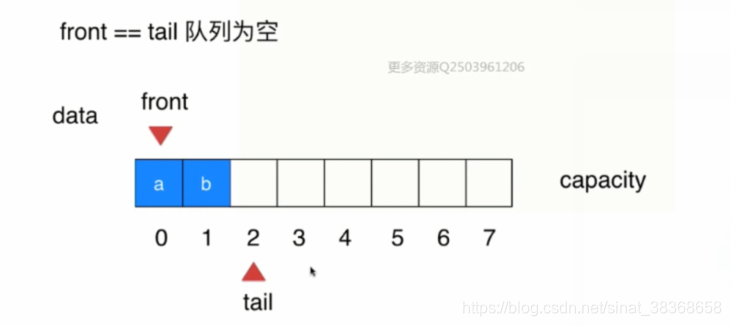

**出队**

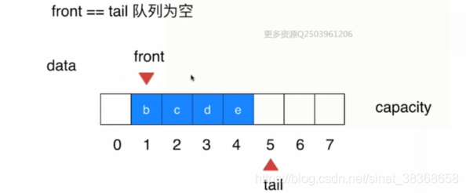

**循环在哪里？**

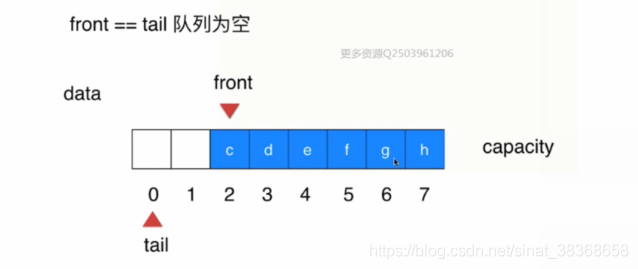

**判空与判满**


```typescript
/**
 * 环形队列（循环队列）的TypeScript实现
 */
class MyQueue {
  private m_pQueue: number[]; // 队列数组
  private m_iQueueLen: number; // 队列当前元素个数
  private m_iQueueCapacity: number; // 队列最大容量
  private m_iHead: number; // 队列头指针
  private m_iTail: number; // 队列尾指针

  /**
   * 构造函数：初始化循环队列
   */
  constructor(queueCapacity: number) {
    this.m_iQueueCapacity = queueCapacity;
    this.m_pQueue = new Array(queueCapacity); // 初始化数组，长度为容量
    this.m_iHead = 0; // 头指针初始化为0
    this.m_iTail = 0; // 尾指针初始化为0
    this.m_iQueueLen = 0; // 初始时队列无元素，长度为0
  }

  /**
   * 清空队列：重置头指针、尾指针和元素个数，不改变队列容量
   */
  clearQueue(): void {
    this.m_iHead = 0;
    this.m_iTail = 0;
    this.m_iQueueLen = 0;
    this.m_pQueue.fill(0, 0, this.m_iQueueCapacity);
  }

  /**
   * 判断队列是否为空
   */
  isQueueEmpty(): boolean {
    return this.m_iQueueLen === 0;
  }

  /**
   * 判断队列是否已满
   */
  isQueueFull(): boolean {
    return this.m_iQueueLen === this.m_iQueueCapacity;
  }

  /**
   * 获取队列当前元素个数
   */
  getQueueLength(): number {
    return this.m_iQueueLen;
  }

  /**
   * 入队操作：将元素添加到队尾
   */
  enQueue(element: number): boolean {
    // 队满则无法入队，返回false
    if (this.isQueueFull()) {
      return false;
    }
    // 将元素存入尾指针位置
    this.m_pQueue[this.m_iTail] = element;
    // 尾指针循环后移：取模确保指针不越界（核心逻辑，对应C++的环形特性）
    this.m_iTail = (this.m_iTail + 1) % this.m_iQueueCapacity;
    // 元素个数加1
    this.m_iQueueLen++;
    return true;
  }

  /**
   * 出队操作：从队首移除元素，并通过返回值返回该元素
   */
  deQueue(): { success: boolean; element?: number } {
    // 队空则无法出队，返回失败
    if (this.isQueueEmpty()) {
      return { success: false };
    }
    // 获取队首元素（头指针指向的位置）
    const element = this.m_pQueue[this.m_iHead];
    // 头指针循环后移：取模确保指针不越界
    this.m_iHead = (this.m_iHead + 1) % this.m_iQueueCapacity;
    // 元素个数减1
    this.m_iQueueLen--;
    // 返回成功状态和出队元素（TS中无引用传参，用对象返回更直观）
    return { success: true, element };
  }

  /**
   * 遍历队列：依次打印所有元素（从队首到队尾）
   */
  queueTraverse(): void {
    let currentIndex = this.m_iHead; // 从队首开始遍历
    // 遍历次数等于元素个数（避免循环越界）
    for (let i = 0; i < this.m_iQueueLen; i++) {
      console.log(this.m_pQueue[currentIndex]);
      // 当前索引循环后移
      currentIndex = (currentIndex + 1) % this.m_iQueueCapacity;
    }
  }
}
```

循环队列的复杂度分析

```typescript
LoopQueue<E>
void enqueue(E)  O(1) 均摊
E deque() **O(1) 均摊** 
E getFront() O(1)
number getSize() O(1)
boolean isEmpty O(1)
```

## 3. 队列的应用

* 广度优先遍历

## 4. 优先队列和堆

### 4.1 优先队列

什么是优先队列？

* 普通队列：先进先出，后进后出；

* 优先队列：出队顺序和入队顺序无关，和优先级相关（对内元素需要具有可比较性）；

  > 为什么使用优先队列？
  >
  > * 对于动态问题：例如操作系统执行任务，每个任务都有优先级，**动态选择**优先级最高的任务执行，使用优先队列。
  >   比如不同用户对同一界面的请求，回应请求优先队列。
  >   或者游戏中只能选择角色攻击敌人的顺序，角色的攻击范围是一定的，该角色由电脑控制选择敌人攻击，使用优先队列。
  > * 对于静态问题：
  >   在10000000个元素中选出前一百名？（即在N各元素中选出前M个元素问题）
  >   使用排序? NlogN
  >   也可以使用优先队列进行优化–》 NlogM

```typescript
interface Queue<E> {   // <--implement-- PriorityQueue<E> 可以使用不同的底层实现
  enqueue(e: E): void;
  dequeue(): E | undefined;
  getFront(): E | undefined;
  getSize(): number;
  isEmpty(): boolean;
}
```

|              | 入队      | 出队（拿出最大元素） |
| ------------ | --------- | -------------------- |
| 普通线性结构 | O（1）    | O（n）               |
| 顺序线性结构 | O（n）    | O（1）               |
| 堆           | O（logn） | O（logn）            |

堆的时间效率 > 使用数组

对于总共N个请求：

- 使用普通数组或者顺序数组，最差情况O（n2）
- 使用堆：O（nlgn）

### 4.2 堆的基础表示MaxHeap

- 二叉堆是一个完全二叉树（结点按顺序存放，所以我们可以使用数组来表示完全二叉树）
- 二叉堆堆中某个结点的值总是不大于其父节点的值，**最大堆**
- 用数组存储二叉堆

注意下标起始的影响

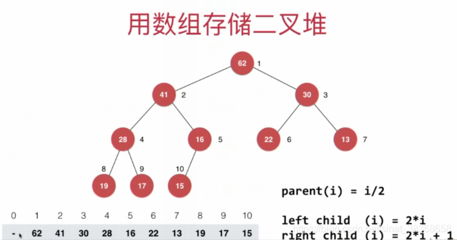

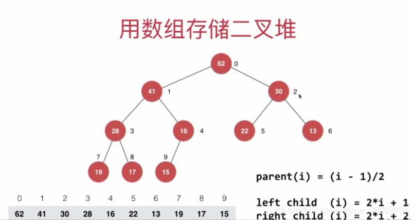

```typescript
// 在这里，我们使用一个从0开始的数组表示的二叉堆
class MaxHeap<E extends { compareTo(other: E): number }> {
  private data: E[];

  constructor(capacity?: number) {
    this.data = capacity ? new Array(capacity) : [];
   }

  size(): number {
    return this.data.length;
  }

  isEmpty(): boolean {
    return this.data.length === 0;
  }

  // 返回完全二叉树的数组表示中，一个索引所表示的元素的父亲节点的索引
  private parent(index: number): number {
    if (index === 0) {
      throw new Error("index-0 doesn't have parent");
    }
    return Math.floor((index - 1) / 2);
  }

  //  返回完全二叉树的数组表示中，一个索引所表示的元素的左孩子节点的索引
  private leftChild(index: number): number {
    return index * 2 + 1;
  }

  //返回完全二叉树的数组表示中，一个索引所表示的元素的右孩子节点的索引
  private rightChild(index: number): number {
    return index * 2 + 2;
  }
}
```

### 4.3 向堆中添加元素和ShitUp

```typescript
// 向堆中添加元素
add(e: E): void {
    this.data.push(e); 
    this.siftUp(this.data.length - 1); // 从最后一个元素索引开始上浮
}

// 上浮调整（siftUp 方法，确保最大堆特性）
private siftUp(k: number): void {
    // 循环条件：k > 0（非根节点）且 父节点值 < 当前节点值（违反最大堆特性）
    while (k > 0 && this.data[this.parent(k)].compareTo(this.data[k]) < 0) {
        const parentIdx = this.parent(k);
        this.data.swap(k, parentIdx); // 交换当前节点与父节点
        [this.data[k], this.data[parentIdx]] = [this.data[parentIdx], this.data[k]];
        k = parentIdx; // 更新 k 为父节点索引，继续向上校验
    }
}
```

### 4.3 从堆中取出元素和ShiftDown

对于堆，只能取根节点的元素，然后把最后一个元素放在根节点的位置，count（堆中元素个数成员变量）–；

然后，调整元素位置使其保持最大堆的性质，即将根节点的元素一步一步向下挪，最终找到其合适的位置，即shift down。

```typescript
// 取出堆中最大元素
extractMax(): E {
    const ret = this.data[0]; // 堆顶为最大值
    // 交换堆顶与最后一个元素
    [this.data[0], this.data[this.data.length - 1]] = [this.data[this.data.length - 1], this.data[0]];
    this.data.pop(); // 移除最后一个元素
    this.siftDown(0); // 堆顶下沉调整
    return ret;
}

// 下沉调整（维持最大堆特性）
private siftDown(k: number): void {
    const size = this.data.length;
    // 左孩子索引存在时进入循环
    while (this.leftChild(k) < size) {
        let j = this.leftChild(k); // 初始指向左孩子
        // 右孩子存在且大于左孩子，j指向右孩子
        if (j + 1 < size && this.data[j + 1].compareTo(this.data[j]) > 0) {
            j++;
        }
        // 当前节点 >= 子节点最大值，无需继续下沉
        if (this.data[k].compareTo(this.data[j]) >= 0) {
            break;
        }
        // 交换当前节点与子节点最大值
        [this.data[k], this.data[j]] = [this.data[j], this.data[k]];
        k = j; // 更新索引继续下沉
    }
}
```

### 4.4 Heapify和Replace

**Replace**

* replace：取出最大元素后，放入一个新元素
* 实现：可以直接将堆顶元素替换以后SiftDown，一次O（nlogn）的操作

```typescript
// 取出堆中最大元素，同时替换为元素 e
replace(E e): E {
    const ret = this.data[0]; // 保存堆顶最大元素
    this.data[0] = e; // 用新元素 e 替换堆顶
    this.siftDown(0); // 下沉调整，维持最大堆特性
    return ret;
}
```

**Heapify**

**heapify：将任意数组整理成堆的形状**

* 所有叶子节点本身就是一个最大堆，每个堆的元素只有一个
* 对于非叶子节点，第一个非叶子节点的索引是n/2，从后向前考查每一个非叶子节点。

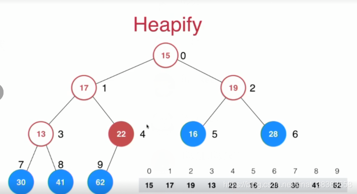

```typescript
// 从数组构造最大堆
constructor(arr: E[]) {
    this.data = [...arr]; 
    // 从最后一个元素的父节点开始，向前遍历并下沉调整
    for (let i = this.parent(this.data.length - 1;); i >= 0; i--) {
        this.siftDown(i);
    }
}
```

**算法复杂度**：将n个元素逐个插入到一个空堆中，算法复杂度是O(nlogn)；heapify的过程，算法复杂度是O（n）；所以对比使用heapify的方式创建堆和将数组中的元素逐个添加到空堆中的性能差异，比较结果：对于百万级的数据量，Heapify的复杂度更低

### 4.5 堆排序

#### 基础堆排序

```typescript
// 堆排序（对应你的 heapSort1）
function heapSort1<T>(arr: T[], compareFn?: (a: T, b: T) => number): void {
  let heap: MaxHeap<T>;

  // 1. 插入所有元素
  for (let i = 0; i < arr.length; i++) {
    heap.add(arr[i]);
  }

  // 2. 从后往前取出最大值（升序）
  for (let i = arr.length - 1; i >= 0; i--) {
    arr[i] = heap.extractMax();
  }
}
```

测试可得堆排序的效率依然不如归并排序和快速排序，系统级别的排序很少使用堆排序，堆这种结构更多用于**动态数据的维护**。

```typescript
// 最大堆类（支持从数组初始化）
class MaxHeap<T> {
  private data: T[]; 
  private count: number;
  private capacity: number;
  private compareFn: (a: T, b: T) => number;

  constructor(
    arg: number | T[],
    compareFn?: (a: T, b: T) => number
  ) {
      // 从数组初始化（Floyd 建堆）
      const arr = arg;
      this.capacity = arr.length;
      this.count = arr.length;
      this.data = new Array(arr.length + 1); // data[0] 空置
      // 拷贝 arr 到 data[1...n]
      for (let i = 0; i < arr.length; i++) {
        this.data[i + 1] = arr[i];
      }
      // Floyd 建堆：从最后一个非叶子节点开始下沉
      for (let i = Math.floor(this.count / 2); i >= 1; i--) {
        this.shiftDown(i);
    }
  }

 
// 堆排序2：使用从数组初始化的堆
function heapSort2<T>(arr: T[], compareFn?: (a: T, b: T) => number): void {
  if (arr.length <= 1) return;

  // 创建堆：直接从 arr 初始化（Floyd 建堆 O(n)）
  const maxHeap = new MaxHeap(arr, compareFn);

  // 从后往前填入最大值（升序）
  for (let i = arr.length - 1; i >= 0; i--) {
    arr[i] = maxHeap.extractMax();
  }
}
```

heapSort2比1块。即一个很有用的结论：
**Heapify的算法复杂度**

1. 将n个元素逐个插入到一个空堆中，算法复杂度是O（nlogn）
2. heapify的过程，算法复杂度为O（n）（heapify的过程一开始就将n/2的元素直接不考虑了，算法肯定要快一些hhhh）

这一小节介绍了将一个数组构建成堆，同时实现了两个版本的堆排序。同时，在堆排序中，我们都需要将数组的内容逐一放入一个堆中，实际上我们额外开了一个大小为n的空间，空间复杂度为O（n）。

#### 优化的堆排序 —— 原地堆排序

我们可以改造，使得不使用任何额外空间，**原地对数组进行排序**

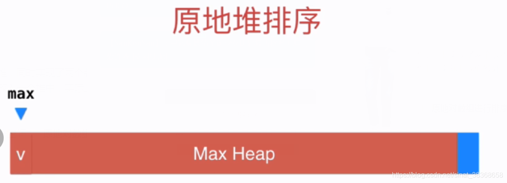

这里用数组存储二叉堆（元素从0开始索引

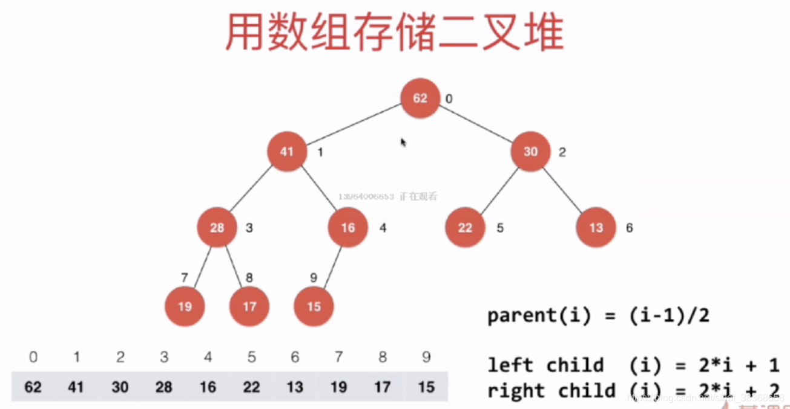

注意在这里进行Heapify的过程中，最后一个非叶子结点的索引为（count-1）/2

```typescript
// 下沉操作（0-based indexing）
function shiftDown<T>(
  arr: T[],
  n: number,      
  k: number,  
  compareFn: (a: T, b: T) => number
): void {
  while (2 * k + 1 < n) { // 左孩子存在
    let j = 2 * k + 1;    // 左孩子索引

    // 找出左右孩子中较大的那个
    if (j + 1 < n && compareFn(arr[j + 1], arr[j]) > 0) {
      j++; // 右孩子更大
    }

    // 如果当前节点 >= 较大孩子，满足堆性质，停止
    if (compareFn(arr[k], arr[j]) >= 0) {
      break;
    }

    // 否则交换并继续下沉
    [arr[k], arr[j]] = [arr[j], arr[k]];
    k = j;
  }
}

// 原地堆排序（升序）
function heapSort<T>(arr: T[], compareFn?: (a: T, b: T) => number): void {
  const n = arr.length;

  // 1. Heapify：从最后一个非叶子节点开始下沉
  for (let i = Math.floor((n - 1) / 2); i >= 0; i--) {//注意索引从0开始
    shiftDown(arr, n, i, compareFn);
  }

  // 2. 排序：依次将堆顶（最大值）与末尾交换，并缩小堆
  for (let i = n - 1; i > 0; i--) {//注意这里是i>0不是i>=0，因为堆里只剩下一个元素的时候就不需要排序了
    // 交换堆顶和当前末尾
    [arr[0], arr[i]] = [arr[i], arr[0]];
    // 对新的堆顶进行下沉（堆大小为 i）
    shiftDown(arr, i, 0, compareFn);
  }
}
```

由测试可知，原地堆排序比之前的两种堆排序都要快，因为省去了开辟空间，效率更高。

### 4.6 基于堆的优先队列

```typescript
// 基于 MaxHeap 实现优先级队列（最大堆 -> 大顶优先级队列）
class PriorityQueue<E extends { compareTo(other: E): number }> implements Queue<E> {
    private maxHeap: MaxHeap<E>;

    constructor() {
        this.maxHeap = new MaxHeap<E>();
    }
    getSize(): number {
        return this.maxHeap.size();
    }
    isEmpty(): boolean {
        return this.maxHeap.isEmpty();
    }
    // 获取队首元素（优先级最高，即堆顶最大值）
    getFront(): E {
        return this.maxHeap.findMax();
    }
    // 入队（添加元素到堆，自动调整优先级）
    enqueue(e: E): void {
        this.maxHeap.add(e);
    }
    // 出队（移除优先级最高的元素，即堆顶最大值）
    dequeue(): E {
        return this.maxHeap.extractMax();
    }
}
```

### 4.7 索引堆IndexHeap

为什么要引入索引堆？

对于与普通的堆，
排序前：

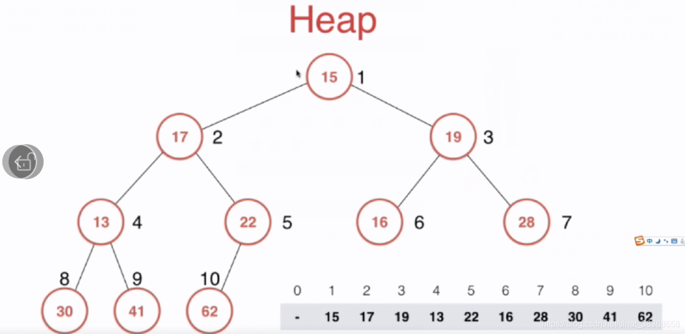

排序后：

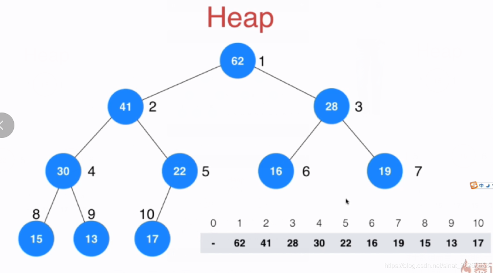

比较这张图。在堆构建前和堆构建后，对于数组而言，**数组的元素位置发生了改变**，正是因为这些数组元素位置的改变，我们才可以将这个数组看作是一个堆。

**但是在我们构建堆的过程中，改变元素的位置，会有一些局限性：**

1. 如果元素是非常复杂的结构，例如巨型字符串，交换元素本身消耗巨大。性能消耗
2. 更致命的是，由于整个元素在数组中的位置发生了改变，使得当堆建成之后，很难索引到它，很难去改变他。例如说这些元素表示的是一个个系统任务，我们要改变索引为6的任务的优先级提高，若原来的数组中O（1）直接提取，建成堆后，堆的数组中索引不到它，我们可以对这些元素再添加一个属性，但是仍要将整个数组遍历一遍才能找到这个任务，这仍然是低效的

**所以，我们引入索引堆：**它不直接存储元素，而是存储**元素的索引**，并通过 `data[]` 间接访问值

建堆前：

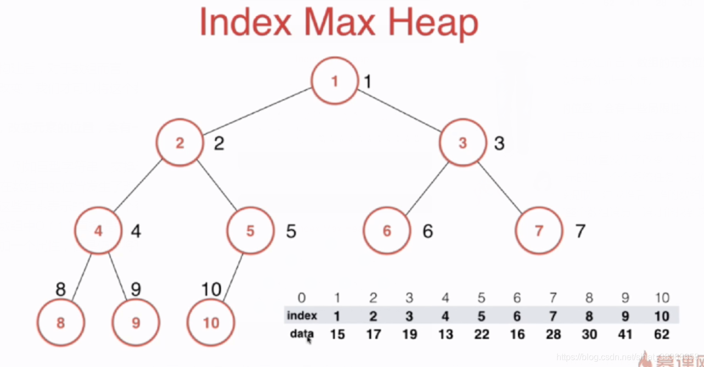

建堆后：

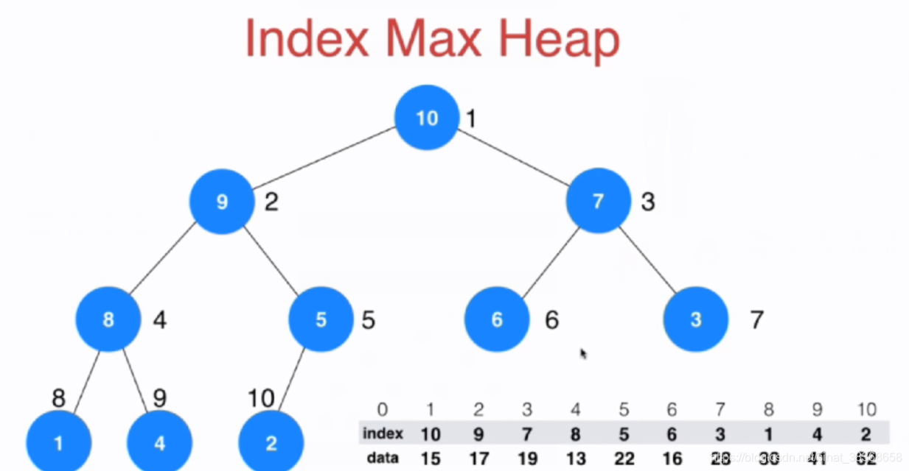

可以index数组发生改变，表示堆。

**可以看到，这样有两个优势**

1. 建堆的过程只是索引的位置发生变化，索引是简单的number型，如果data是复杂的元素，只交换number型的索引所提升的效率是非常高的
2. 可以快速索引到某个元素

可以看到思路与之前一样，元素比较的时候比较的是data的元素，但真正进行交换的是number的索引

代码实现：

```typescript
class IndexMaxHeap<T> {
  private data: T[];        // 存储实际元素（1-based）
  private indexes: number[]; // 堆中存储的是 data 的索引（1-based）
  private count: number;
  private capacity: number;

  constructor(capacity: number) {
    this.data = new Array(capacity + 1);      // data[1..capacity]
    this.indexes = new Array(capacity + 1);   // indexes[1..count]
    this.count = 0;
    this.capacity = capacity;
  }

  // 插入：将 data[i] = item，其中 i 是用户视角的 0-based 索引
  insert(i: number, item: T): void {
    const internalIndex = i + 1; // 转为 1-based
    this.data[internalIndex] = item;
    this.indexes[this.count + 1] = internalIndex;
    this.count++;
    this.shiftUp(this.count);
  }

  //返回最大的元素的索引，将这个元素删除
  extractMaxIndex(): number {
      //对于用户开始，从0开始的索引
    const ret = this.indexes[1] - 1; // 转回 0-based

    // 将堆尾移到堆顶
    this.indexes[1] = this.indexes[this.count];
    this.count--;
    this.shiftDown(1);

    return ret;
  }

  // 获取 data[i]（i 是用户 0-based 索引）
  getItem(i: number): T {
    return this.data[i + 1];
  }

  // 修改 data[i] 的值，并调整堆
  change(i: number, newItem: T): void {
    const internalIndex = i + 1;
    this.data[internalIndex] = newItem;

     //找到indexs[j]=i;j表示data[i]在堆中的位置
     //之后shiftup(j).在shiftdown（j）
    for (let j = 1; j <= this.count; j++) {
      if (this.indexes[j] === internalIndex) {
         // 调整堆：先上浮再下沉（或反之），确保位置正确
    	this.shiftUp(j);
    	this.shiftDown(j);
        break;
      }
    }
  }
}
```

对于修改元素，change，找到这个j，使用for循环，O（n），在change里，将索引为i的元素修改为新的item值，完成了操作
在这里怎么对change进行优化呢?

#### 索引堆的优化

##### 反向查找思路

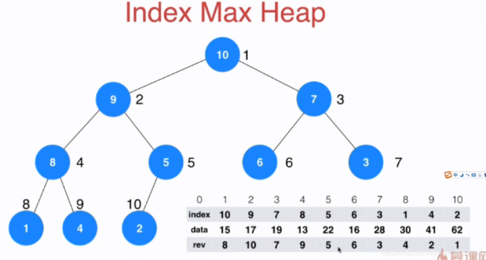

rev[i]的意思是i这个索引，他在数组中的位置。
只要维护好rev这个数组，我们就能在更新的操作中，直接把一个索引对应在indexes数组中的位置直接找到， O（1）

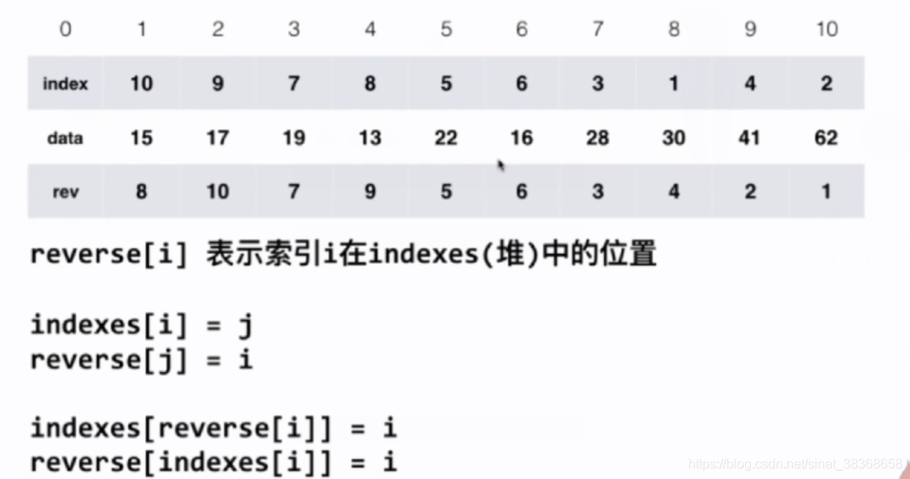

加入reverse，使得change变为o（nlogn）

完整索引堆代码：

```typescript
class IndexMaxHeap<T> {
  private data: T[];        // 实际数据（1-based）
  private indexes: number[]; // 堆结构：存储 data 的索引（1-based）
  private reverse: number[]; // reverse[i] = data[i] 在 indexes 中的位置（0 表示不在堆中）
  private count: number;
  private capacity: number;

  constructor(capacity: number) {
    this.data = new Array(capacity + 1);
    this.indexes = new Array(capacity + 1);
    this.reverse = new Array(capacity + 1).fill(0); // 初始化为 0（表示未在堆中）
    this.count = 0;
    this.capacity = capacity;
  }

  size(): number {
    return this.count;
  }

  isEmpty(): boolean {
    return this.count === 0;
  }

  // 检查索引 i（用户视角 0-based）是否在堆中
  contain(i: number): boolean {
    if (i < 0 || i >= this.capacity) return false;
    return this.reverse[i + 1] !== 0;
  }

  // 插入：i 是用户 0-based 索引
  insert(i: number, item: T): void {
    if (this.count + 1 > this.capacity) {
      throw new Error('Heap overflow');
    }
    if (i < 0 || i >= this.capacity) {
      throw new Error(`Index ${i} out of range [0, ${this.capacity - 1}]`);
    }
    if (this.contain(i)) {
      throw new Error(`Index ${i} already in heap`);
    }

    const internalIndex = i + 1;
    this.data[internalIndex] = item;
    this.count++;
    this.indexes[this.count] = internalIndex;
    this.reverse[internalIndex] = this.count;

    this.shiftUp(this.count);
  }

  // 提取最大值对应的用户索引（0-based）
  extractMaxIndex(): number {
    if (this.isEmpty()) {
      throw new Error('Heap is empty');
    }

    const maxInternalIndex = this.indexes[1];
    const userIndex = maxInternalIndex - 1;

    // 将堆尾移到堆顶
    this.indexes[1] = this.indexes[this.count];
    this.reverse[this.indexes[1]] = 1;
    // 清除被移除元素的 reverse 记录
    this.reverse[maxInternalIndex] = 0;
    this.count--;

    if (this.count > 0) {
      this.shiftDown(1);
    }

    return userIndex;
  }

  // 获取 data[i]（i 是用户 0-based 索引）
  getItem(i: number): T {
    if (!this.contain(i)) {
      throw new Error(`Index ${i} is not in heap`);
    }
    return this.data[i + 1];
  }

  // 修改 data[i] 的值（i 是用户 0-based 索引）
  change(i: number, newItem: T): void {
    if (!this.contain(i)) {
      throw new Error(`Index ${i} is not in heap`);
    }

    const internalIndex = i + 1;
    this.data[internalIndex] = newItem;
    const heapPos = this.reverse[internalIndex];

    this.shiftUp(heapPos);
    this.shiftDown(heapPos);
  }

  // 上浮
  private shiftUp(k: number): void {
    while (k > 1) {
      const parent = Math.floor(k / 2);
      if (this.data[this.indexes[parent]] >= this.data[this.indexes[k]]) {
        break;
      }
      // 交换 indexes
      [this.indexes[parent], this.indexes[k]] = [this.indexes[k], this.indexes[parent]];
      // 更新 reverse
      this.reverse[this.indexes[parent]] = parent;
      this.reverse[this.indexes[k]] = k;
      k = parent;
    }
  }

  // 下沉
  private shiftDown(k: number): void {
    while (2 * k <= this.count) {
      let j = 2 * k; // left child
      if (j + 1 <= this.count && this.data[this.indexes[j + 1]] > this.data[this.indexes[j]]) {
        j++;
      }
      if (this.data[this.indexes[k]] >= this.data[this.indexes[j]]) {
        break;
      }
      // 交换 indexes
      [this.indexes[k], this.indexes[j]] = [this.indexes[j], this.indexes[k]];
      // 更新 reverse
      this.reverse[this.indexes[k]] = k;
      this.reverse[this.indexes[j]] = j;
      k = j;
    }
  }
}
```


### 4.8 和堆相关的更多话题和广义队列

- 可以使用堆进行多路归并排序。
- d叉堆
- 二项堆，斐波那契堆
- 最大堆 最大索引堆
- 广义队列
  普通队列，优先队列
  栈，也可以理解成一个队列。

# 刷题

215、295、347、767
