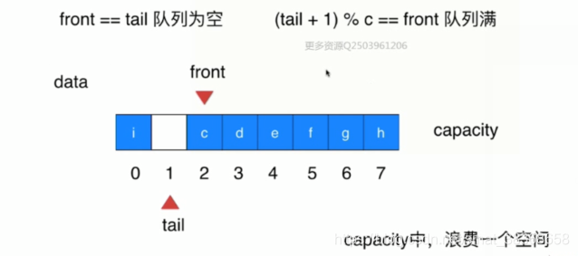

# 队列

队列Queue

* 队列也是一种线性结构
* 普通队列，循环队列
* FIFO：先进先出，只能从一端（队尾）添加元素，只能从另一端（队首）取出元素

## 1. 数组队列

数组队列的复杂度分析

```typescript
ArrayQueue<E>
void enqueue(E)  O(1) 均摊
E deque() O(n) 
E getFront() O(1)
number getSize() O(1)
boolean isEmpty O(1)
```

注：出队操作时，每一次把数组的第一个元素（索引为0拿出后），后面所有的元素都要向前移，但如果数组承载的元素是百万级，出队要进行百万级的时间消耗，这样会耗费很长的时间。

如何改进使得出队和入队的循环复杂度都为O（1）？**循环队列**

## 2. 循环队列

删除后不挪动其他元素，基于这样的思想，我们记录队首是谁。
当队首的元素移出后，我们只需要更改front（即head）的指向就行了，即front++


**front指向第一个元素，tail指向最后一个元素的下一个位置。**

**入队**


**出队**


**循环在哪里？**


**判空与判满**



```typescript
/**
 * 环形队列（循环队列）的TypeScript实现
 */
class MyQueue {
  private m_pQueue: number[]; // 队列数组
  private m_iQueueLen: number; // 队列当前元素个数
  private m_iQueueCapacity: number; // 队列最大容量
  private m_iHead: number; // 队列头指针
  private m_iTail: number; // 队列尾指针

  /**
   * 构造函数：初始化循环队列
   */
  constructor(queueCapacity: number) {
    this.m_iQueueCapacity = queueCapacity;
    this.m_pQueue = new Array(queueCapacity); // 初始化数组，长度为容量
    this.m_iHead = 0; // 头指针初始化为0
    this.m_iTail = 0; // 尾指针初始化为0
    this.m_iQueueLen = 0; // 初始时队列无元素，长度为0
  }

  /**
   * 清空队列：重置头指针、尾指针和元素个数，不改变队列容量
   */
  clearQueue(): void {
    this.m_iHead = 0;
    this.m_iTail = 0;
    this.m_iQueueLen = 0;
    this.m_pQueue.fill(0, 0, this.m_iQueueCapacity);
  }

  /**
   * 判断队列是否为空
   */
  isQueueEmpty(): boolean {
    return this.m_iQueueLen === 0;
  }

  /**
   * 判断队列是否已满
   */
  isQueueFull(): boolean {
    return this.m_iQueueLen === this.m_iQueueCapacity;
  }

  /**
   * 获取队列当前元素个数
   */
  getQueueLength(): number {
    return this.m_iQueueLen;
  }

  /**
   * 入队操作：将元素添加到队尾
   */
  enQueue(element: number): boolean {
    // 队满则无法入队，返回false
    if (this.isQueueFull()) {
      return false;
    }
    // 将元素存入尾指针位置
    this.m_pQueue[this.m_iTail] = element;
    // 尾指针循环后移：取模确保指针不越界（核心逻辑，对应C++的环形特性）
    this.m_iTail = (this.m_iTail + 1) % this.m_iQueueCapacity;
    // 元素个数加1
    this.m_iQueueLen++;
    return true;
  }

  /**
   * 出队操作：从队首移除元素，并通过返回值返回该元素
   */
  deQueue(): { success: boolean; element?: number } {
    // 队空则无法出队，返回失败
    if (this.isQueueEmpty()) {
      return { success: false };
    }
    // 获取队首元素（头指针指向的位置）
    const element = this.m_pQueue[this.m_iHead];
    // 头指针循环后移：取模确保指针不越界
    this.m_iHead = (this.m_iHead + 1) % this.m_iQueueCapacity;
    // 元素个数减1
    this.m_iQueueLen--;
    // 返回成功状态和出队元素（TS中无引用传参，用对象返回更直观）
    return { success: true, element };
  }

  /**
   * 遍历队列：依次打印所有元素（从队首到队尾）
   */
  queueTraverse(): void {
    let currentIndex = this.m_iHead; // 从队首开始遍历
    // 遍历次数等于元素个数（避免循环越界）
    for (let i = 0; i < this.m_iQueueLen; i++) {
      console.log(this.m_pQueue[currentIndex]);
      // 当前索引循环后移
      currentIndex = (currentIndex + 1) % this.m_iQueueCapacity;
    }
  }
}
```

循环队列的复杂度分析

```typescript
LoopQueue<E>
void enqueue(E)  O(1) 均摊
E deque() **O(1) 均摊** 
E getFront() O(1)
number getSize() O(1)
boolean isEmpty O(1)
```

## 3. 队列的应用

* 广度优先遍历

## 4. 优先队列和堆

### 4.1 优先队列

什么是优先队列？

* 普通队列：先进先出，后进后出；
* 优先队列：出队顺序和入队顺序无关，和优先级相关（对内元素需要具有可比较性）；例子：计算机的操作系统，动态选择优先级最高的任务执行；

```typescript
interface Queue<E> {   // <--implement-- PriorityQueue<E> 可以使用不同的底层实现
  enqueue(e: E): void;
  dequeue(): E | undefined;
  getFront(): E | undefined;
  getSize(): number;
  isEmpty(): boolean;
}
```

|              | 入队       | 出队（拿出最大元素） |
| ------------ | ---------- | -------------------- |
| 普通线性结构 | O（1）     | O（n）               |
| 顺序线性结构 | O（n）     | O（1）               |
| 堆           | O（nlogn） | O（nlogn）           |

### 4.2 堆的基础表示MaxHeap

- 二叉堆是一个完全二叉树（结点按顺序存放，所以我们可以使用数组来表示完全二叉树）
- 二叉堆堆中某个结点的值总是不大于其父节点的值，**最大堆**
- 用数组存储二叉堆

注意下标起始的影响


```typescript
// 在这里，我们使用一个从0开始的数组表示的二叉堆
class MaxHeap<E extends { compareTo(other: E): number }> {
  private data: E[];

  constructor(capacity?: number) {
    this.data = capacity ? new Array(capacity) : [];
   }

  size(): number {
    return this.data.length;
  }

  isEmpty(): boolean {
    return this.data.length === 0;
  }

  // 返回完全二叉树的数组表示中，一个索引所表示的元素的父亲节点的索引
  private parent(index: number): number {
    if (index === 0) {
      throw new Error("index-0 doesn't have parent");
    }
    return Math.floor((index - 1) / 2);
  }

  //  返回完全二叉树的数组表示中，一个索引所表示的元素的左孩子节点的索引
  private leftChild(index: number): number {
    return index * 2 + 1;
  }

  //返回完全二叉树的数组表示中，一个索引所表示的元素的右孩子节点的索引
  private rightChild(index: number): number {
    return index * 2 + 2;
  }
}
```

### 4.3 向堆中添加元素和Shit Up

```typescript
// 向堆中添加元素
add(e: E): void {
    this.data.push(e); 
    this.siftUp(this.data.length - 1); // 从最后一个元素索引开始上浮
}

// 上浮调整（siftUp 方法，确保最大堆特性）
private siftUp(k: number): void {
    // 循环条件：k > 0（非根节点）且 父节点值 < 当前节点值（违反最大堆特性）
    while (k > 0 && this.data[this.parent(k)].compareTo(this.data[k]) < 0) {
        const parentIdx = this.parent(k);
        this.data.swap(k, parentIdx); // 交换当前节点与父节点
        [this.data[k], this.data[parentIdx]] = [this.data[parentIdx], this.data[k]];
        k = parentIdx; // 更新 k 为父节点索引，继续向上校验
    }
}
```

### 4.3 从堆中取出元素和Sift Down

```typescript
// 取出堆中最大元素
extractMax(): E {
    const ret = this.data[0]; // 堆顶为最大值
    // 交换堆顶与最后一个元素
    [this.data[0], this.data[this.data.length - 1]] = [this.data[this.data.length - 1], this.data[0]];
    this.data.pop(); // 移除最后一个元素
    this.siftDown(0); // 堆顶下沉调整
    return ret;
}

// 下沉调整（维持最大堆特性）
private siftDown(k: number): void {
    const size = this.data.length;
    // 左孩子索引存在时进入循环
    while (this.leftChild(k) < size) {
        let j = this.leftChild(k); // 初始指向左孩子
        // 右孩子存在且大于左孩子，j指向右孩子
        if (j + 1 < size && this.data[j + 1].compareTo(this.data[j]) > 0) {
            j++;
        }
        // 当前节点 >= 子节点最大值，无需继续下沉
        if (this.data[k].compareTo(this.data[j]) >= 0) {
            break;
        }
        // 交换当前节点与子节点最大值
        [this.data[k], this.data[j]] = [this.data[j], this.data[k]];
        k = j; // 更新索引继续下沉
    }
}
```

### 4.4 Heapify和Replace

**Replace**

* replace：取出最大元素后，放入一个新元素
* 实现：可以直接将堆顶元素替换以后SiftDown，一次O（nlogn）的操作

```typescript
// 取出堆中最大元素，同时替换为元素 e
replace(E e): E {
    const ret = this.data[0]; // 保存堆顶最大元素
    this.data[0] = e; // 用新元素 e 替换堆顶
    this.siftDown(0); // 下沉调整，维持最大堆特性
    return ret;
}
```

**Heapify**

**heapify：将任意数组整理成堆的形状**


```typescript
// 从数组构造最大堆
constructor(arr: E[]) {
    this.data = [...arr]; 
    // 从最后一个元素的父节点开始，向前遍历并下沉调整
    for (let i = this.parent(this.data.length - 1;); i >= 0; i--) {
        this.siftDown(i);
    }
}
```

**算法复杂度**：将n个元素逐个插入到一个空堆中，算法复杂度是O(nlogn)；heapify的过程，算法复杂度是O（n）；所以对比使用heapify的方式创建堆和将数组中的元素逐个添加到空堆中的性能差异，比较结果：对于百万级的数据量，Heapify的复杂度更低

### 4.5 基于堆的优先队列

```typescript
// 基于 MaxHeap 实现优先级队列（最大堆 -> 大顶优先级队列）
class PriorityQueue<E extends { compareTo(other: E): number }> implements Queue<E> {
    private maxHeap: MaxHeap<E>;

    constructor() {
        this.maxHeap = new MaxHeap<E>();
    }
    getSize(): number {
        return this.maxHeap.size();
    }
    isEmpty(): boolean {
        return this.maxHeap.isEmpty();
    }
    // 获取队首元素（优先级最高，即堆顶最大值）
    getFront(): E {
        return this.maxHeap.findMax();
    }
    // 入队（添加元素到堆，自动调整优先级）
    enqueue(e: E): void {
        this.maxHeap.add(e);
    }
    // 出队（移除优先级最高的元素，即堆顶最大值）
    dequeue(): E {
        return this.maxHeap.extractMax();
    }
}
```

### 4.8 和堆相关的更多话题和广义队列

- d叉堆
- 索引堆
- 二项堆，斐波那契堆
- 广义队列
  普通队列，优先队列
  栈，也可以理解成一个队列。
