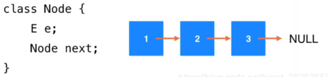
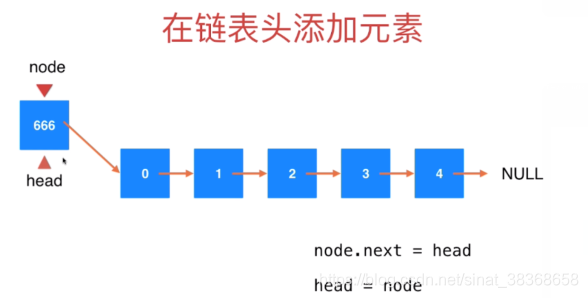
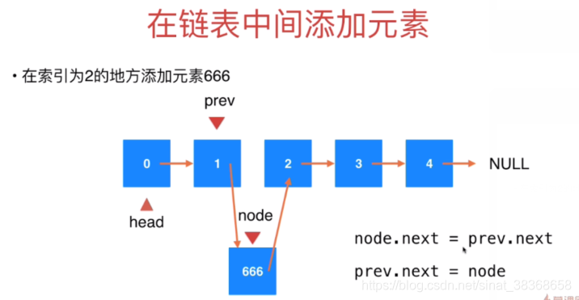
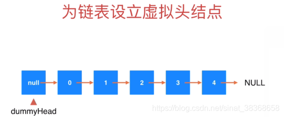
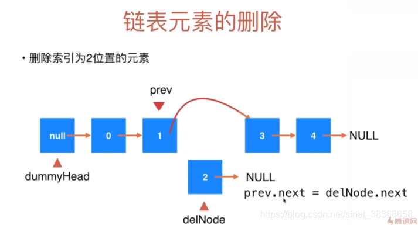
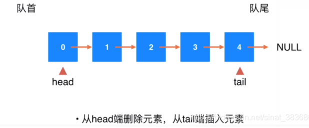

# 线性表

- 线性表是n个数据元素的有限序列
- 线性表分为：

1. **顺序表（数组）**：特点是**支持快速查询**，搜索能力强，适用于索引有语义的情况，例如scores[2]
2. **链表**：静态链表，单链表，循环链表，双向链表

- 应用场景：通讯录；一元多项式；

## 1. 顺序表（数组）

数组自动管理内存（TS 底层由 JS 引擎处理）

## 2. 链表 Linked List

> 参考：C++数据结构
>
> 1. 单链表：结点有指针域数据域
> 2. 循环链表：最后一个结点指针域又指向头结点
> 3. 双向链表：结点有数据域，两个指针域
> 4. 静态链表：没有指针的情况下用数组完成
>
> 注：ts中无显式指针，内存管理是自动垃圾回收（GC），无需手动释放节点内存



* 数据存储在节点Node中
* 优点：真正的动态，不需要处理固定容量的问题
* 缺点：丧失了随机访问的能力

```ts
class LinkedList<E> {
  private class Node {
    public e: E | null;
    public next: LinkedList<E>['Node'] | null;

    constructor(e?: E, next?: LinkedList<E>['Node'] | null) {
      this.e = e ?? null;
      this.next = next ?? null;
    }
  }
}

```

### 2.1 链表操作

#### 在链表中添加元素

关键：找到要添加的节点的前一个节点





```ts
class LinkedList<E> {
  private class Node {
    public e: E | null;
    public next: LinkedList<E>['Node'] | null;

    constructor(e?: E, next?: LinkedList<E>['Node'] | null) {
      this.e = e ?? null;
      this.next = next ?? null;
    }
  }

  private head: LinkedList<E>['Node'] | null;
  private size: number;

  constructor() {
    this.head = null;
    this.size = 0;
  }

  // 获取链表元素个数
  getSize(): number {
    return this.size;
  }

  // 判断链表是否为空
  isEmpty(): boolean {
    return this.size === 0;
  }

  // 在链表头添加元素e
  addFirst(e: E): void {
    // 新建节点，next指向原head，再更新head为新节点
    this.head = new this.Node(e, this.head);
    this.size++;
  }

  // 在index（0-based）位置添加元素e
  // 在链表中不是一个常用的操作，练习用：）
  add(index: number, e: E): void {
    // 校验索引合法性
    if (index < 0 || index > this.size) {
      throw new Error('Add failed, Illegal index!');
    }

    if (index === 0) {
      this.addFirst(e);
    } else {
      // 找到index前一个节点prev
      let prev = this.head;
      for (let i = 0; i < index - 1; i++) {
        prev = prev.next;
      }

      // 新建节点插入到prev之后
      prev.next = new this.Node(e, prev.next);
      this.size++;
    }
  }

  // 在链表末尾添加元素e
  addLast(e: E): void {
    this.add(this.size, e);
  }
}
```

#### 使用链表的虚拟头结点

上文介绍了如何在链表中添加元素。
在添加元素的过程中，遇到了一个问题:在向链表的任意一个位置添加元素的时候，在链表头添加元素和在链表的其他位置添加元素逻辑上会有差别，究其原因，为什么在链表头添加元素比较特殊呢？
是因为添加元素的过程要找到待添加的位置相应之前的一个结点，但是链表头没有前面的结点，所以在逻辑上会特殊一些。

实现中的技巧，可以把链表头这种特殊的操作和其他的操作统一起来，**该方法就是造一个链表头之前的结点，不存储任何元素，将这个空节点称为整个链表的head，也就是dummyhead**。



这样链表的第一个元素就是dummyHead.next对应的元素，dummyHead的元素没有内容，对用户来说也没有意义，只是为了编写逻辑方便而出现的一个虚拟头结点，这样一个内部的机制对用户也是屏蔽的。

```ts
class LinkedList<E> {
  private class Node {
      //......
  }

  private dummyHead: LinkedList<E>['Node']; // 虚拟头结点（非 null）
  private size: number;

  constructor() {
    this.dummyHead = new this.Node();
    this.size = 0;
  }


  // 在 index（0-based）位置添加元素 e（核心方法，复用虚拟头结点逻辑）
  add(index: number, e: E): void {
    //（核心方法，复用虚拟头结点逻辑）
    let prev = this.dummyHead;
    for (let i = 0; i < index; i++) {
      prev = prev.next;
    }
    prev.next = new this.Node(e, prev.next);
    this.size++;
  }
}
```

#### 链表的遍历、查询和修改

```ts
class LinkedList<E> {
  private class Node {
      //....
  }

  private dummyHead: LinkedList<E>['Node'];
  private size: number;

  constructor() {
    this.dummyHead = new this.Node();
    this.size = 0;
  }

  /**
   * 获得链表第 index(0-based) 个位置的元素
   */
  get(index: number): E {
    if (index < 0 || index >= this.size) {
      throw new Error('Get failed! Illegal index');
    }
    let cur = this.dummyHead.next; 
    for (let i = 0; i < index; i++) {
      cur = cur.next; 
    }
    return cur.e!;
  }

  // 获得链表第一个元素
  getFirst(): E {
    return this.get(0);
  }

  // 获得链表最后一个元素
  getLast(): E {
    return this.get(this.size - 1);
  }

  /**
   * 修改链表第 index(0-based) 个位置的元素为 e
   */
  set(index: number, e: E): void {
    if (index < 0 || index >= this.size) {
      throw new Error('Set failed. Illegal index!');
    }
    let cur = this.dummyHead.next;
    for (let i = 0; i < index; i++) {
      cur = cur.nex;
    }
    cur.e = e; 
  }

  /**
   * 查找链表中是否包含元素 e
   */
  contains(e: E): boolean {
    let cur = this.dummyHead.next;
    while (cur !== null) {
      if (cur.e === e) {
        return true;
      }
      cur = cur.next;
    }
    return false;
  }
}
```

#### 链表中删除元素



```ts
class LinkedList<E> {
  /**
   * 删除链表第 index(0-based) 位置的元素，返回删除的元素
   */
  remove(index: number): E {
    if (index < 0 || index >= this.size) {
      throw new Error('Remove failed. Index is illegal.');
    }

    // 找到要删除节点的前驱节点（从虚拟头结点开始）
    let prev = this.dummyHead;
    for (let i = 0; i < index; i++) {
      prev = prev.next!; 

    // 记录要删除的节点，修改前驱节点的 next 指针
    const retNode = prev.next; 
    prev.next = retNode.next;
    retNode.next = null;
    this.size--;

    return retNode.e;
  }

  removeFirst(): E {
    return this.remove(0);
  }

  removeLast(): E {
    return this.remove(this.size - 1);
  }

  /**
   * 删除链表中第一个匹配的元素 e（仅删除第一个）
   */
  removeElement(e: E): void {
    let prev = this.dummyHead;
    while (prev.next !== null) {
      if (prev.next.e === e) {
        break;
      }
      prev = prev.next;
    }
    if (prev.next !== null) {
      const delNode = prev.next;
      prev.next = delNode.next;
      delNode.next = null; 
      this.size--;
    }
  }
}
```

#### 链表时间复杂度分析

*  增：O（n）（如果只对链表头进行操作：O（1））
* 删：O（n）（如果只对链表头进行操作：O（1））
* 改：O（n）
* 差：O（n）（只查链表头的元素O（1））

### 2.2 使用链表实现栈

看上节的复杂度分析，可以把链表头当做栈顶，使用链表实现栈

### 2.3 使用链表实现队列：带有尾指针的链表



可以看到有了头指针和尾指针后，在两端添加结点很容易。
当删除元素时，head比较容易，要找到待删除结点的之前一个结点，还是无法使用O（1）的复杂度删除尾端结点，从tail删除元素不容易。

**所以，我们从head端删除元素，从tail端插入元素，即head端设为队首，tail端设为队尾。**

当然，由于没有dummyHead，要注意链表为空的情况。

```ts
interface Queue<E> {
  getSize(): number;
  isEmpty(): boolean;
  enqueue(e: E): void;
  dequeue(): E;
  getFront(): E;
  toString(): string;
}

class LinkedListQueue<E> implements Queue<E> {
  private class Node {
   //.....
  }

  private head: LinkedListQueue<E>['Node'] | null; // 队首指针
  private tail: LinkedListQueue<E>['Node'] | null; // 队尾指针
  private size: number; // 队列元素个数
  constructor() {
    this.head = null;
    this.tail = null;
    this.size = 0;
  }

  // 获取队列元素个数
  getSize(): number {
    return this.size;
  }

  // 判断队列是否为空
  isEmpty(): boolean {
    return this.size === 0;
  }

  // 入队：队尾添加元素
  enqueue(e: E): void {
    // 队列空时，头指针和尾指针指向同一个新节点
    if (this.tail === null) {
      this.tail = new this.Node(e);
      this.head = this.tail;
    } else {
      // 队列非空时，尾指针后移
      this.tail.next = new this.Node(e);
      this.tail = this.tail.next;
    }
    this.size++;
  }

  // 出队：队首删除元素，返回删除的元素
  dequeue(): E {
    if (this.isEmpty()) {
      throw new Error('can not dequeue from an empty queue');
    }

    const retNode = this.head;
    this.head = this.head.next;
    retNode.next = null;

    // 队列清空时，尾指针也置为 null
    if (this.head === null) {
      this.tail = null;
    }

    this.size--;
    return retNode.e!;
  }

  // 获取队首元素
  getFront(): E {
    if (this.isEmpty()) {
      throw new Error('Queue is empty');
    }
    return this.head.e;
  }
}
```

TODO
