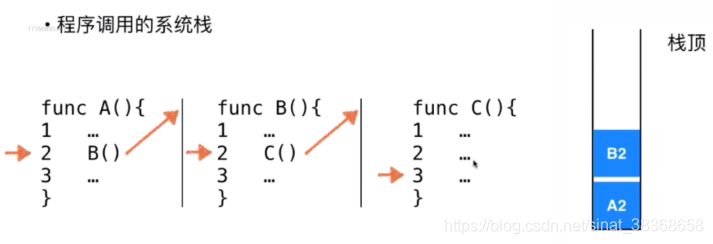

# 栈

栈:

* 栈是一种线性结构
* 先进后出（FILO）/ 后进先出（LIFO）
* 栈顶：只能从一端添加元素，也只能从一端取出元素，这一端叫栈顶；栈底：栈底部

## 1. 用数组实现栈

```typescript
/**
 * 定义泛型栈类Stack（支持任意数据类型）
 */
class Stack<T> {
  private stack: T[]; // 栈数组
  private size: number; // 栈容量

  constructor(size: number) {
    this.stack = [];
    this.size = size;
  }

  // 入栈
  push(item: T): boolean {
    if (this.isFull()) {
      return false;
    }
    this.stack.push(item);
    return true;
  }

  // 出栈
  pop(): boolean {
    if (this.isEmpty()) {
      return false;
    };
    
    this.stack = this.stack.slice(0, this.stack.length - 1);
    return true;
  }
    
    // 查看栈顶元素
    peek(): T | undefined {
        if (this.isEmpty()) {
            return undefined;
        }
        return this.stack[this.stack.length - 1];
    }

  // 遍历栈元素(参数控制遍历方向，true为从栈底到栈顶，false为从栈顶到栈底)
  stackTraverse(isFromBottom: boolean): void {
    if (this.isEmpty()) {
      console.log("Stack is empty.");
      return;
    }
    if (isFromBottom) {
      for (let i = 0; i < this.stack.length; i++) {
        console.log(this.stack[i]);
      }
    } else {
      for (let i = this.stack.length - 1; i >= 0; i--) {
        console.log(this.stack[i]);
      }
    }
  }

  clearStack(): void {
    this.stack = [];
  }

  stackLength(): number {
    return this.stack.length;
  }

  private isFull(): boolean {
    return this.stack.length >= this.size;
  }

  private isEmpty(): boolean {
    return 0 === this.stack.length ;
  }
}
```

## 2. 栈应用

栈的应用：

* Undo操作（撤销）

* 程序调用的系统栈：因为有系统栈记录每一次调用过程中的调用点，在编程时进行子过程调用的时候，当一个子过程执行完成之后，可以回到上层调用中断的位置继续执行下去。

  

### 2.1. 数值转换

```typescript
/*
描述：输入任意的十进制正整数N，分别输出该整数N的二进制、八进制、十六进制的数
公式：N = (N div d) * d + N mod d (div表示整除，mod表示求余)
(1348)(十进制) = (2504)(八进制) = (544)(十六进制) = (10101000100)(二进制)

短除法（八进制转换示例）：
      N      N div 8   N mod 8
    1348       168        4
     168        21        0
      21         2        5
       2         0        2

短除法（十六进制转换示例）：
      N      N div 16  N mod 16
    1348        84        4
      84         5        4
       5         0        5

目的：通过实例灵活掌握栈机制的使用技巧
*/

function convertNumberSystem(N: number, d: number): string {
  const stack = [];

  let num = N;

  while (num !== 0) {
    const mod = num % d;
    stack.push(mod);
    num = Math.floor(num / d);
  }

  let result = "";

  let length = stack.length;
  for (let i = length - 1; i >= 0; i--) {
    result += stack[i].toString();
  }

  return result;
}

// console.log(convertNumberSystem(1348, 8));
// console.log(convertNumberSystem(1348, 16)); // 十六进制
// console.log(convertNumberSystem(1348, 2)); // 二进制
```

### 2. 2 括号匹配

用于编译器

```typescript
/*
栈应用--括号匹配

描述：任意输入一组括号，可以判断括号是否匹配

字符串示例：[( )]  [( )( )]  [( )[( )]]  [[( )]

思路：维护一个栈，对于输入的括号序列，遇到左括号就入栈，遇到右括号就和当前栈顶的左括号匹配，直到栈为空，匹配失败则括号不匹配。
（栈顶元素反映了在嵌套的层次关系中，最近的需要匹配的元素）
*/

function isBracketMatched(str: string): boolean {
  if(s.length%2===1){
    return false;
  }
    
  const needChar: Record<string, string> = {
    "(": ")",
    "[": "]",
    "{": "}",
  };

  const stack = new Array<string>(); // 存储左括号
  const needStack = new Array<string>(); // 存储需要匹配的右括号

  for (let i = 0; i < str.length; i++) {
    const char = str.charAt(i);
    if (char === "(" || char === "[" || char === "{") {
      stack.push(char);
      needStack.push(needChar[char]!);
    } else if (char === ")" || char === "]" || char === "}") {
      // 右括号无需入栈，只需判断 + 弹出左括号
      if (needStack.length === 0 || char !== needStack.pop()) {
        return false;
      }
      stack.pop(); // 弹出左括号
    } else {
      return false; // 遇到非括号字符，直接返回false
    }
  }

  // 最终需同时满足：左括号栈空 + 右括号需求栈空
  return stack.length === 0 && needStack.length === 0;
}

// // 测试括号匹配函数
// const testStrings = ["[( )]", "[( )( )]", "[( )[( )]]", "[[( )]"];

// for (const str of testStrings) {
//   console.log(`Testing string: ${str} => Matched: ${isBracketMatched(str)}`);
// }
```


