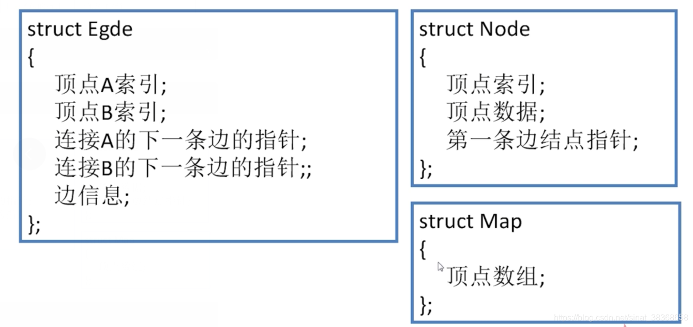

# 图

- 图的表示法
- 图的遍历
- 最小生成树（非常有价值）
- 图的应用：路程规划，工程规划，战略规划

对于有向图：一条弧，有弧度，弧尾，权值

## 1. 图的存储结构

**图的存储结构：**

* 邻接矩阵
* 邻接表
* 十字链表
* 邻接多重表

### 1.1 邻接矩阵-数组存储

* 顶点的表示方法：顶点索引+顶点数据
* 弧的表示方法：邻接矩阵 `matrix[4][4]`

【注】对于**无向图**的邻接矩阵是对称的，为了节省空间，可以只记录下三角或者上三角的部分

### 1.2 邻接表-链式存储

* 顶点的表示方法：顶点索引 + 出链表表头指针 + 顶点数据
* 弧的表示方法：弧头顶点索引 + 下一条弧指针 + 弧数据

### 1.3 十字链表-链式存储

### 1.4 邻接多重表-链式存储（无向图）

