# 树

- 树是节点的有限集合，是一种天然的组织结构
- 树的用途：压缩软件 哈夫曼树；人机对战（不断做树的搜索）；
- 有二分搜索树，平衡二叉树，AVL树，红黑树，堆，并查集，线段树，Trie（字典数，前缀树）

## 1. 二叉树


* 二叉树不一定是“满”的，一个节点也是二叉树、空（NULL）也是二叉树

### 1.1  二叉树数组

```typescript
/** 
二叉树（数组表示）

要求：完成树的基本操作
  1.树的创建和销毁
  2.树中节点的搜索
  3.树中节点的添加与删除
  4.树中节点的遍历

函数操作: 创建树、 销毁树、 添加节点、 删除节点、 搜索节点、 遍历树

关于数组与树之间的算法转换：
number tree [n] 3 5 8 2 6 9 7   父亲结点下标*2+1 该结点左
                                父亲结点下标*2+2 该结点右
          3 (0)

    5 (1)       8 (2)
    
2 (3) 6 (4)   9 (5) 7 (6)
*/

class BinaryTree {
  private tree: number[];
  private size: number;

  constructor(size: number, root: number) {
    this.size = size;
    this.tree = new Array(size).fill(0);
    this.tree[0] = root;
  }

  searchNode(nodeIndex: number): number | null {
    if (nodeIndex < 0 || nodeIndex >= this.size) {
      return null;
    }
    if (this.tree[nodeIndex] === 0) {
      return null;
    }
    return this.tree[nodeIndex];
  }

  addNode(
    nodeIndex: number,
    direction: "left" | "right",
    node: number
  ): boolean {
    if (nodeIndex < 0 || nodeIndex >= this.size) {
      // nodeIndex 本身不合法
      return false;
    }
    if (this.tree[nodeIndex] === 0) {
      return false;
    }

    if (direction === "left") {
      const leftNodeIndex = 2 * nodeIndex + 1;
      if (leftNodeIndex >= this.size) {
        //结点范围不合法
        return false;
      }
      if (this.tree[leftNodeIndex] !== 0) {
        //结点已有值
        return false;
      }
      this.tree[leftNodeIndex] = node;
    } else {
      const rightNodeIndex = 2 * nodeIndex + 2;
      if (rightNodeIndex >= this.size) {
        //结点范围不合法
        return false;
      }
      if (this.tree[rightNodeIndex] !== 0) {
        //结点已有值
        return false;
      }
      this.tree[rightNodeIndex] = node;
    }
    return true;
  }

  deleteNode(nodeIndex: number): { success: boolean; deletedNode?: number } {
    if (nodeIndex < 0 || nodeIndex >= this.size) {
      return { success: false };
    }
    if (this.tree[nodeIndex] === 0) {
      return { success: false }; // 要删除的地方本身就没有结点
    }

    const deletedNode = this.tree[nodeIndex];
    this.tree[nodeIndex] = 0;
    return { success: true, deletedNode };
  }

  treeTraverse(): void {
    console.log(this.tree.join(" "));
  }
}

// main.ts
function main() {
  const root = 3;
  const pTree = new BinaryTree(10, root);

  const node1 = 5;
  const node2 = 8;
  pTree.addNode(0, "left", node1);
  pTree.addNode(0, "right", node2);

  const node3 = 2;
  const node4 = 6;
  pTree.addNode(1, "left", node3);
  pTree.addNode(1, "right", node4);

  const node5 = 9;
  const node6 = 7;
  pTree.addNode(2, "left", node5);
  pTree.addNode(2, "right", node6);

  const deleteResult = pTree.deleteNode(6);
  if (deleteResult.success && deleteResult.deletedNode !== undefined) {
    console.log(`Deleted node: ${deleteResult.deletedNode}`);
  }

  pTree.treeTraverse();

  const searchResult = pTree.searchNode(2);
  if (searchResult !== null) {
    console.log(`node = ${searchResult}`);
  }
}

main();

```

### 1.2 二叉树链表

```
/**
 * 二叉树：链表实现
 * 函数：创建树、销毁树、搜索节点、添加结点、删除节点、遍历（前序、中序、后序）

  结点要素：索引 数据 左孩子指针 右孩子指针
            (0)
      5(1)        8(2)
    2(3) 6(4)   9(5) 7(6)
 */
```

```typescript
//TreeNode 类，包含二叉树节点的基本属性
class TreeNode {
  index: number;
  data: number;
  leftChild: TreeNode | null;
  rightChild: TreeNode | null;
  parent: TreeNode | null;

  constructor(index:number = 0, data:number = 0) {
    this.index = index;
    this.data = data;
    this.leftChild = null;
    this.rightChild = null;
    this.parent = null;
  }

  searchTreeNode(nodeIndex: number): TreeNode | null {
    if (this.index === nodeIndex) {
      return this;
    }
    let temp: TreeNode | null = null;
    if (this.leftChild !== null) {
      if (this.leftChild.index === nodeIndex) {
        return this.leftChild;
      } else {
        //注意没找到的情况继续往下找
        temp = this.leftChild.searchTreeNode(nodeIndex);
        if (temp !== null) {
          return temp;
        }
      }
    }
    if (this.rightChild !== null) {
      if (this.rightChild.index === nodeIndex) {
        return this.rightChild;
      } else {
        temp = this.rightChild.searchTreeNode(nodeIndex);
        if (temp !== null) {
          return temp;
        }
      }
    }
    return null;
  }

  deleteTreeNode(): void {
    //递归删除节点
    if (this.leftChild !== null) {
      //先删除左子树
      this.leftChild.deleteTreeNode();
    }
    if (this.rightChild !== null) {
      //再删除右子树
      this.rightChild.deleteTreeNode();
    }
    if (this.parent !== null) {
      //找到父节点
      if (this.parent.leftChild === this) {
        //如果该节点是父节点的左节点
        this.parent.leftChild = null;
      }
      if (this.parent.rightChild === this) {
        //如果该节点是父节点的右节点
        this.parent.rightChild = null;
      }
    }
  }

  // 前序遍历
  preOrderTraverse(): void {
    console.log(`${this.index}---${this.data}`);
    if (this.leftChild !== null) {
      this.leftChild.preOrderTraverse();
    }
    if (this.rightChild !== null) {
      this.rightChild.preOrderTraverse();
    }
  }

  // 中序遍历
  inOrderTraverse(): void {
    if (this.leftChild !== null) {
      this.leftChild.inOrderTraverse();
    }
    console.log(`${this.index}---${this.data}`);
    if (this.rightChild !== null) {
      this.rightChild.inOrderTraverse();
    }
  }

  // 后序遍历
  postOrderTraverse(): void {
    if (this.leftChild !== null) {
      this.leftChild.postOrderTraverse();
    }
    if (this.rightChild !== null) {
      this.rightChild.postOrderTraverse();
    }
    console.log(`${this.index}---${this.data}`);
  }
}
```

```typescript
// Tree 类，以TreeNode类为基础，管理整个二叉树
class Tree {
  private root: TreeNode;

  constructor(rootIndex: number = 0, rootData: number = 0) {
    this.root = new TreeNode(rootIndex, rootData);
  }

  searchNode(nodeIndex: number): TreeNode | null {
    return this.root.searchTreeNode(nodeIndex);
  }

  addNode(nodeIndex: number, direction: number, newNode: TreeNode): boolean {
    const temp = this.searchNode(nodeIndex);
    if (temp === null) {
      return false;
    }

    const node = new TreeNode();
    node.index = newNode.index;
    node.data = newNode.data;
    node.parent = temp;

    if (direction === 0) {
      //添加左节点
      temp.leftChild = node;
    } else if (direction === 1) {
      //添加右节点
      temp.rightChild = node;
    } else {
      return false;
    }
    return true;
  }

  deleteNode(nodeIndex: number): boolean {
    const temp = this.searchNode(nodeIndex);
    if (temp === null) {
      return false;
    }
    temp.deleteTreeNode();
    return true;
  }

  preOrderTraversal(): void {
    this.root.preOrderTraverse();
  }

  inOrderTraversal(): void {
    this.root.inOrderTraverse();
  }

  postOrderTraversal(): void {
    this.root.postOrderTraverse();
  }
}
```

测试函数

```typescript
function main() {
  const node1 = new TreeNode(1,5);
  const node2 = new TreeNode(2,8);
  const node3 = new TreeNode(3,2);
  const node4 = new TreeNode(4,6);
  const node5 = new TreeNode(5,9);
  const node6 = new TreeNode(6,7);
  
  const tree = new Tree();
  tree.addNode(0, 0, node1);
  tree.addNode(0, 1, node2);

  tree.addNode(1, 0, node3);
  tree.addNode(1, 1, node4);

  tree.addNode(2, 0, node5);
  tree.addNode(2, 1, node6);

  tree.deleteNode(2);

  console.log("--------------poster----------------");
  tree.postOrderTraversal(); 
  // --------------poster----------------3---2
  //4---6
  //1---5
  //0---0
}

main();
```

## 2. 二分查找法Binary Search

对于有序数列，才能使用二分查找法（排序的作用）（logn级别复杂度）

使用递归方式实现二分查找法
递归实现通常实现起来更容易，但在性能上会有略差。

```typescript
// 迭代版二分查找
function binarySearch<T>(arr: T[], target: T): number {
  let l = 0, r = arr.length - 1;

  while (l <= r) {
    const mid = l + Math.floor((r - l) / 2);

    if (arr[mid] === target) {
      return mid;
    }

    if (target < arr[mid]) {
      r = mid - 1; // 在左半部分 arr[l, mid-1] 查找
    } else {
      l = mid + 1; // 在右半部分 arr[mid+1, r] 查找
    }
  }

  return -1; // 未找到
}

// 递归版二分查找
function _binarySearch2<T>(arr: T[], l: number, r: number, target: T): number {
  if (l > r) {
    return -1; // 递归终止条件
  }

  const mid = l + Math.floor((r - l) / 2);

  if (arr[mid] === target) {
    return mid;
  } else if (target < arr[mid]) {
    return _binarySearch2(arr, l, mid - 1, target);
  } else {
    return _binarySearch2(arr, mid + 1, r, target);
  }
}

function binarySearch2<T>(arr: T[], target: T): number {
  return _binarySearch2(arr, 0, arr.length - 1, target);
}
```

### 二分查找法的变种

**两个非常重要的函数：floor和ceil（有的地方也称为lowerBound和upperBound）**

为什么要使用这两个函数？
之前实现的二分查找法（上文），都是假设在这个数组中没有重复元素的，当然有重复元素时，依然能找到这个元素的索引，只不过这个元素可能在数组中出现过很多次，上文的二分查找无法找到具体哪个索引。

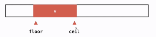

相应定义了两个函数，floor找到这个数字v在数组中第一次出现的位置。ceil是v最后一次出现的位置

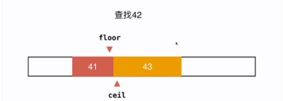

当在数组中查找的元素不存在的时候，（如查找42），上文的算法得到的是-1，但是定义floor和ceil后，如图，floor返回的是42之前的元素（41）的元素的最后一个位置，ceil返回的是42之后的元素（43）的第一个位置。

## 2. 二分搜索树

### 2.1 二分搜索树BST


但是。二分搜索树不一定是一个完全二叉树，所以不能用数组，通常使用node结点表示key-value对，使用指针表示结点之间的关系。

注意：二分搜索树中的结点必须具有可比较性；

```ts
// 泛型约束：E 必须是可比较的类型
class BST<E extends { compareTo(other: E): number }> {
    private class Node {
        public e: E;
        public left: Node | null;
        public right: Node | null;

        constructor(e: E) {
            this.e = e;
            this.left = null;
            this.right = null;
        }
    }

    private root: Node | null;
    private size: number;

    constructor() {
        this.root = null;
        this.size = 0;
    }

    size(): number {
        return this.size;
    }
    isEmpty(): boolean {
        return this.size === 0;
    }
}
```

二分搜索树的优势：

|            | 查找元素 | 插入元素 | 删除元素 |
| ---------- | -------- | -------- | -------- |
| 普通数组   | O(n)     | O(n)     | O(n)     |
| 顺序数组   | O(logn)  | O(n)     | O(n)     |
| 二分搜索树 | O(logn)  | O(logn)  | O(logn)  |

高效，不仅可查找数据，还可以高效地插入，删除数据 —— 动态维护数据

可以方便地回答很多数据之间的关系问题：min、max、floor、ceil、rank、select

### 2.2  添加元素

向二分搜索树中添加新元素

* 我们的二分搜索树不包含重复元素（如果想包含重复元素，只需要定义：左子树小于等于结点；或者右子树大于等于节点）
* 二分搜索树添加元素的非递归写法，和链表很像；
* 更常用递归实现，更简单

```typescript
class BST<E extends { compareTo(other: E): number }> 
    //...
    
    // 调用递归辅助方法，更新根节点
    add(e: E): void {
        this.root = this.addRecursive(this.root, e);
    }

    // 向以node为根的二分搜索树中插入元素e，递归算法
    // 返回插入新节点后二分搜索树的根
    private addRecursive(node: this.Node | null, e: E): this.Node {
        // 递归终止条件：当前节点为null，创建新节点并返回（作为新的子树根）
        if (node === null) {
            this.size++;
            return new this.Node(e);
        }

        // 递归查找插入位置
        if (e.compareTo(node.e) < 0) {
            // 元素小于当前节点，插入左子树，更新左指针
            node.left = this.addRecursive(node.left, e);
        } else if (e.compareTo(node.e) > 0) {
            // 元素大于当前节点，插入右子树，更新右指针
            node.right = this.addRecursive(node.right, e);
        }
        // 元素相等时：不插入（默认不存储重复元素）

        // 返回当前节点（插入后，当前子树的根节点不变）
        return node;
    }
}
```

### 2.3 查询操作

```typescript
class BST<E extends { compareTo(other: E): number }> {
    //...

    // 判断二分搜索树中是否包含元素e
    contains(e: E): boolean {
        // 调用递归辅助方法，从根节点开始查找
        return this.containsRecursive(this.root, e);
    }

    // 看以node为根的二分搜索树中是否包含元素e
    private containsRecursive(node: this.Node | null, e: E): boolean {
        // 递归终止条件：节点为null，说明未找到
        if (node === null) {
            return false;
        }
        
        if (e.compareTo(node.e) === 0) {
            return true;
        }else if (e.compareTo(node.e) < 0) {
            return this.containsRecursive(node.left, e);
        }else {
            return this.containsRecursive(node.right, e);
        }
    }
}
```

### 2.4  遍历（递归实现）

#### 前序遍历

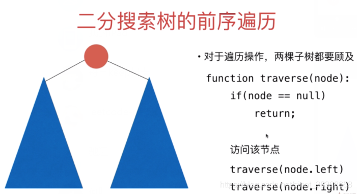

```typescript
class BST<E extends { compareTo(other: E): number }> {
    //...

    // 二分搜索树的前序遍历（递归）
    preOrder(): void {
        this.preOrderRecursive(this.root);
    }

    // 前序遍历以node为根的二分搜索树
    private preOrderRecursive(node: this.Node | null): void {
        if (node === null) return;
        console.log(node.e); 
        // 递归遍历左子树
        this.preOrderRecursive(node.left);
        // 递归遍历右子树
        this.preOrderRecursive(node.right);
    }
```

#### 中序遍历

```typescript
class BST<E extends { compareTo(other: E): number }> {
    inOrder(): void {
        this.inOrderRecursive(this.root);
    }

    private inOrderRecursive(node: this.Node | null): void {
        if (node === null) return;
        this.inOrderRecursive(node.left);
        console.log(node.e); 
        this.inOrderRecursive(node.right);
    }
```

#### 后序遍历

- 后序遍历的一个应用：为二分搜索树释放内存

```typescript
class BST<E extends { compareTo(other: E): number }> {
    postOrder(): void {
        this.postOrderRecursive(this.root);
    }

    private postOrderRecursive(node: this.Node | null): void {
        if (node === null) return;
        this.postOrderRecursive(node.left);
        this.postOrderRecursive(node.right);
        console.log(node.e); 
    }
```

### 2.5  遍历（非递归实现）

#### 深度优先遍历

非递归实现比递归实现复杂很多。中序遍历和后序遍历的非递归实现实际应用不广。前序遍历是深度优先遍历的具体实现之一，下面是前序遍历的使用栈的非递归实现

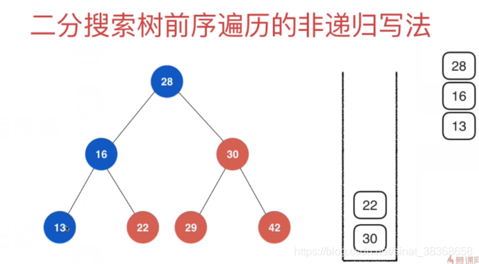

```typescript
	// 非递归前序遍历（NR = Non-Recursive）
    preOrderNR(): void {
        // 根节点为null，直接返回
        if (this.root === null) return;
        // TS 用数组模拟栈：push()入栈，pop()出栈（LIFO）
        const stack: this.Node[] = [];
        stack.push(this.root);

        // 栈不为空则循环
        while (stack.length > 0) {
            // 弹出栈顶节点（当前访问节点）
            const cur = stack.pop(); 
            // 访问当前节点
            console.log(cur.e);
            // 注意：前序遍历是“根→左→右”，栈是LIFO，因此先压右子树，再压左子树
            if (cur.right !== null) {
                stack.push(cur.right);
            }
            if (cur.left !== null) {
                stack.push(cur.left);
            }
        }
    } 
```

#### 广度优先遍历（层序遍历）

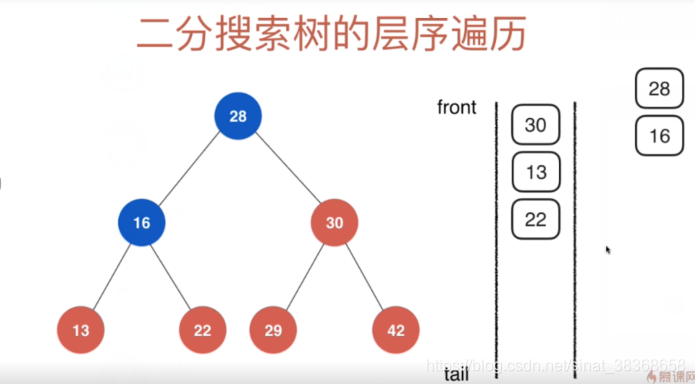

```typescript
// 二分搜索树的层序遍历（非递归，基于队列实现）
levelOrder(): void {
    if (this.root === null) return;

    // TS 用数组模拟队列：push()入队，shift()出队（FIFO）
    const queue: this.Node[] = [];
    queue.push(this.root);

    while (queue.length > 0) {
        // 出队队首节点（当前访问节点）
        const cur = queue.shift();
        // 访问当前节点
        console.log(cur.e);

        // 左子树先入队，右子树后入队（保证层序顺序）
        if (cur.left !== null) {
            queue.push(cur.left);
        }
        if (cur.right !== null) {
            queue.push(cur.right);
        }
    }
}
```

层序遍历常用于算法设计中找最短路径

### 2.6 删除最大元素和最小元素

从最简单的，删除二分搜索树的最大值和最小值开始。

以删除最大值为例

- 如果最大值直接为叶子节点，删除即可
- 如果不是，则将该左结点上提至该位置即可

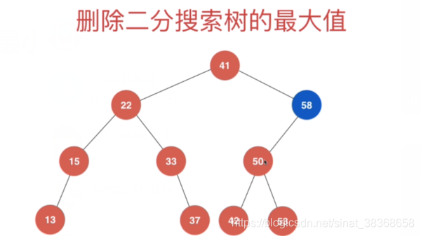

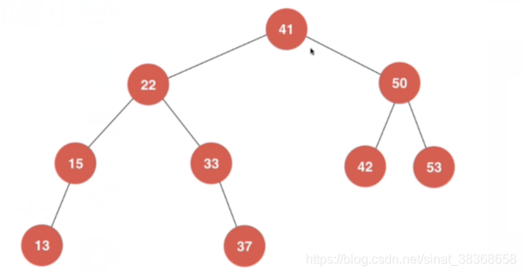

```typescript
// 寻找二分搜索树中的最小元素
minimum(): E {
    if (this.size === 0) {
        throw new Error("BST is empty");
    }
    const minNode = this.minimumNode(this.root);
    return minNode.e;
}

// 私有递归辅助：返回以 node 为根的 BST 最小值所在节点
private minimumNode(node: this.Node): this.Node {
    if (node.left === null) {
        return node;
    }
    return this.minimumNode(node.left);
}

// 寻找二分搜索树中的最大元素（公开方法）
maximum(): E {
    if (this.size === 0) {
        throw new Error("BST is empty");
    }
    const maxNode = this.maximumNode(this.root);
    return maxNode.e;
}

// 私有递归辅助：返回以 node 为根的 BST 最大值所在节点
private maximumNode(node: this.Node): this.Node {
    if (node.right === null) {
        return node;
    }
    return this.maximumNode(node.right);
}

// 从 BST 中删除最小值所在节点，返回最小值
removeMin(): E {
    const ret = this.minimum(); // 先获取最小值（已处理空树异常）
    this.root = this.removeMinNode(this.root);
    return ret;
}

// 删除以 node 为根的 BST 中的最小节点，返回删除后的新根
private removeMinNode(node: this.Node): this.Node | null {
    if (node.left === null) {
        // 找到最小节点（左子树为空），将其右子树替代当前节点
        const rightNode = node.right;
        node.right = null;
        this.size--;
        return rightNode;
    }
    // 递归删除左子树的最小节点，更新左指针
    node.left = this.removeMinNode(node.left);
    return node;
}

// 从 BST 中删除最大值所在节点，返回最大值
removeMax(): E {
    const ret = this.maximum(); // 先获取最大值
    this.root = this.removeMaxNode(this.root); 
    return ret;
}

// 私有递归辅助：删除以 node 为根的 BST 中的最大节点，返回删除后的新根
private removeMaxNode(node: this.Node): this.Node | null {
    if (node.right === null) {
        // 找到最大节点（右子树为空），将其左子树替代当前节点
        const leftNode = node.left;
        node.left = null; // 断开连接，便于垃圾回收
        this.size--;
        return leftNode;
    }

    // 递归删除右子树的最大节点，更新右指针
    node.right = this.removeMaxNode(node.right);
    return node;
}
```

测试代码

```typescript
function testRemoveMin() {
    // 1. 初始化：创建存储 number 类型的 BST 实例
    const bst = new BST<number>();
    const n = 1000; 

    // 2. 向 BST 插入 1000 个随机整数（范围 0-9999）
    for (let i = 0; i < n; i++) {
        const randomNum = Math.floor(Math.random() * 10000); 
        bst.add(randomNum); 
    }
    // 3. 批量删除 BST 的最小值，存入数组
    const nums: number[] = [];
    while (!bst.isEmpty()) {
        const minNum = bst.removeMin(); 
        nums.push(minNum);
    }
    // 4. 验证结果：输出删除的元素列表（可选）
    console.log("删除的元素列表（升序为正确结果）：", nums);
}
```

### 2.7 删除任意元素

几种情况

- 如果删除只有左孩子的结点，将左孩子代替该位置即可
- 如果删除只有右孩子的结点，将右孩子代替该位置即可
- 如果删除左右都有孩子的结点，先找到后继（其右子树大于该节点的最小值），取代这个元素。

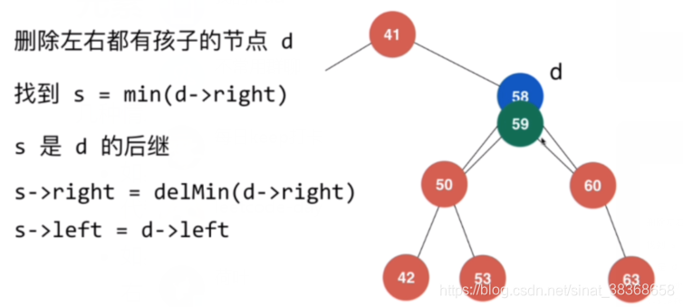

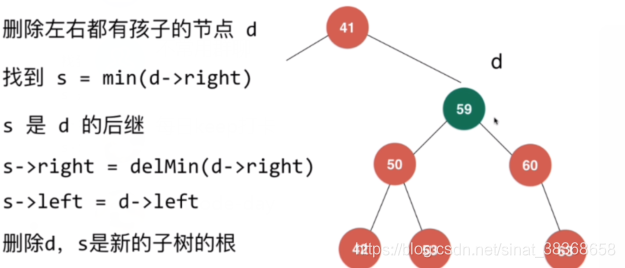

- 注意：当然，寻找左子树的最大前驱一样可以维持树

```typescript
// 公开方法：从二分搜索树中删除元素为 e 的节点
remove(e: E): void {
    this.root = this.removeNode(this.root, e);
}

// 删除以 node 为根的 BST 中值为 e 的节点，递归算法
// 返回删除节点后新的二分搜索树的根
private removeNode(node: this.Node | null, e: E): this.Node | null {
    // 递归终止：未找到待删除节点，返回 null
    if (node === null) {
        return null;
    }

    // 1. 查找待删除节点（递归遍历左/右子树）
    if (e.compareTo(node.e) < 0) {
        node.left = this.removeNode(node.left, e);
        return node;
    } else if (e.compareTo(node.e) > 0) {
        node.right = this.removeNode(node.right, e);
        return node;
    } else {
        // 2. 找到待删除节点（e 与 node.e 相等），处理三种情况

        // 情况1：待删除节点左子树为空 → 用右子树替代
        if (node.left === null) {
            const rightNode = node.right;
            node.right = null; // 断开连接，便于垃圾回收
            this.size--;
            return rightNode;
        }

        // 情况2：待删除节点右子树为空 → 用左子树替代
        if (node.right === null) {
            const leftNode = node.left;
            node.left = null; // 断开连接，便于垃圾回收
            this.size--;
            return leftNode;
        }

        // 情况3：待删除节点左右子树均不为空
        // 核心逻辑：找「后继节点」（右子树的最小值节点）替代待删除节点
        const successor = this.minimumNode(node.right); // 复用之前实现的最小节点查找方法
        // 后继节点的右子树 = 删除右子树最小值后的新根（复用 removeMinNode 方法，已处理 size--）
        successor.right = this.removeMinNode(node.right);
        // 后继节点的左子树 = 待删除节点的左子树
        successor.left = node.left;

        // 断开待删除节点的连接
        node.left = null;
        node.right = null;

        // 返回后继节点，作为新的子树根
        return successor;
    }
}

// 复用之前实现的辅助方法（确保存在以下两个方法）
// 1. 查找最小节点（已实现，此处为提醒，无需重复编写）
private minimumNode(node: this.Node): this.Node {
    return node.left === null ? node : this.minimumNode(node.left);
}

// 2. 删除最小节点（已实现，此处为提醒，无需重复编写）
private removeMinNode(node: this.Node): this.Node | null {
    if (node.left === null) {
        const rightNode = node.right;
        node.right = null;
        this.size--;
        return rightNode;
    }
    node.left = this.removeMinNode(node.left);
    return node;
}
```

### 2.8 更多二分搜索树相关话题

- 二分搜索的顺序性：minimum，maximum，successor，oredecessor，floor，ceil，rank，select

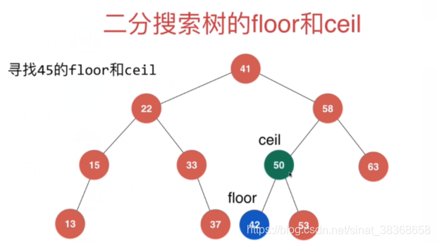

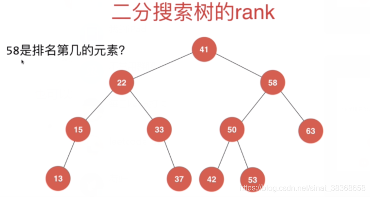

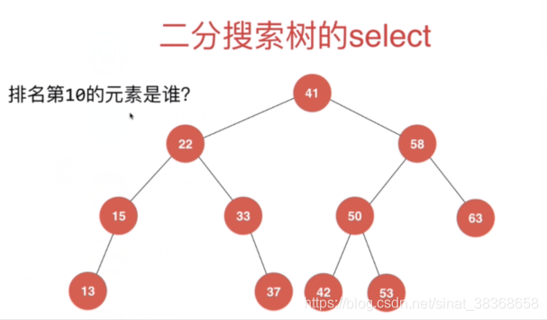

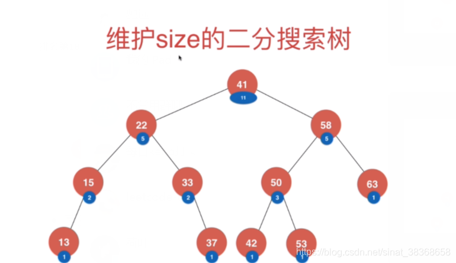


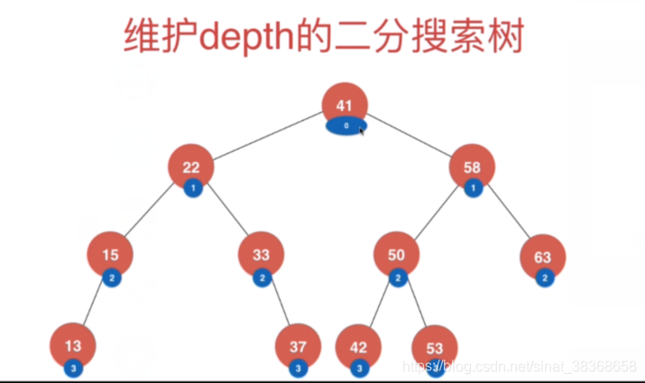

## 3.线段树

### 3.1 线段树（区间树）

- 对于有一类问题，我们关心的是线段（或者区间）

**经典问题1： 区间染色**

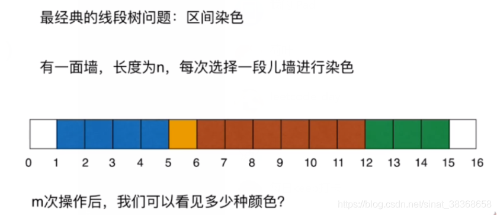

|                      | 使用数组实现 |
| -------------------- | ------------ |
| 染色操作（更新区间） | O(n)         |
| 查询操作（查询区间） | O(n)         |

经典问题2： 区间查询

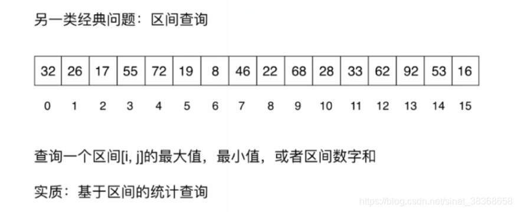

**为什么要使用线段树？**

**实质：基于区间的统计查询**

- 实质：基于区间的统计查询
- 示例问题：
  - 2017 年注册用户中消费最高的用户？消费最少的用户？学习时间最长的用户？
  - 某个太空区间中天体总量？

|      | 使用数组实现 | 使用线段树 |
| ---- | ------------ | ---------- |
| 更新 | O(n)         | O(logn)    |
| 查询 | O(n)         | O(logn)    |

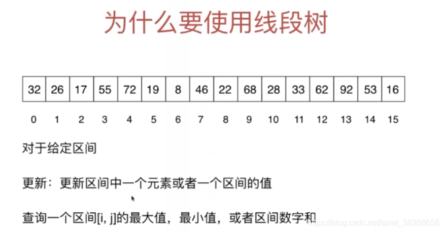

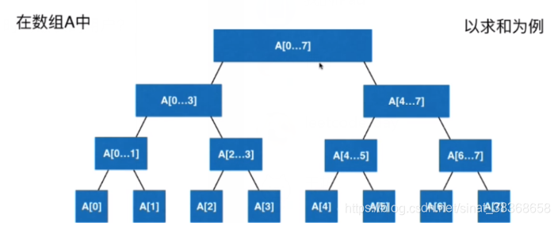

### 3.2 线段树基础表示


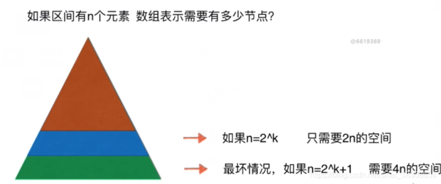

- 问题：如果区间有 n 个元素 数组表示需要有多少节点？
- 结论：需要 4n 的空间
- 说明：我们的线段树不考虑添加元素，即区间固定；使用 4n 的静态空间即可

### 3.3 创建线段树

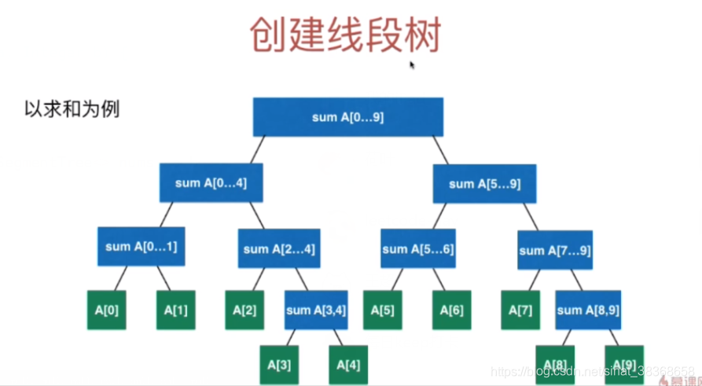

```typescript
// 定义 Merger
interface Merger<E> {
  merge(a: E, b: E): E;
}

class SegmentTree<E> {
  private tree: (E | null)[];
  private data: E[];
  private merger: Merger<E>;

  constructor(arr: E[], merger: Merger<E>) {
    this.merger = merger;
    this.data = [...arr]; // 深拷贝输入数组
    this.tree = new Array<E | null>(4 * arr.length).fill(null); // 初始化4n空间
    this.buildSegmentTree(0, 0, this.data.length - 1);
  }

  // 构建线段树的递归方法
  //在treeIndex的位置创建表示区间[1....r]的线段树
  private buildSegmentTree(treeIndex: number, l: number, r: number): void {
    if (l === r) {
      this.tree[treeIndex] = this.data[l];
      return;
    }

    const leftTreeIndex = this.leftChild(treeIndex);
    const rightTreeIndex = this.rightChild(treeIndex);

    //int mid = (l+r)/2 为避免l和r都特别大的时候使得l+r产生整形溢出的情况
    const mid = l + Math.floor((r - l) / 2);
    this.buildSegmentTree(leftTreeIndex, l, mid);
    this.buildSegmentTree(rightTreeIndex, mid + 1, r);

    this.tree[treeIndex] = this.merger.merge(
      this.tree[leftTreeIndex]!,
      this.tree[rightTreeIndex]!
    );
  }

  getSize(): number {
    return this.data.length;
  }

  get(index: number): E {
    if (index < 0 || index >= this.data.length) {
      throw new Error("Index is illegal.");
    }
    return this.data[index];
  }

  private leftChild(index: number): number {
    return 2 * index + 1;
  }

  private rightChild(index: number): number {
    return 2 * index + 2;
  }

  printSegementTree(): string {
    const res: (E | "null")[] = [];
    for (const node of this.tree) {
      res.push(node === null ? "null" : node);
    }
    return `[${res.join(", ")}]`;
  }
}

// 测试代码
const nums = [-2, 0, 3, -5, 2, -1];
const sumMerger: Merger<number> = {
  merge(a, b) {
    return a + b;
  },
};
const segTree = new SegmentTree(nums, sumMerger);
console.log(segTree.printSegementTree());
// [-3, 1, -4, -2, 3, -3, -1, -2, 0, null, null, -5, 2, null, null, null, null, null, null, null, null, null, null, null]
```

### 3.4 线段树中的区间查询

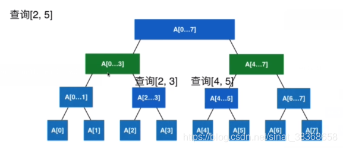

```typescript
 //区间查询方法,返回区间[queryL,queryR]的值
    query(queryL: number, queryR: number): E {
        if (
            queryL < 0 || queryL >= this.data.length ||
            queryR < 0 || queryR >= this.data.length ||
            queryL > queryR
        ) {
            throw new Error("Index is illegal");
        }
        return this._query(0, 0, this.data.length - 1, queryL, queryR);
    }

    // 在以treeIndex为根的线段树中[l,,,,r]的范围里，搜索区间[queryL....qeuryR]的值
    private _query(
        treeIndex: number,
        l: number,
        r: number,
        queryL: number,
        queryR: number
    ): E {
        if (l === queryL && r === queryR) {
            return this.tree[treeIndex]!;
        }

        const mid = l + Math.floor((r - l) / 2);
        const leftTreeIndex = this.leftChild(treeIndex);
        const rightTreeIndex = this.rightChild(treeIndex);

        if (queryL >= mid + 1) {
            return this._query(rightTreeIndex, mid + 1, r, queryL, queryR);
        } else if (queryR <= mid) {
            return this._query(leftTreeIndex, l, mid, queryL, queryR);
        }

        const leftResult = this._query(leftTreeIndex, l, mid, queryL, mid);
        const rightResult = this._query(rightTreeIndex, mid + 1, r, mid + 1, queryR);
        return this.merger.merge(leftResult, rightResult);
    }
```

### 3.5 线段树的更新操作

```typescript
 // 更新 index 位置的值为 e
    set(index: number, e: E): void {
        if (index < 0 || index >= this.data.length) {
            throw new Error("Index is illegal");
        }
        this.data[index] = e; // 更新原始数据
        this._set(0, 0, this.data.length - 1, index, e); // 递归更新线段树
    }

    // 在以 treeIndex 为根的线段树中，更新 index 位置的值为 e
    private _set(treeIndex: number, l: number, r: number, index: number, e: E): void {
        if (l === r) {
            this.tree[treeIndex] = e; // 叶子节点，直接更新
            return;
        }

        const mid = l + Math.floor((r - l) / 2);
        const leftTreeIndex = this.leftChild(treeIndex);
        const rightTreeIndex = this.rightChild(treeIndex);
        if (index >= mid + 1) {
            // 目标索引在右子树，递归更新右子树
            this._set(rightTreeIndex, mid + 1, r, index, e);
        } else {
            // 目标索引在左子树，递归更新左子树
            this._set(leftTreeIndex, l, mid, index, e);
        }

        // 关键：更新完子节点后，回溯更新当前节点（合并左右子树的新结果）
        this.tree[treeIndex] = this.merger.merge(
            this.tree[leftTreeIndex]!,
            this.tree[rightTreeIndex]!
        );
    }
```


### 3.6  LeetCode上线段树相关的问题

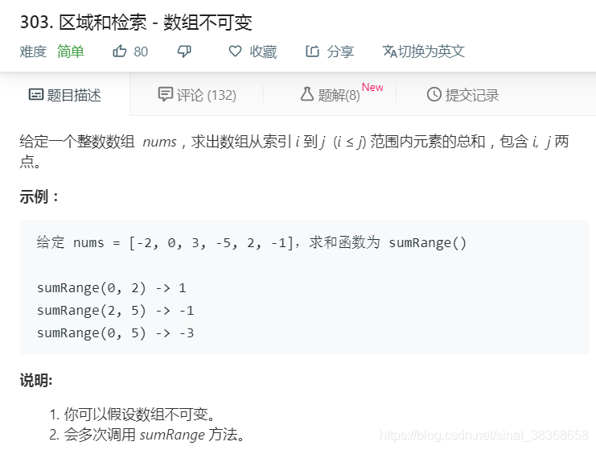

```typescript
function main() {
    const nums = [-2, 0, 3, -5, 2, -1];
    const sumMerger: Merger<number> = {
        merge(a, b) {
            return a + b;
        }
    };
    const segTree = new SegmentTree(nums, sumMerger);

    // console.log("线段树结构：", segTree.toString());
    // 测试区间查询
    console.log("\n区间查询测试：");
    console.log("区间 [0, 2] 的和：", segTree.query(0, 2)); // 预期：-2 + 0 + 3 = 1
    console.log("区间 [3, 5] 的和：", segTree.query(3, 5)); // 预期：-5 + 2 + (-1) = -4
}
```

想快速查询某个区间的元素和，而且这个区间中的元素不会改变，对于这样的需求可以进行**预处理**

```typescript
class NumArray {
  private sum: number[];
  // sum[i] 存储前 i 个元素和（sum[0] = 0），sum[i] = nums[0...i-1] 的和

  constructor(nums: number[]) {
    const len = nums.length;
    this.sum = new Array(len + 1);
    this.sum[0] = 0; // 初始化前 0 个元素和为 0
    // 计算前缀和：sum[i] = sum[i-1] + nums[i-1]
    for (let i = 1; i < this.sum.length; i++) {
      this.sum[i] = this.sum[i - 1] + nums[i - 1];
    }
  }

  // 计算区间 [i, j] 的和（闭区间），公式：sum[j+1] - sum[i]
  sumRange(i: number, j: number): number {
    return this.sum[j + 1] - this.sum[i];
  }
}

// 测试代码
const nums1 = [-2, 0, 3, -5, 2, -1];
const numArray = new NumArray(nums1);

console.log(numArray.sumRange(0, 2)); // 输出：1（-2 + 0 + 3）
console.log(numArray.sumRange(3, 5)); // 输出：-4（-5 + 2 + (-1)）
```

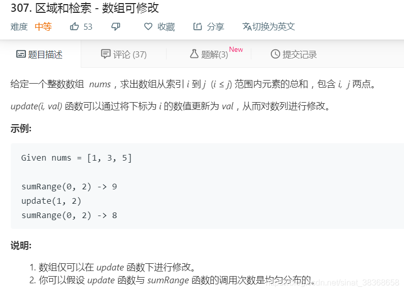

```typescript
class NumArray3 {
  private data: number[];
  private sum: number[]; // sum[i] 存储前 i 个元素和（sum[0] = 0），sum[i] = data[0..i-1] 的和

  constructor(nums: number[]) {
    this.data = [...nums]; // 存储原始数据
    this.sum = new Array(nums.length + 1);
    this.sum[0] = 0;
    for (let i = 1; i <= nums.length; i++) {
      this.sum[i] = this.sum[i - 1] + this.data[i - 1];
    }
  }

  sumRange(left: number, right: number): number {
    return this.sum[right + 1] - this.sum[left];
  }

  // 更新指定索引的值，并重新计算前缀和
  update(index: number, val: number): void {
    this.data[index] = val;
    // 从 index+1 开始重新计算前缀和（因 index 对应 sum 的 index+1 位置）
    for (let i = index + 1; i < this.sum.length; i++) {
      this.sum[i] = this.sum[i - 1] + this.data[i - 1];
    }
  }
}
```

**注意：使用数组虽然可以实现，但是耗时非常多，会超出时间限制。这个时候就要用到我们的线段树。**

线段树实现版本

```typescript
interface Merger<E> {
    merge(a: E, b: E): E;
}

// 线段树类（求和场景）
class SegmentTree<E> {
    //.....
}

// 3. 实现 LeetCode 307 题的 NumArray 类（基于线段树）
class NumArray {
    private segmentTree: SegmentTree<number>;

    constructor(nums: number[]) {
        // 构建求和线段树（Merger 实现两数相加）
        const sumMerger: Merger<number> = {
            merge(a, b) {
                return a + b;
            }
        };
        this.segmentTree = new SegmentTree(nums, sumMerger);
    }

    // 更新指定索引的值（O(log n)）
    update(index: number, val: number): void {
        this.segmentTree.set(index, val);
    }

    // 计算区间 [left, right] 的和（O(log n)）
    sumRange(left: number, right: number): number {
        return this.segmentTree.query(left, right);
    }
}

// 测试用例（完全匹配 LeetCode 示例）
const numArray = new NumArray([1, 3, 5]);
console.log(numArray.sumRange(0, 2)); // 输出：9（1+3+5）
numArray.update(1, 2); // 更新索引1为2，数组变为 [1,2,5]
console.log(numArray.sumRange(0, 2)); // 输出：8（1+2+5）
```

### 3.7 更多线段树相关的话题

线段树的相关问题都比较困难，是高级数据结构。一般面试不会考，更多应用于算法竞赛。

更多延伸

* 对于一个区间进行更新，例如将[2,5]去加中的所有元素+3
* 懒惰更新，使用lazy数组记录未更新的内容。
* 二维线段树
* 动态线段树
* 区间操作相关另外一个重要数据结构：树状数组
* 区间相关问题：RMQ Range Minimum Query
