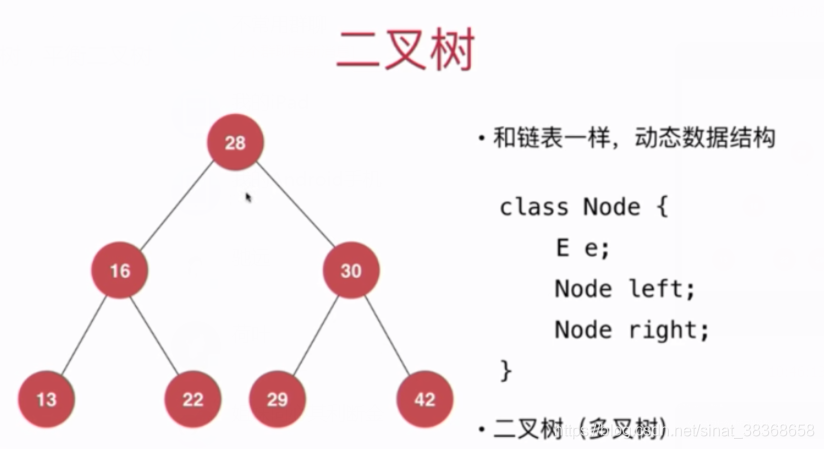
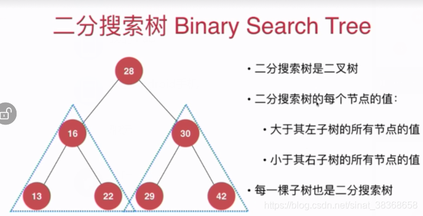

# 树

- 树是节点的有限集合，是一种天然的组织结构
- 树的用途：压缩软件 哈夫曼树；人机对战（不断做树的搜索）；
- 有二分搜索树，平衡二叉树，AVL树，红黑树，堆，并查集，线段树，Trie（字典数，前缀树）

## 1. 二叉树



* 二叉树不一定是“满”的，一个节点也是二叉树、空（NULL）也是二叉树

### 1.1  二叉树数组

```typescript
/** 
二叉树（数组表示）

要求：完成树的基本操作
  1.树的创建和销毁
  2.树中节点的搜索
  3.树中节点的添加与删除
  4.树中节点的遍历

函数操作: 创建树、 销毁树、 添加节点、 删除节点、 搜索节点、 遍历树

关于数组与树之间的算法转换：
number tree [n] 3 5 8 2 6 9 7   父亲结点下标*2+1 该结点左
                                父亲结点下标*2+2 该结点右
          3 (0)

    5 (1)       8 (2)
    
2 (3) 6 (4)   9 (5) 7 (6)
*/

class BinaryTree {
  private tree: number[];
  private size: number;

  constructor(size: number, root: number) {
    this.size = size;
    this.tree = new Array(size).fill(0);
    this.tree[0] = root;
  }

  searchNode(nodeIndex: number): number | null {
    if (nodeIndex < 0 || nodeIndex >= this.size) {
      return null;
    }
    if (this.tree[nodeIndex] === 0) {
      return null;
    }
    return this.tree[nodeIndex];
  }

  addNode(
    nodeIndex: number,
    direction: "left" | "right",
    node: number
  ): boolean {
    if (nodeIndex < 0 || nodeIndex >= this.size) {
      // nodeIndex 本身不合法
      return false;
    }
    if (this.tree[nodeIndex] === 0) {
      return false;
    }

    if (direction === "left") {
      const leftNodeIndex = 2 * nodeIndex + 1;
      if (leftNodeIndex >= this.size) {
        //结点范围不合法
        return false;
      }
      if (this.tree[leftNodeIndex] !== 0) {
        //结点已有值
        return false;
      }
      this.tree[leftNodeIndex] = node;
    } else {
      const rightNodeIndex = 2 * nodeIndex + 2;
      if (rightNodeIndex >= this.size) {
        //结点范围不合法
        return false;
      }
      if (this.tree[rightNodeIndex] !== 0) {
        //结点已有值
        return false;
      }
      this.tree[rightNodeIndex] = node;
    }
    return true;
  }

  deleteNode(nodeIndex: number): { success: boolean; deletedNode?: number } {
    if (nodeIndex < 0 || nodeIndex >= this.size) {
      return { success: false };
    }
    if (this.tree[nodeIndex] === 0) {
      return { success: false }; // 要删除的地方本身就没有结点
    }

    const deletedNode = this.tree[nodeIndex];
    this.tree[nodeIndex] = 0;
    return { success: true, deletedNode };
  }

  treeTraverse(): void {
    console.log(this.tree.join(" "));
  }
}

// main.ts
function main() {
  const root = 3;
  const pTree = new BinaryTree(10, root);

  const node1 = 5;
  const node2 = 8;
  pTree.addNode(0, "left", node1);
  pTree.addNode(0, "right", node2);

  const node3 = 2;
  const node4 = 6;
  pTree.addNode(1, "left", node3);
  pTree.addNode(1, "right", node4);

  const node5 = 9;
  const node6 = 7;
  pTree.addNode(2, "left", node5);
  pTree.addNode(2, "right", node6);

  const deleteResult = pTree.deleteNode(6);
  if (deleteResult.success && deleteResult.deletedNode !== undefined) {
    console.log(`Deleted node: ${deleteResult.deletedNode}`);
  }

  pTree.treeTraverse();

  const searchResult = pTree.searchNode(2);
  if (searchResult !== null) {
    console.log(`node = ${searchResult}`);
  }
}

main();

```

### 1.2 二叉树链表

```
/**
 * 二叉树：链表实现
 * 函数：创建树、销毁树、搜索节点、添加结点、删除节点、遍历（前序、中序、后序）

  结点要素：索引 数据 左孩子指针 右孩子指针
            (0)
      5(1)        8(2)
    2(3) 6(4)   9(5) 7(6)
 */
```

```typescript
//TreeNode 类，包含二叉树节点的基本属性
class TreeNode {
  index: number;
  data: number;
  leftChild: TreeNode | null;
  rightChild: TreeNode | null;
  parent: TreeNode | null;

  constructor(index:number = 0, data:number = 0) {
    this.index = index;
    this.data = data;
    this.leftChild = null;
    this.rightChild = null;
    this.parent = null;
  }

  searchTreeNode(nodeIndex: number): TreeNode | null {
    if (this.index === nodeIndex) {
      return this;
    }
    let temp: TreeNode | null = null;
    if (this.leftChild !== null) {
      if (this.leftChild.index === nodeIndex) {
        return this.leftChild;
      } else {
        //注意没找到的情况继续往下找
        temp = this.leftChild.searchTreeNode(nodeIndex);
        if (temp !== null) {
          return temp;
        }
      }
    }
    if (this.rightChild !== null) {
      if (this.rightChild.index === nodeIndex) {
        return this.rightChild;
      } else {
        temp = this.rightChild.searchTreeNode(nodeIndex);
        if (temp !== null) {
          return temp;
        }
      }
    }
    return null;
  }

  deleteTreeNode(): void {
    //递归删除节点
    if (this.leftChild !== null) {
      //先删除左子树
      this.leftChild.deleteTreeNode();
    }
    if (this.rightChild !== null) {
      //再删除右子树
      this.rightChild.deleteTreeNode();
    }
    if (this.parent !== null) {
      //找到父节点
      if (this.parent.leftChild === this) {
        //如果该节点是父节点的左节点
        this.parent.leftChild = null;
      }
      if (this.parent.rightChild === this) {
        //如果该节点是父节点的右节点
        this.parent.rightChild = null;
      }
    }
  }

  // 前序遍历
  preOrderTraverse(): void {
    console.log(`${this.index}---${this.data}`);
    if (this.leftChild !== null) {
      this.leftChild.preOrderTraverse();
    }
    if (this.rightChild !== null) {
      this.rightChild.preOrderTraverse();
    }
  }

  // 中序遍历
  inOrderTraverse(): void {
    if (this.leftChild !== null) {
      this.leftChild.inOrderTraverse();
    }
    console.log(`${this.index}---${this.data}`);
    if (this.rightChild !== null) {
      this.rightChild.inOrderTraverse();
    }
  }

  // 后序遍历
  postOrderTraverse(): void {
    if (this.leftChild !== null) {
      this.leftChild.postOrderTraverse();
    }
    if (this.rightChild !== null) {
      this.rightChild.postOrderTraverse();
    }
    console.log(`${this.index}---${this.data}`);
  }
}
```

```typescript
// Tree 类，以TreeNode类为基础，管理整个二叉树
class Tree {
  private root: TreeNode;

  constructor(rootIndex: number = 0, rootData: number = 0) {
    this.root = new TreeNode(rootIndex, rootData);
  }

  searchNode(nodeIndex: number): TreeNode | null {
    return this.root.searchTreeNode(nodeIndex);
  }

  addNode(nodeIndex: number, direction: number, newNode: TreeNode): boolean {
    const temp = this.searchNode(nodeIndex);
    if (temp === null) {
      return false;
    }

    const node = new TreeNode();
    node.index = newNode.index;
    node.data = newNode.data;
    node.parent = temp;

    if (direction === 0) {
      //添加左节点
      temp.leftChild = node;
    } else if (direction === 1) {
      //添加右节点
      temp.rightChild = node;
    } else {
      return false;
    }
    return true;
  }

  deleteNode(nodeIndex: number): boolean {
    const temp = this.searchNode(nodeIndex);
    if (temp === null) {
      return false;
    }
    temp.deleteTreeNode();
    return true;
  }

  preOrderTraversal(): void {
    this.root.preOrderTraverse();
  }

  inOrderTraversal(): void {
    this.root.inOrderTraverse();
  }

  postOrderTraversal(): void {
    this.root.postOrderTraverse();
  }
}
```

测试函数

```typescript
function main() {
  const node1 = new TreeNode(1,5);
  const node2 = new TreeNode(2,8);
  const node3 = new TreeNode(3,2);
  const node4 = new TreeNode(4,6);
  const node5 = new TreeNode(5,9);
  const node6 = new TreeNode(6,7);
  
  const tree = new Tree();
  tree.addNode(0, 0, node1);
  tree.addNode(0, 1, node2);

  tree.addNode(1, 0, node3);
  tree.addNode(1, 1, node4);

  tree.addNode(2, 0, node5);
  tree.addNode(2, 1, node6);

  tree.deleteNode(2);

  console.log("--------------poster----------------");
  tree.postOrderTraversal(); 
  // --------------poster----------------3---2
  //4---6
  //1---5
  //0---0
}

main();
```

## 2. 二分搜索树

### 2.1 BST



注意：二分搜索树中的结点必须具有可比较性；

```ts
// 泛型约束：E 必须是可比较的类型
class BST<E extends { compareTo(other: E): number }> {
    private class Node {
        public e: E;
        public left: Node | null;
        public right: Node | null;

        constructor(e: E) {
            this.e = e;
            this.left = null;
            this.right = null;
        }
    }

    private root: Node | null;
    private size: number;

    constructor() {
        this.root = null;
        this.size = 0;
    }

    size(): number {
        return this.size;
    }
    isEmpty(): boolean {
        return this.size === 0;
    }
}
```

### 2.2  向二分搜索树中添加元素

向二分搜索树中添加新元素

* 我们的二分搜索树不包含重复元素（如果想包含重复元素，只需要定义：左子树小于等于结点；或者右子树大于等于节点）
* 二分搜索树添加元素的非递归写法，和链表很像；
* 更常用递归实现，更简单

```typescript
class BST<E extends { compareTo(other: E): number }> 
    //...
    
    // 向二分搜索树中添加新的元素e
    add(e: E): void {
        if (this.root === null) {
            this.root = new this.Node(e);
            this.size++;
        } else {
            this.addRecursive(this.root, e);
        }
    }

    // 向以node为根的二分搜索树中插入元素e，递归算法
    private addRecursive(node: this.Node, e: E): void {
        // 元素已存在，直接返回（不重复添加）
        if (e === node.e) { 
            return;
        }
        // 元素小于当前节点，且左子树为空，直接插入左子节点
        else if (e.compareTo(node.e) < 0 && node.left === null) {
            node.left = new this.Node(e);
            this.size++;
            return;
        }
        // 元素大于当前节点，且右子树为空，直接插入右子节点
        else if (e.compareTo(node.e) > 0 && node.right === null) {
            node.right = new this.Node(e);
            this.size++;
            return;
        }

        // 递归向下查找插入位置
        if (e.compareTo(node.e) < 0) {
            this.addRecursive(node.left, e); 
        } else {
            this.addRecursive(node.right, e); 
        }
    }
}
```

