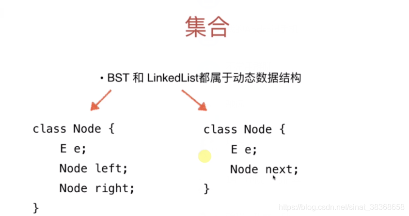
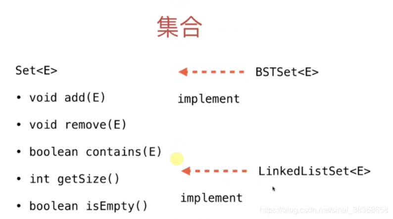
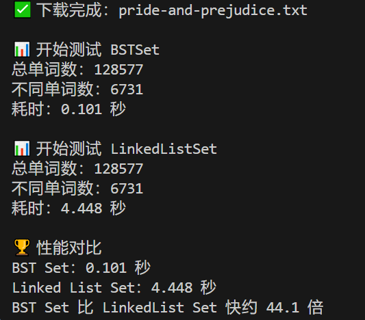
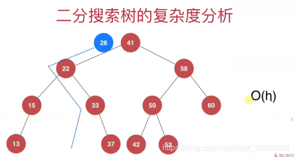
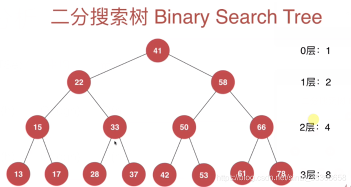
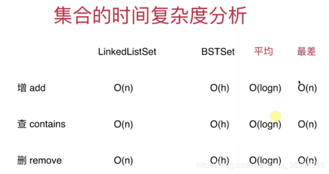
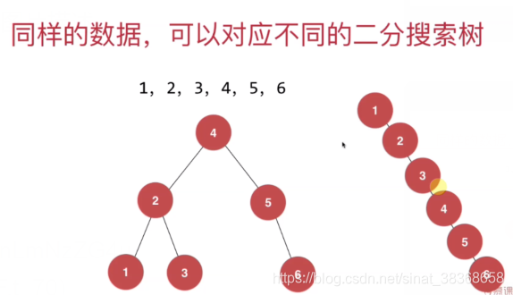

# 集合

## 1.集合

- **集合中不能包含重复元素**
- 典型应用：客户统计，文本词汇量统计，

```typescript
interface Set<E> {
    add(e: E): void;
    remove(e: E): void;
    contains(e: E): boolean;
    getSize(): number;
    isEmpty(): boolean;
}
```

## 2. 集合实现

在二分搜索树中，不能存放重复元素，所以这就是一个非常好的实现“集合”的底层数据结构

详见【树-BST】一节

### 2.1 基于BTS和基于链表的集合实现





注意基于链表的集合实现其中的对象并不要求具有可比性。

### 2.2 集合类的复杂度分析

比较两种实现的性能能差异

```typescript
import fs from 'fs'; 
// 读取文件并提取单词数组
function readFile(filename: string): string[] {
 	//...
}

// 测试 Set 性能：返回耗时（秒）
function testSet(set: Set<string>, filename: string): number {
    const startTime = process.hrtime.bigint(); 
    const words = readFile(filename);
    console.log(`总单词数：${words.length}`);

    // 批量添加单词到 Set（自动去重）
    for (const word of words) {
        set.add(word);
    }
    console.log(`不同单词数：${set.getSize()}`);
    const endTime = process.hrtime.bigint();
    return Number(endTime - startTime) / 1e9;
}

function main() {
    const filename = 'pride-and-prejudice.txt'; // 确保文件在当前目录下
    // 测试 BSTSet
    const bstSet = new BSTSet<string>();
    const time1 = testSet(bstSet, filename);
    console.log(`BST Set 耗时：${time1.toFixed(3)} 秒`);
    // 测试 LinkedListSet
    const linkedListSet = new LinkedListSet<string>();
    const time2 = testSet(linkedListSet, filename);
    console.log(`Linked List Set 耗时：${time2.toFixed(3)} 秒`);
}
main();
```

测试结果：



显然使用**二分搜索树（BSTSet）的效率是高于链表（LinkedListSet）的**。







二分搜索树的最坏情况，按照顺序（顺序or逆序）创建树（如下图），即最差为O（n），**如何解决这个问题，即创建平衡二叉树。**



### 2.3 其他集合

##### 有序集合和无序集合

> - 有序集合中的元素具有顺序性 <-- 基于搜索树的实现
> - 无序集合中的元素没有顺序性 <-- 基于哈希表的实现

##### 多重集合

- 集合中的元素可以重复
