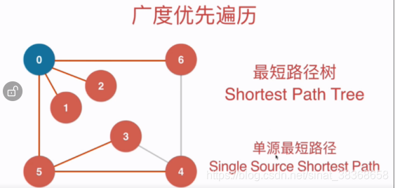
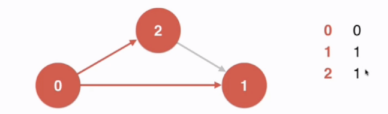
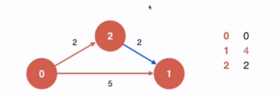
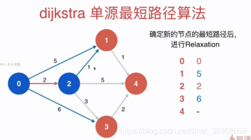

# 图

- 图的表示法
- 图的遍历
- 最小生成树（非常有价值）
- 图的应用：路程规划，工程规划，战略规划，社交网络、互联网、程序状态执行、交通运输


对于有向图：一条弧，有弧度，弧尾，权值

## 1. 图的存储结构

**图的存储结构：**

* 邻接矩阵
* 邻接表
* 十字链表
* 邻接多重表

### 1.1 邻接矩阵-数组存储

* 邻接矩阵：适合表示稠密图（Dense Graph），例如完全图
* 顶点的表示方法：顶点索引+顶点数据
* 弧的表示方法：邻接矩阵 `matrix[4][4]`


```typescript
/**
 * 稠密图 - 使用邻接矩阵的简易版实现
 */
class DenseGraph {
    private n: number;          // 顶点数
    private m: number;          // 边数
    private directed: boolean;  // 是否为有向图
    private g: boolean[][];     // 邻接矩阵

    constructor(n: number, directed: boolean) {
        this.n = n;
        this.m = 0;
        this.directed = directed;
        // 初始化 n x n 的邻接矩阵，全部为 false
        this.g = Array.from({ length: n }, () => Array(n).fill(false));
    }

    V(): number {
        return this.n;
    }

    E(): number {
        return this.m;
    }

    /**添加一条边 v-w*/
    addEdge(v: number, w: number): void {
        if (this.hasEdge(v, w)) {
            return; // 避免重复添加
        }

        this.g[v][w] = true;
        if (!this.directed) {
            this.g[w][v] = true;
        }

        this.m++;
    }

    /**判断 v 和 w 之间是否有边*/
    hasEdge(v: number, w: number): boolean {
        return this.g[v][w];
    }
}

export default DenseGraph;
```

```typescript
// 邻接表的简易版实现
export class SparseGraph {
  private n: number;          // 顶点数
  private m: number;          // 边数
  private directed: boolean;   // 是否有向
  private g: number[][];      // 邻接表：g[v] 存储 v 的所有邻接点

  constructor(n: number, directed: boolean) {
    this.n = n;
    this.m = 0;
    this.directed = directed;
    this.g = Array.from({ length: n }, () => []); // 初始化邻接表
  }

  // 获取顶点数
  V(): number {
    return this.n;
  }

  // 获取边数
  E(): number {
    return this.m;
  }

  // 添加边 v-w
  addEdge(v: number, w: number): void {
    if (this.hasEdge(v, w)) {
      return; // 避免重复边
    }

    this.g[v].push(w);
    // 如果是无向图且不是自环，添加反向边
    if (v !== w && !this.directed) {
      this.g[w].push(v);
    }

    this.m++;
  }

  // 判断 v 和 w 是否有边
  hasEdge(v: number, w: number): boolean {
    // 在 g[v] 中查找 w
    return this.g[v].includes(w);
  }

  // 获取顶点 v 的所有邻接点（可选，用于遍历）
  adj(v: number): number[] {
    if (v < 0 || v >= this.n) {
      throw new Error(`Vertex index out of range [0, ${this.n - 1}]`);
    }
    return [...this.g[v]]; 
  }
}
```

【注】上述两种实现在`hasEdge` 等方法中需要加入边界检查，检查是否有超出图的顶点范围

【注】对于**无向图**的邻接矩阵是对称的，为了节省空间，可以只记录下三角或者上三角的部分


### 1.2 邻接表-链式存储

* 邻接表：适合表示稀疏图（Sparse Graph）
* 顶点的表示方法：顶点索引 + 出链表表头指针 + 顶点数据
* 弧的表示方法：弧头顶点索引 + 下一条弧指针 + 弧数据


### 1.3 十字链表-链式存储


### 1.4 邻接多重表-链式存储（无向图）


## 2. 图的遍历

- 深度优先搜索（前序遍历）
- 广度优先搜索
- 最小生成树 prime算法 / kruskal算法

### 2.1 深度优先遍历与连通分量


```typescript
// Graph.ts
export interface IGraph {
  V(): number; // 顶点数
  adj(v: number): number[]; // 返回 v 的所有邻接点
}

export class Component {
  private G: IGraph;
  private visited: boolean[];
  private id: number[]; //id[v]表示v所属的联通分量编号
  private ccount: number; // 连通分量个数

  constructor(graph: IGraph) {
    this.G = graph;
    const n = this.G.V();
    this.visited = new Array(n).fill(false);
    this.id = new Array(n).fill(-1);
    this.ccount = 0;

    //对每个未访问的顶点执行一次DFS,得到一个联通分量
    for (let v = 0; v < n; v++) {
      if (!this.visited[v]) {
        this.dfs(v);
        this.ccount++;
      }
    }
  }

  // 深度优先遍历
  private dfs(v: number): void {
    this.visited[v] = true;
    this.id[v] = this.ccount;

    // 遍历v的所有邻接点
    const neighbors = this.G.adj(v);
    for (const w of neighbors) {
      if (!this.visited[w]) {
        this.dfs(w);
      }
    }
  }

  // 返回图的联通分量个数
  public count(): number {
    return this.ccount;
  }

  // 判断顶点 v 和 顶点 w 是否联通
  public isConnected(v: number, w: number): boolean {
    if (v < 0 || v >= this.G.V() || w < 0 || w >= this.G.V()) {
      throw new Error(`Vertex index out of range [0, ${this.G.V() - 1}]`);
    }
    return this.id[v] === this.id[w];
  }
}
```

图的深度优先遍历复杂度

* 稀疏图（邻接表）: O(V+E)
* 稠密图（邻接矩阵）：O(V^2)

### 2.2 寻路

```typescript
// 基于深度优先搜索（DFS）的单源路径查找器，用于在图中从起点 s 到任意顶点 w 找到一条路径。
export class Path {
  private G: IGraph;
  private s: number; // 起点
  private visited: boolean[];
  private from: number[]; // from[v] 表示在 DFS 树中，v 的前驱顶点（即从哪个顶点到达 v）
 
  // 构造函数：执行 DFS 预处理，构建从起点 s 出发的路径树
  constructor(graph: IGraph, s: number) { 
        if (s < 0 || s >= graph.V()) {
      throw new Error(`Start vertex ${s} out of range [0, ${graph.V() - 1}]`);
    }
    this.G = graph;
    this.s = s;
    const n = this.G.V();

    // 初始化 visited 和 from 数组
    this.visited = new Array(n).fill(false);  // 初始时所有顶点未被访问
    this.from = new Array(n).fill(-1);        // 初始时所有顶点的前驱顶点为 -1（表示无前驱）
    
    // 从起点 s 开始执行 DFS，构建路径树
    this.dfs(s);
  }


  // 深度优先搜索（DFS）算法，递归实现
  // 遍历从v出发能到达的所有顶点，并记录路径信息（通过from数组）
  private dfs(v: number): void {
    this.visited[v] = true; // 标记顶点 v 为已访问
    const neighbors = this.G.adj(v); // 获取顶点 v 的所有邻接点

    // 遍历每个邻接点 w
    for (const w of neighbors) {
      if (!this.visited[w]) { // 如果邻接点 w 未被访问
        this.from[w] = v;    // 记录 w 的前驱顶点为 v
        this.dfs(w);         // 递归访问邻接点 w
      }
    }
  }

  // 判断从起点 s 到顶点 w 是否存在路径
  // 如果存在路径返回 true，否则 false
  public hasPath(w: number): boolean {
    if (w < 0 || w >= this.G.V()) {
      throw new Error(`Vertex index out of range [0, ${this.G.V() - 1}]`);
    }
    return this.visited[w];
  }

  // 返回从起点 s 到顶点 w 的路径，路径以数组形式返回
  public path(w: number): number[] {
    const path: number[] = [];
    if (!this.hasPath(w)) {
      return path; // 如果没有路径，返回空数组
    }

    // 使用栈逆向重建路径（因为from是从w指向s的）
    const stack: number[] = [];
    let p = w;
    while (p !== -1) {
      stack.push(p);
      p = this.from[p]; // 回溯到前驱
    }

    // 将栈中元素弹出到结果数组（得到 s -> ... -> w 的顺序）
    const result: number[] = [];
    while (stack.length > 0) {
      result.push(stack.pop()!);
    }
    return result
  }

  // 打印从起点 s 到顶点 w 的路径 (格式：s => ... => w)
  public showPath(w: number): void {
    if(!this.hasPath(w)) {
      console.log(`No path from ${this.s} to ${w}`);
      return;
    }

    const path = this.path(w);
    console.log(path.join('=>'));
  }
}
```

测试函数

```typescript
// 创建无向图
const graph = new SparseGraph(7, false);
graph.addEdge(0, 1);
graph.addEdge(0, 2);
graph.addEdge(0, 5);
graph.addEdge(0, 6);
graph.addEdge(3, 4);
graph.addEdge(3, 5);
graph.addEdge(4, 6);

// 从顶点 0 开始找路径
const pathFinder = new Path(graph, 0);
pathFinder.showPath(6); 
console.log(pathFinder.hasPath(6)); // true
console.log(pathFinder.path(6));    // [0,5,3,4,6]
```

### 2.3广度优先遍历和最短路

广度优先遍历求出了无权图的最短路径

```typescript
// 基于广度优先搜索（BFS）的无权图单源最短路径查找器
export class ShortestPath {
  private G: IGraph; //图的引用
  private s: number; //起点
  private visited: boolean[]; //记录顶点是否被访问
  private from: number[]; //记录路径, from[i]表示查找路径时,i是从哪个顶点过来的
  private ord: number[]; // 记录路径中节点的次序。ord[i]表示i节点在路径中的次序。s 到 v 的最短距离（边数）

  // 构造函数, 寻找无权图graph从s点到其他点的最短路径
  constructor(graph: IGraph, s: number) {
    if (s < 0 || s >= graph.V()) {
      throw new Error(`Start vertex ${s} out of range [0, ${graph.V() - 1}]`);
    }

    this.G = graph;
    this.s = s;
    const n = this.G.V();

    // 初始化数组
    this.visited = new Array(n).fill(false);
    this.from = new Array(n).fill(-1); // 初始化为 -1，表示无前驱
    this.ord = new Array(n).fill(-1); // 初始化为 -1，表示不可达

    // 执行广度优先搜索（BFS）
    const queue: number[] = [];
    queue.push(s);
    this.visited[s] = true;
    this.ord[s] = 0; // 起点到起点的距离为0

    while (queue.length > 0) {
      const v = queue.shift()!; // 取出队首元素

      // 遍历 v 的所有邻接点
      const adjList = this.G.adj(v);
      for (const w of adjList) {
        if (!this.visited[w]) {
          queue.push(w);
          this.visited[w] = true;
          this.from[w] = v; // 记录前驱
          this.ord[w] = this.ord[v] + 1; // 距离 = 父节点距离 + 1
        }
      }
    }
  }

  // 判断从起点 s 到顶点 w 是否存在路径
  public hasPath(w: number): boolean {
    if (w < 0 || w >= this.G.V()) {
      throw new Error(`Vertex index out of range [0, ${this.G.V() - 1}]`);
    }
    return this.visited[w];
  }

  // 返回从起点 s 到顶点 w 的路径，路径以数组形式返回
  public path(w: number): number[] {
    if (!this.hasPath(w)) {
      return [];
    }

    // 通过from数组逆向查找到从s到w的路径, 存放到栈中
    const stack: number[] = [];
    let p = w;
    while (p !== -1) {
      stack.push(p);
      p = this.from[p];
    }

    // 从栈中依次取出元素, 获得顺序的从s到w的路径
    const result: number[] = [];
    while (stack.length > 0) {
      result.push(stack.pop()!);
    }
    return result;
  }

  // 打印从起点 s 到顶点 w 的路径 (格式：s => ... => w)
  public showPath(w: number): void {
    if (!this.hasPath(w)) {
      console.log(`No path from ${this.s} to ${w}`);
      return;
    }
    const path = this.path(w);
    console.log(path.join("=>"));
  }

  // 获取从起点 s 到顶点 w 的最短路径长度（边的数量）
  public length(w: number): number {
    if (w < 0 || w >= this.G.V()) {
      throw new Error(`Vertex index out of range [0, ${this.G.V() - 1}]`);
    }
    return this.ord[w];
  }
}
```

测试

```typescript
// 创建无向图
const graph = new SparseGraph(7, false);
graph.addEdge(0, 1);
graph.addEdge(0, 2);
graph.addEdge(0, 5);
graph.addEdge(0, 6);
graph.addEdge(3, 4);
graph.addEdge(3, 5);
graph.addEdge(4, 6);

// 从顶点 0 开始找最短路径
const shortestPathFinder = new ShortestPath(graph, 0);
shortestPathFinder.showPath(6);
console.log(shortestPathFinder.hasPath(6)); // true
console.log(shortestPathFinder.path(6)); // [0,6]
console.log(shortestPathFinder.length(6)); // 1

```

## 3. 有权图

有权图的表示

* 邻接矩阵：存储为edge类型
* 邻接表：每一个结点存储两个信息：相邻节点+权值

```typescript
export class Edge<T> {
  public readonly v: number; // 起点
  public readonly w: number; // 终点
  public readonly weight: T; // 权重

  constructor(v: number, w: number, weight: T) {
    this.v = v;
    this.w = w;
    this.weight = weight;
  }

  wt(): T {
    return this.weight;
  }

  // 获取另一个顶点（用于遍历）
  other(x: number): number {
    if (x === this.v) return this.w;
    if (x === this.w) return this.v;
    throw new Error('Invalid vertex');
  }
}
```

稠密图

```typescript
// 稠密图-邻接矩阵
import { Edge } from './Edge';

export class DenseGraph<T> {
  private n: number;                // 顶点数
  private m: number;                // 边数
  private directed: boolean;         // 是否有向
  private g: (Edge<T> | null)[][];  // 邻接矩阵：g[i][j] 存储边或 null

  constructor(n: number, directed: boolean) {
    this.n = n;
    this.m = 0;
    this.directed = directed;
    // g初始化为n*n的矩阵，每一个g[i][j]指向一个边的信息，初始化为NULL
    this.g = Array.from({ length: n }, () => 
      Array.from({ length: n }, () => null)
    );
  }

  // 获取顶点个数
  V(): number {
    return this.n;
  }

  // 获取边的个数
  E(): number {
    return this.m;
  }

  // 向图中添加一个边，权值为weight
  addEdge(v: number, w: number, weight: T): void {
    if (v < 0 || v >= this.n || w < 0 || w >= this.n) {
      throw new Error(`Vertex index out of range [0, ${this.n - 1}]`);
    }

    //如果从v到w已经有边，删除这条边
    if (this.hasEdge(v, w)) {
      this.g[v][w] = null;
      if (v !== w && !this.directed) {
        this.g[w][v] = null;
      }
      this.m--;
    }

    // 创建新边
    this.g[v][w] = new Edge(v, w, weight);
    if (v !== w && !this.directed) {
      this.g[w][v] = new Edge(w, v, weight);
    }
    this.m++;
  }

  // 判断是否存在从 v 到 w 的边
  hasEdge(v: number, w: number): boolean {
    if (v < 0 || v >= this.n || w < 0 || w >= this.n) {
      return false;
    }
    return this.g[v][w] !== null;
  }

  // 显示图的信息（调试用）
  show(): void {
    for (let i = 0; i < this.n; i++) {
      let row = '';
      for (let j = 0; j < this.n; j++) {
        if (this.g[i][j]) {
          row += `${this.g[i][j]!.wt()}\t`;
        } else {
          row += 'NULL\t';
        }
      }
      console.log(row);
    }
  }

  // 邻边迭代器，传入一个图和一个顶点
  //迭代在这个图中和这个顶点相连的所有边
  adjIterator(v: number): Iterable<Edge<T>> {
    if (v < 0 || v >= this.n) {
      throw new Error(`Vertex ${v} out of range [0, ${this.n - 1}]`);
    }

    // 返回一个可迭代对象
    return {
      [Symbol.iterator]: () => {
        let index = -1;//索引从-1开始，因为每次遍历都需要调用一次next()
        return {
          //返回图G中与顶点v相连接的下一个边
          next: (): IteratorResult<Edge<T>> => {
            // //从当前index开始向后搜索，直到找到一个g[v][index]为true
            index++;
            while (index < this.n) {
              if (this.g[v][index] !== null) {
                return { done: false, value: this.g[v][index]! };
              }
              index++;
            }
             //若没有顶点和v相连接，则返回undefined
            return { done: true, value: undefined as any };
          }
        };
      }
    };
  }
}
```

稀疏图

```typescript
// SparseGraph.ts
import { Edge } from './Edge';

export class SparseGraph<T> {
  private n: number;               // 顶点数
  private m: number;               // 边数
  private directed: boolean;        // 是否有向
  private g: Edge<T>[][];          // 邻接表：g[i] 存储从 i 出发的所有边

  constructor(n: number, directed: boolean) {
    if (n < 0) throw new Error('Vertex count must be non-negative');
    this.n = n;
    this.m = 0;
    this.directed = directed;
    // 初始化邻接表：每个顶点对应一个空边列表
    this.g = Array.from({ length: n }, () => []);
  }

  // 获取顶点数
  V(): number {
    return this.n;
  }

  // 获取边数
  E(): number {
    return this.m;
  }

  // 添加边 v-w，权重为 weight
  addEdge(v: number, w: number, weight: T): void {
    if (v < 0 || v >= this.n || w < 0 || w >= this.n) {
      throw new Error(`Vertex index out of range [0, ${this.n - 1}]`);
    }

    //注意，由于在邻接表的情况，查找是否有重边需要遍历整个链表
    //我们的程序允许重边的出现
    this.g[v].push(new Edge(v, w, weight));
    if (v !== w && !this.directed) {
      this.g[w].push(new Edge(w, v, weight));
    }
    this.m++;
  }

  // 判断是否存在从 v 到 w 的边
  hasEdge(v: number, w: number): boolean {
    if (v < 0 || v >= this.n || w < 0 || w >= this.n) {
      return false;
    }
    // 遍历 v 的邻接边，检查是否有终点为 w 的边
    return this.g[v].some(edge => edge.other(v) === w);
  }

  // 显示图的信息（调试用）
  show(): void {
    for (let i = 0; i < this.n; i++) {
      const edges = this.g[i]
        .map(edge => `(to: ${edge.w}, wt: ${edge.wt()})`)
        .join('\t');
      console.log(`vertex ${i}:\t${edges}`);
    }
  }

  // 返回可迭代的邻接边集合
  adjIterator(v: number): Iterable<Edge<T>> {
    if (v < 0 || v >= this.n) {
      throw new Error(`Vertex ${v} out of range [0, ${this.n - 1}]`);
    }
    return this.g[v]; // 数组本身就是可迭代的！
  }
}
```

##  4. 最小生成树MST和切分定理

- 例如：电缆布线设计，网络设计，电路设计。
- 最小生成树：针对连通图，针对**带权无向图**

```typescript
/*
    A
  / | \
B---F---E
 \ / \ /
  C---D

  A B C D E F
  0 1 2 3 4 5 

  A-B 6  A-E 5  A-F 1
  B-C 3  B-F 2
  C-F 8  C-D 7
  D-F 4  D-E 2
  E-F 9 
   
*/
```

### 4.1 **切分定理（Cut Property）**

把图中的结点分为两部分，成为一个**切分（cut）**
如果一个边的两个端点，属于切分（cut）不同的两边，这个边称为**横切边**

> **切分定理**：给定**任意**切分，横切边中权值最小的边必然属于最小生成树 

### 4.2 Prim算法

#### Lazy Prim

在这里选取权值最小的边的时候要利用到最小堆，以下为prime算法：

```typescript
// LazyPrimMST.ts
import { MinPriorityQueue } from '@datastructures-js/priority-queue';

// 注意：LeetCode 中无需 import，直接使用即可
// 本地测试时需安装：npm install @datastructures-js/priority-queue

export class LazyPrimMST<T> {
  private G: IGraph;                // 图的引用
  private pq: MinPriorityQueue<Edge<T>>; // 最小堆：存储横切边
  private marked: boolean[];            // marked[v] = v 是否已在 MST 中
  private mst: Edge<T>[];              // MST 所包含的所有便
  private mstWeight: number;           // MST 的总权重

  // 使用prime求图的MST
  constructor(graph: IGraph) {
    this.G = graph;
    const n = this.G.V();
    
    // 初始化
    this.marked = new Array(n).fill(false);
    this.mst = [];
    
    // 使用 LeetCode 内置 MinPriorityQueue，注意：必须提供 priority 函数（返回数字）
    this.pq = new MinPriorityQueue<Edge<T>>((edge) => edge.wt() as number);

    // Lazy Prim 核心逻辑
    this.visit(0); // 从顶点 0 开始

    while (!this.pq.isEmpty()) {
      const e = this.pq.dequeue()!; // 取出最小权重边

      // 如果边的两端都在 MST 中，跳过（无效横切边）
      if (this.marked[e.v] === this.marked[e.w]) {
        continue;
      }

      // 否则，这条边属于 MST
      this.mst.push(e);

      // 访问未访问的端点
      if (!this.marked[e.v]) {
        this.visit(e.v);
      } else {
        this.visit(e.w);
      }
    }

    // 计算总权重
    this.mstWeight = this.mst.reduce((sum, edge) => sum + (edge.wt() as number), 0);
  }

  // 访问顶点 v：将所有连接到未访问顶点的边加入堆
  private visit(v: number): void {
    if (this.marked[v]) return;
    this.marked[v] = true;

    // 遍历 v 的所有邻接边
    for (const edge of this.G.adjIterator(v)) {
      const other = edge.other(v);
      if (!this.marked[other]) {
        this.pq.enqueue(edge);
      }
    }
  }

  // 返回 MST 的所有边
  mstEdges(): Edge<T>[] {
    return [...this.mst]; // 返回副本
  }

  // 返回 MST 的总权重
  result(): number {
    return this.mstWeight;
  }
}

```

- 时间复杂度 O（ElogE）

#### Prime的优化

进行优化使之时间复杂度为O（ElogV）

维护一个**IndexMinHeap**数据结构，最小索引堆中的元素个数和图中的顶点个数一致，在堆操作这里提高了效率，遍历边的次数也变小了。

```typescript
export class PrimeMST<T> {
  private G: IGraph; // 图的引用
  private ipq: IndexMinHeap<T>; // 最小索引堆存储每个顶点的最小边权重
  private edgeTo: (Edge<T> | null)[]; // edgeTo[v]存储连接v和MST的最小边
  private marked: boolean[]; // marked[v] = v 是否已在 MST 中
  private mst: Edge<T>[]; // MST 所包含的所有便
  private mstWeight: number; // MST 的总权重

  // 访问结点v
  private visit(v: number): void {
    if (this.marked[v]) return;
    this.marked[v] = true;

    // 将和节点v相连的未放问的另一端点，和与之相连接的边，放入最小堆中
    for (const edge of this.G.adjIterator(v)) {
      const w = edge.other(v);
      // 如果w未被访问
      if (!this.marked[w]) {
        //如果从没有考虑过这个端点，直接将这个端点和与之相连接的边加入索引堆
        if (this.edgeTo[w] === null) {
          this.edgeTo[w] = edge;
          this.ipq.insert(w, edge.wt());
        }
        //如果考虑过这个端点，但现在的边比之前考虑的边更短，则进行替换
        else if (edge.wt() < this.edgeTo[w]!.wt()) {
          //更新最小边
          this.edgeTo[w] = edge;
          //更新索引堆中的权值
          this.ipq.change(w, edge.wt());
        }
      }
    }
  }

  constructor(graph: IGraph) {
    this.G = graph;
    const n = this.G.V();

    // 初始化
    this.ipq = new IndexMinHeap<T>(n);
    this.edgeTo = new Array(n).fill(null);
    this.marked = new Array(n).fill(false);
    this.mst = [];

    // Prim 核心逻辑
    this.visit(0);

    while (!this.ipq.isEmpty()) {
      //使用最小索引堆找出已经访问的边中权值最小的边
      //最小索引堆中存储的是点的索引，通过点的索引找到相对应的边
      const v = this.ipq.extractMinIndex();
      this.mst.push(this.edgeTo[v]!);
      //访问这个点
      this.visit(v);
    }

    // 计算总权重
    this.mstWeight = this.mst.reduce(
      (sum, edge) => sum + (edge.wt() as number),
      0,
    );
  }

  // 返回 MST 的所有边
  mstEdges(): Edge<T>[] {
    return [...this.mst]; // 返回副本
  }

  // 返回 MST 的总权重
  result(): number {
    return this.mstWeight;
  }
}
```

测试代码

```typescript
const graph = new DenseGraph<Number>(7, false);
graph.addEdge(0, 1, 7);
graph.addEdge(0, 3, 5);
graph.addEdge(1, 2, 8);
graph.addEdge(1, 3, 9);
graph.addEdge(1, 4, 7);
graph.addEdge(2, 4, 5);

// const prim = new LazyPrimMST(graph);
const prim = new PrimeMST(graph);
console.log(prim.result()); // 24
```

### 4.3 Krusk算法

思路：每次都找最短的那边条，只要不构成环，那条边一定是最小生成树的边。

为什么呢？因为根据这条最短边，我们总能找到一个切分，使得该边为这个切分下的横切边的最短边。

**如果判断加入边后有没有环的存在呢？使用并查集**

```typescript
export class KruskalMST<T> {
  private mst: Edge<T>[]; // MST 所包含的所有边
  private mstWeight: number; // MST 的总权重

  constructor(graph: IGraph) {
    const n = graph.V();
    if (n === 0) {
      this.mst = [];
      this.mstWeight = 0;
      return;
    }

    // 1.收集图中的所有边（避免重复：只取w>v的边）
    const edges: Edge<T>[] = [];
    for (let v = 0; v < n; v++) {
      for (const e of graph.adjIterator(v)) {
        if (e.other(v) > v) {
          // 无向图去重
          edges.push(e);
        }
      }
    }

    // 2.将边按权重排序
    edges.sort((a, b) => (a.wt() as number) - (b.wt() as number));
    
    // 3.创建并查集
    const uf = new UnionFind(n); // UniondFind需要自己实现
    this.mst = [];

    // 4.Kruskal核心逻辑
    for (const e of edges) {
      /// 如果 MST 已完成（V-1 条边），提前退出
      if (this.mst.length === n - 1) {
        break;
      }

      //如果该边的两个端点是联通的，说明加入这条边将产生幻环，扔掉这条边
      if (uf.isConnected(e.v, e.w)) {
        continue;
      }

      ///否则，将这条边添加进最小生成树，同时标记边的两个端点联通
      this.mst.push(e);
      uf.union(e.v, e.w);
    }

    // 5.计算总权重
    this.mstWeight = this.mst.reduce(
      (sum, edge) => sum + (edge.wt() as number),
      0,
    );
  }

  // 返回 MST 的所有边
  mstEdges(): Edge<T>[] {
    return [...this.mst]; // 返回副本
  }

  // 返回 MST 的总权重
  result(): number {
    return this.mstWeight;
  }
}
```

### 4.4 最小生成树算法的思考

**最小生成树问题**

* lazy prim O(ElogE)
* prim O(ElogV)
* Kruskal O（ElogE）
* ？？？？ O（E）？？？？（没有下限，待探索）

如果横切边有相等的边，根据算法的具体实现，每次选择一个边，此时，图存在多个最小生成树。

延伸问题：对于一个图有多少个最小生成树？？

Vessotsky‘s algorithm

将边逐渐的添加到生成树中，一旦形成环，删除环中权值最大的边（难度比较大）。

## 5. 最短路径

### 5.1 最短路径问题和松弛操作



之前说讲过的广度优先遍历：

* 起点）到其他顶点的最短路径问题，通过BFS，得到了一棵树，这棵树就叫做最短路径树（shortest path tree）：即所有顶点距离起始顶点的总权值最小（注意和上一章所讲的最小生成树的区别）
* 求得这个最短路径树的答案，其实就是解决了一个**单源最短路径（Single Source Shortest Path）**问题

无权图的最短路径



**有权图的最短路径**



**松弛操作Relaxation**：最短路径求解的核心
当我们到达一个结点的时候，我们要尝试一下，从这个结点到其他结点所得到的路径长度是否比之前求过的不经过这个节点到其他节点所得到的路径短，如果更短，我们要更新原始节点到这个节点的路径信息。

### 5.2 Dijkstra算法



**Dijkstra单源最短路径算法：**

- 前提：图中不能有负权边
- 复杂度：O（E log（V））

```typescript
export class Dijkstra<T> {
  private G: IGraph; // 图的引用
  private s: number; // 起始点
  private distTo: (number | null)[]; // distTo[v]存储从起始点s到v的最短路径长度
  private marked: boolean[]; // marked[v]表示顶点v是否被访问过
  private from: (Edge<T> | null)[]; // form[i]记录最短路径中，到达i点的边是哪一条，从而用来恢复整个最短路径

  constructor(graph: IGraph, s: number) {
    if (s < 0 || s >= graph.V()) {
      throw new Error(`Source vertex ${s} out of range [0, ${graph.V() - 1}]`);
    }

    this.G = graph;
    this.s = s;
    const n = this.G.V();

    // 初始化
    this.distTo = new Array(n).fill(Infinity);
    this.marked = new Array(n).fill(false);
    this.from = new Array(n).fill(null);

    // Dijkstra 核心逻辑
    this.distTo[s] = 0;
    this.from[s] = new Edge<T>(s, s, 0 as any); // 虚拟自环边

    // 创建索引最小堆（ 存储顶点索引，按distTo的值排序）
    const ipq = new IndexMinHeap<number>(n);
    ipq.insert(s, this.distTo[s]!);

    // Dijkstra 核心算法
    while (!ipq.isEmpty()) {
      const v = ipq.extractMinIndex(); //取出当前距离的最小的顶点
      this.marked[v] = true;

      // 对v的所有邻接边进行松弛操作
      for (const e of this.G.adjIterator(v)) {
        const w = e.other(v);

        //如果从s点到w点的最短路径还没有找到
        if (!this.marked[w]) {
          //如果w点以前没有访问过
          //或者访问过，但是通过当前的v点到w点距离更短，则进行更新
          const newDist = this.distTo[v]! + (e.wt() as number);
          if (this.from[w] === null || newDist < this.distTo[w]!) {
            this.distTo[w] = newDist;
            this.from[w] = e;

            if (ipq.contains(w)) {
              ipq.change(w, this.distTo[w]!);
            } else {
              ipq.insert(w, this.distTo[w]!);
            }
          }
        }
      }
    }
  }

  // 判断从 s 到 w 是否有路径
  hasPathTo(w: number): boolean {
    if (w < 0 || w >= this.G.V()) return false;
    return this.marked[w];
  }

  // 返回从s点到w点的最短路径长度
  shortestPathTo(w: number): number | null {
    if (w < 0 || w >= this.G.V()) {
      throw new Error(`Vertex ${w} out of range [0, ${this.G.V() - 1}]`);
    }
    if (!this.hasPathTo(w)) {
      throw new Error(`No path from ${this.s} to ${w}`);
    }
    return this.distTo[w];
  }

  // 获取从 s 到 w 的最短路径（边序列）
  shortestPath(w: number): Edge<T>[] {
    if (!this.hasPathTo(w)) {
      return [];
    }

    const path: Edge<T>[] = [];
    let current = w;

    // 从 w 反向回溯到 s
    while (current !== this.s) {
      const edge = this.from[current]!;
      path.unshift(edge); // 插入到开头
      current = edge.other(current);
    }

    return path;
  }

  // 打印路径（格式：s -> ... -> w）
  showPath(w: number): void {
    if (!this.hasPathTo(w)) {
      console.log(`No path from ${this.s} to ${w}`);
      return;
    }

    const path = this.shortestPath(w);
    const vertices: number[] = [this.s];

    for (const edge of path) {
      vertices.push(edge.other(vertices[vertices.length - 1]));
    }

    console.log(vertices.join(" -> "));
  }
}
```

测试代码

```typescript
const graph = new DenseGraph<Number>(7, false);
graph.addEdge(0, 1, 7);
graph.addEdge(0, 3, 5);
graph.addEdge(1, 2, 8);
graph.addEdge(1, 3, 9);
graph.addEdge(1, 4, 7);
graph.addEdge(2, 4, 5);

const distance = new Dijkstra(graph, 0);
console.log(distance.shortestPathTo(4));//14
distance.showPath(4); // 0 -> 1 ->4
```

