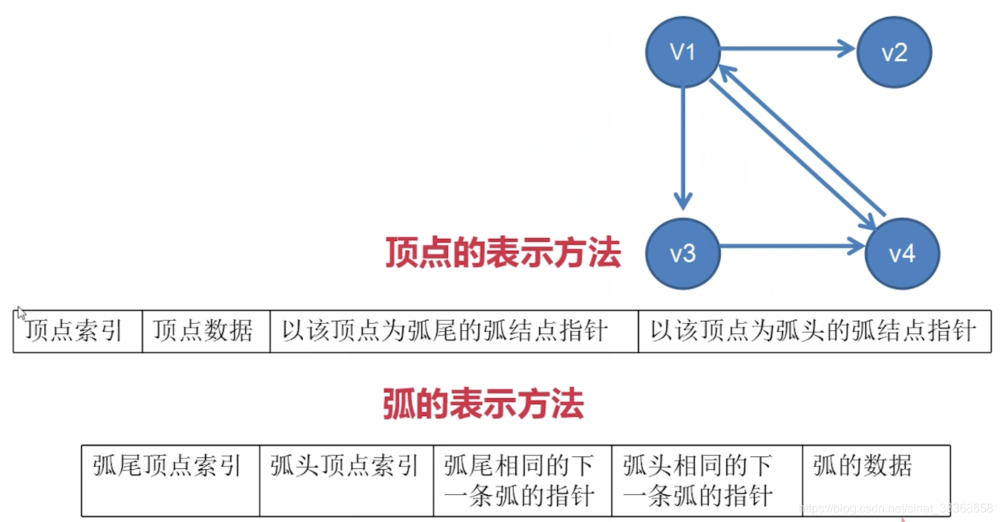
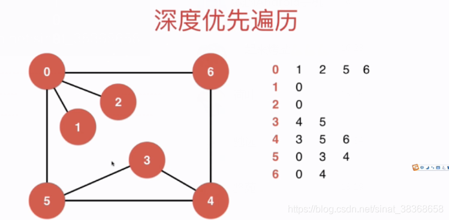
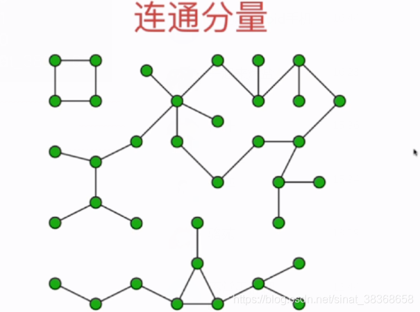

# 图

- 图的表示法
- 图的遍历
- 最小生成树（非常有价值）
- 图的应用：路程规划，工程规划，战略规划，社交网络、互联网、程序状态执行、交通运输


对于有向图：一条弧，有弧度，弧尾，权值

## 1. 图的存储结构

**图的存储结构：**

* 邻接矩阵
* 邻接表
* 十字链表
* 邻接多重表

### 1.1 邻接矩阵-数组存储

* 邻接矩阵：适合表示稠密图（Dense Graph），例如完全图
* 顶点的表示方法：顶点索引+顶点数据
* 弧的表示方法：邻接矩阵 `matrix[4][4]`


```typescript
/**
 * 稠密图 - 使用邻接矩阵的简易版实现
 */
class DenseGraph {
    private n: number;          // 顶点数
    private m: number;          // 边数
    private directed: boolean;  // 是否为有向图
    private g: boolean[][];     // 邻接矩阵

    constructor(n: number, directed: boolean) {
        this.n = n;
        this.m = 0;
        this.directed = directed;
        // 初始化 n x n 的邻接矩阵，全部为 false
        this.g = Array.from({ length: n }, () => Array(n).fill(false));
    }

    V(): number {
        return this.n;
    }

    E(): number {
        return this.m;
    }

    /**添加一条边 v-w*/
    addEdge(v: number, w: number): void {
        if (this.hasEdge(v, w)) {
            return; // 避免重复添加
        }

        this.g[v][w] = true;
        if (!this.directed) {
            this.g[w][v] = true;
        }

        this.m++;
    }

    /**判断 v 和 w 之间是否有边*/
    hasEdge(v: number, w: number): boolean {
        return this.g[v][w];
    }
}

export default DenseGraph;
```

```typescript
// 邻接表的简易版实现
export class SparseGraph {
  private n: number;          // 顶点数
  private m: number;          // 边数
  private directed: boolean;   // 是否有向
  private g: number[][];      // 邻接表：g[v] 存储 v 的所有邻接点

  constructor(n: number, directed: boolean) {
    this.n = n;
    this.m = 0;
    this.directed = directed;
    this.g = Array.from({ length: n }, () => []); // 初始化邻接表
  }

  // 获取顶点数
  V(): number {
    return this.n;
  }

  // 获取边数
  E(): number {
    return this.m;
  }

  // 添加边 v-w
  addEdge(v: number, w: number): void {
    if (this.hasEdge(v, w)) {
      return; // 避免重复边
    }

    this.g[v].push(w);
    // 如果是无向图且不是自环，添加反向边
    if (v !== w && !this.directed) {
      this.g[w].push(v);
    }

    this.m++;
  }

  // 判断 v 和 w 是否有边
  hasEdge(v: number, w: number): boolean {
    // 在 g[v] 中查找 w
    return this.g[v].includes(w);
  }

  // 获取顶点 v 的所有邻接点（可选，用于遍历）
  adj(v: number): number[] {
    if (v < 0 || v >= this.n) {
      throw new Error(`Vertex index out of range [0, ${this.n - 1}]`);
    }
    return [...this.g[v]]; 
  }
}
```

【注】上述两种实现在`hasEdge` 等方法中需要加入边界检查，检查是否有超出图的顶点范围

【注】对于**无向图**的邻接矩阵是对称的，为了节省空间，可以只记录下三角或者上三角的部分


### 1.2 邻接表-链式存储

* 邻接表：适合表示稀疏图（Sparse Graph）
* 顶点的表示方法：顶点索引 + 出链表表头指针 + 顶点数据
* 弧的表示方法：弧头顶点索引 + 下一条弧指针 + 弧数据


### 1.3 十字链表-链式存储




### 1.4 邻接多重表-链式存储（无向图）


## 2. 图的遍历

- 深度优先搜索（前序遍历）
- 广度优先搜索
- 最小生成树 prime算法 / kruskal算法

### 2.1 深度优先遍历与连通分量





```typescript
// Graph.ts
export interface IGraph {
  V(): number; // 顶点数
  adj(v: number): number[]; // 返回 v 的所有邻接点
}

export class Component {
  private G: IGraph;
  private visited: boolean[];
  private id: number[]; //id[v]表示v所属的联通分量编号
  private ccount: number; // 连通分量个数

  constructor(graph: IGraph) {
    this.G = graph;
    const n = this.G.V();
    this.visited = new Array(n).fill(false);
    this.id = new Array(n).fill(-1);
    this.ccount = 0;

    //对每个未访问的顶点执行一次DFS,得到一个联通分量
    for (let v = 0; v < n; v++) {
      if (!this.visited[v]) {
        this.dfs(v);
        this.ccount++;
      }
    }
  }

  // 深度优先遍历
  private dfs(v: number): void {
    this.visited[v] = true;
    this.id[v] = this.ccount;

    // 遍历v的所有邻接点
    const neighbors = this.G.adj(v);
    for (const w of neighbors) {
      if (!this.visited[w]) {
        this.dfs(w);
      }
    }
  }

  // 返回图的联通分量个数
  public count(): number {
    return this.ccount;
  }

  // 判断顶点 v 和 顶点 w 是否联通
  public isConnected(v: number, w: number): boolean {
    if (v < 0 || v >= this.G.V() || w < 0 || w >= this.G.V()) {
      throw new Error(`Vertex index out of range [0, ${this.G.V() - 1}]`);
    }
    return this.id[v] === this.id[w];
  }
}
```

图的深度优先遍历复杂度

* 稀疏图（邻接表）: O(V+E)
* 稠密图（邻接矩阵）：O(V^2)

### 2.2 寻路

```typescript
// 基于深度优先搜索（DFS）的单源路径查找器，用于在图中从起点 s 到任意顶点 w 找到一条路径。
export class Path {
  private G: IGraph;
  private s: number; // 起点
  private visited: boolean[];
  private from: number[]; // from[v] 表示在 DFS 树中，v 的前驱顶点（即从哪个顶点到达 v）
 
  // 构造函数：执行 DFS 预处理，构建从起点 s 出发的路径树
  constructor(graph: IGraph, s: number) { 
        if (s < 0 || s >= graph.V()) {
      throw new Error(`Start vertex ${s} out of range [0, ${graph.V() - 1}]`);
    }
    this.G = graph;
    this.s = s;
    const n = this.G.V();

    // 初始化 visited 和 from 数组
    this.visited = new Array(n).fill(false);  // 初始时所有顶点未被访问
    this.from = new Array(n).fill(-1);        // 初始时所有顶点的前驱顶点为 -1（表示无前驱）
    
    // 从起点 s 开始执行 DFS，构建路径树
    this.dfs(s);
  }


  // 深度优先搜索（DFS）算法，递归实现
  // 遍历从v出发能到达的所有顶点，并记录路径信息（通过from数组）
  private dfs(v: number): void {
    this.visited[v] = true; // 标记顶点 v 为已访问
    const neighbors = this.G.adj(v); // 获取顶点 v 的所有邻接点

    // 遍历每个邻接点 w
    for (const w of neighbors) {
      if (!this.visited[w]) { // 如果邻接点 w 未被访问
        this.from[w] = v;    // 记录 w 的前驱顶点为 v
        this.dfs(w);         // 递归访问邻接点 w
      }
    }
  }

  // 判断从起点 s 到顶点 w 是否存在路径
  // 如果存在路径返回 true，否则 false
  public hasPath(w: number): boolean {
    if (w < 0 || w >= this.G.V()) {
      throw new Error(`Vertex index out of range [0, ${this.G.V() - 1}]`);
    }
    return this.visited[w];
  }

  // 返回从起点 s 到顶点 w 的路径，路径以数组形式返回
  public path(w: number): number[] {
    const path: number[] = [];
    if (!this.hasPath(w)) {
      return path; // 如果没有路径，返回空数组
    }

    // 使用栈逆向重建路径（因为from是从w指向s的）
    const stack: number[] = [];
    let p = w;
    while (p !== -1) {
      stack.push(p);
      p = this.from[p]; // 回溯到前驱
    }

    // 将栈中元素弹出到结果数组（得到 s -> ... -> w 的顺序）
    const result: number[] = [];
    while (stack.length > 0) {
      result.push(stack.pop()!);
    }
    return result
  }

  // 打印从起点 s 到顶点 w 的路径 (格式：s => ... => w)
  public showPath(w: number): void {
    if(!this.hasPath(w)) {
      console.log(`No path from ${this.s} to ${w}`);
      return;
    }

    const path = this.path(w);
    console.log(path.join('=>'));
  }
}
```

测试函数

```typescript
// 创建无向图
const graph = new SparseGraph(7, false);
graph.addEdge(0, 1);
graph.addEdge(0, 2);
graph.addEdge(0, 5);
graph.addEdge(0, 6);
graph.addEdge(3, 4);
graph.addEdge(3, 5);
graph.addEdge(4, 6);

// 从顶点 0 开始找路径
const pathFinder = new Path(graph, 0);
pathFinder.showPath(6); 
console.log(pathFinder.hasPath(6)); // true
console.log(pathFinder.path(6));    // [0,5,3,4,6]
```

### 2.3广度优先遍历和最短路

广度优先遍历求出了无权图的最短路径

```typescript
// 基于广度优先搜索（BFS）的无权图单源最短路径查找器
export class ShortestPath {
  private G: IGraph; //图的引用
  private s: number; //起点
  private visited: boolean[]; //记录顶点是否被访问
  private from: number[]; //记录路径, from[i]表示查找路径时,i是从哪个顶点过来的
  private ord: number[]; // 记录路径中节点的次序。ord[i]表示i节点在路径中的次序。s 到 v 的最短距离（边数）

  // 构造函数, 寻找无权图graph从s点到其他点的最短路径
  constructor(graph: IGraph, s: number) {
    if (s < 0 || s >= graph.V()) {
      throw new Error(`Start vertex ${s} out of range [0, ${graph.V() - 1}]`);
    }

    this.G = graph;
    this.s = s;
    const n = this.G.V();

    // 初始化数组
    this.visited = new Array(n).fill(false);
    this.from = new Array(n).fill(-1); // 初始化为 -1，表示无前驱
    this.ord = new Array(n).fill(-1); // 初始化为 -1，表示不可达

    // 执行广度优先搜索（BFS）
    const queue: number[] = [];
    queue.push(s);
    this.visited[s] = true;
    this.ord[s] = 0; // 起点到起点的距离为0

    while (queue.length > 0) {
      const v = queue.shift()!; // 取出队首元素

      // 遍历 v 的所有邻接点
      const adjList = this.G.adj(v);
      for (const w of adjList) {
        if (!this.visited[w]) {
          queue.push(w);
          this.visited[w] = true;
          this.from[w] = v; // 记录前驱
          this.ord[w] = this.ord[v] + 1; // 距离 = 父节点距离 + 1
        }
      }
    }
  }

  // 判断从起点 s 到顶点 w 是否存在路径
  public hasPath(w: number): boolean {
    if (w < 0 || w >= this.G.V()) {
      throw new Error(`Vertex index out of range [0, ${this.G.V() - 1}]`);
    }
    return this.visited[w];
  }

  // 返回从起点 s 到顶点 w 的路径，路径以数组形式返回
  public path(w: number): number[] {
    if (!this.hasPath(w)) {
      return [];
    }

    // 通过from数组逆向查找到从s到w的路径, 存放到栈中
    const stack: number[] = [];
    let p = w;
    while (p !== -1) {
      stack.push(p);
      p = this.from[p];
    }

    // 从栈中依次取出元素, 获得顺序的从s到w的路径
    const result: number[] = [];
    while (stack.length > 0) {
      result.push(stack.pop()!);
    }
    return result;
  }

  // 打印从起点 s 到顶点 w 的路径 (格式：s => ... => w)
  public showPath(w: number): void {
    if (!this.hasPath(w)) {
      console.log(`No path from ${this.s} to ${w}`);
      return;
    }
    const path = this.path(w);
    console.log(path.join("=>"));
  }

  // 获取从起点 s 到顶点 w 的最短路径长度（边的数量）
  public length(w: number): number {
    if (w < 0 || w >= this.G.V()) {
      throw new Error(`Vertex index out of range [0, ${this.G.V() - 1}]`);
    }
    return this.ord[w];
  }
}
```

测试

```typescript
// 创建无向图
const graph = new SparseGraph(7, false);
graph.addEdge(0, 1);
graph.addEdge(0, 2);
graph.addEdge(0, 5);
graph.addEdge(0, 6);
graph.addEdge(3, 4);
graph.addEdge(3, 5);
graph.addEdge(4, 6);

// 从顶点 0 开始找最短路径
const shortestPathFinder = new ShortestPath(graph, 0);
shortestPathFinder.showPath(6);
console.log(shortestPathFinder.hasPath(6)); // true
console.log(shortestPathFinder.path(6)); // [0,6]
console.log(shortestPathFinder.length(6)); // 1

```


### 2.4 最小生成树

```
/*
    A
  / | \
B---F---E
 \ / \ /
  C---D

  A B C D E F
  0 1 2 3 4 5 

  A-B 6  A-E 5  A-F 1
  B-C 3  B-F 2
  C-F 8  C-D 7
  D-F 4  D-E 2
  E-F 9 
   
*/
```


