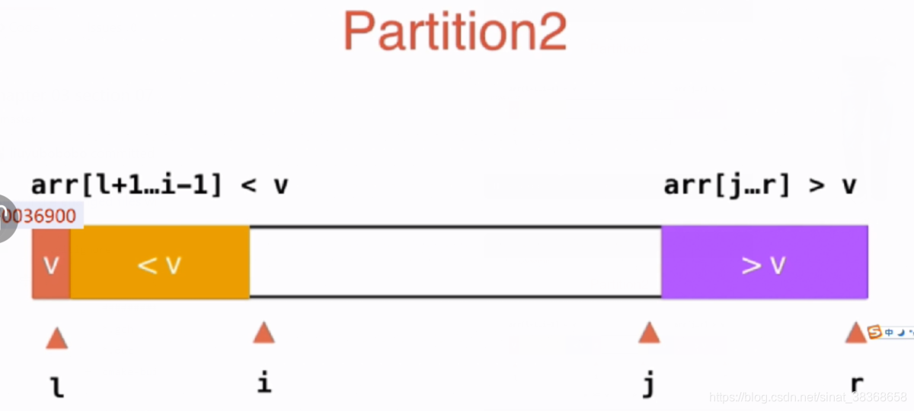
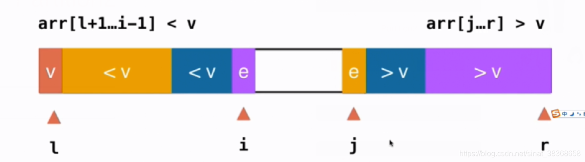
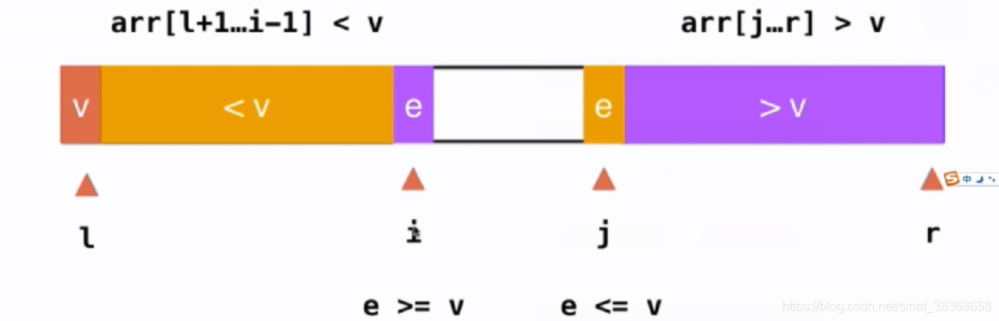
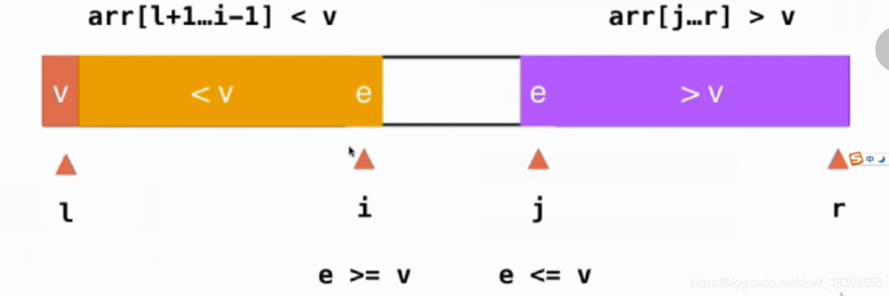
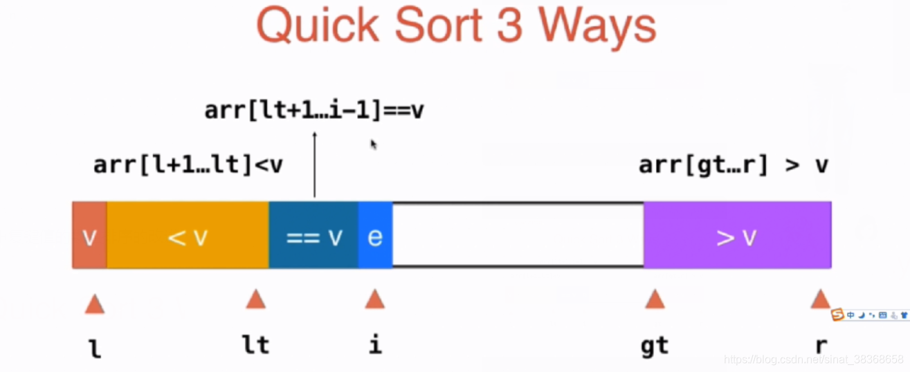
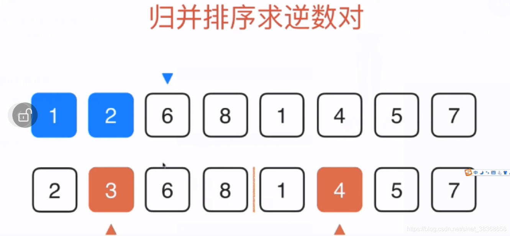
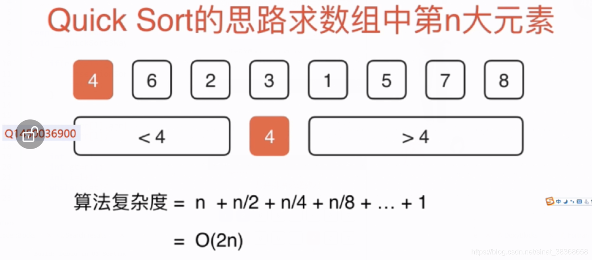

# 排序

## 1. 排序基础

### 1.1 选择排序

```typescript
function selectionSort<T>(arr: T[], compareFn?: (a: T, b: T) => boolean): void {
  // 默认比较函数：升序（a < b）
  const less = compareFn ?? ((a: T, b: T) => a < b);
  const n = arr.length;

  for (let i = 0; i < n; i++) {
    let minIndex = i;
    for (let j = i + 1; j < n; j++) {
      if (less(arr[j], arr[minIndex])) {
        minIndex = j;
      }
    }
    // 交换
    [arr[i], arr[minIndex]] = [arr[minIndex], arr[i]];
  }
}
```

**为什么要选择o（n2）的排序算法？**

基础；编码简单，易于实现，是一些简单情景的首选；
在一些特殊情况下，简单的排序算法更有效；
简单的排序算法思想衍生出复杂的排序算法；
作为子过程，改进更复杂的排序算法

**选择排序的优化**

```typescript
//在每一轮中, 可以同时找到当前未处理元素的最大值和最小值
function selectionSort<T extends number | string>(arr: T[]): void {
  let left = 0;
  let right = arr.length - 1;

  while (left < right) {
    let minIndex = left;
    let maxIndex = right;

     // 在每一轮查找时, 要保证arr[minIndex] <= arr[maxIndex]
    if (arr[minIndex] > arr[maxIndex]) {
      [arr[minIndex], arr[maxIndex]] = [arr[maxIndex], arr[minIndex]];
    }

    // 在 (left, right) 开区间内查找最小值和最大值
    for (let i = left + 1; i < right; i++) {
      if (arr[i] < arr[minIndex]) {
        minIndex = i;
      } else if (arr[i] > arr[maxIndex]) {
        maxIndex = i;
      }
    }

    // 将最小值放到左端
    [arr[left], arr[minIndex]] = [arr[minIndex], arr[left]];

    // 将最大值放到右端
    [arr[right], arr[maxIndex]] = [arr[maxIndex], arr[right]];

    left++;
    right--;
  }
}
```

### 1.2 插入排序

基础插入排序

```typescript
function insertionSort<T>(arr: T[]): void {
  const n = arr.length;
  for (let i = 1; i < n; i++) {
    for (let j = i; j > 0 && arr[j] < arr[j - 1]; j--) {
      // 交换相邻元素
      [arr[j], arr[j - 1]] = [arr[j - 1], arr[j]];
    }
  }
}
```

swap比较耗时，如何进行改进？让其只交换一次

```typescript
function insertionSort2<T extends number | string>(arr: T[]): void {
  const n = arr.length;
  for (let i = 1; i < n; i++) {
    const e = arr[i]; // 当前要插入的元素
    let j = i;
    // 向后移动所有大于 e 的元素（升序）
    while (j > 0 && arr[j - 1] > e) {
      arr[j] = arr[j - 1];
      j--;
    }
    arr[j] = e; // 插入到正确位置
  }
}
```

#### 衡量算法性能函数

编写测试用例

```typescript
/**
 * 生成一个包含 n 个元素的随机整数数组
 * 每个元素的取值范围为 [rangeL, rangeR]（闭区间）
 */
function generateRandomArray(n: number, rangeL: number, rangeR: number): number[] {
  // 断言：确保 rangeL <= rangeR
  if (rangeL > rangeR) {
    throw new Error(`Invalid range: rangeL (${rangeL}) must be <= rangeR (${rangeR})`);
  }

  const arr: number[] = [];
  for (let i = 0; i < n; i++) {
    // 生成 [rangeL, rangeR] 之间的随机整数
    const randomNum = Math.floor(Math.random() * (rangeR - rangeL + 1)) + rangeL;
    arr.push(randomNum);
  }
  return arr;
}
```

看算法在特定的数据集上的执行时间

```typescript
// 1. 判断数组是否已排序（升序）
function isSorted<T>(arr: T[], compareFn?: (a: T, b: T) => boolean): boolean {
  const less = compareFn ?? ((a: T, b: T) => a < b);
  const n = arr.length;
  for (let i = 0; i < n - 1; i++) {
    // 如果 arr[i] > arr[i+1]，即 !(arr[i] <= arr[i+1])，等价于 less(arr[i+1], arr[i])
    if (less(arr[i + 1], arr[i])) {
      return false;
    }
  }
  return true;
}

// 2. 测试排序函数的正确性和性能
function testSort<T>(
  sortName: string,
  sortFn: (arr: T[], compareFn?: (a: T, b: T) => boolean) => void,
  arr: T[],
  compareFn?: (a: T, b: T) => boolean
): void {
  // 深拷贝数组（避免原数组被修改）
  const arrCopy = [...arr];

  const startTime = performance.now();
  sortFn(arrCopy, compareFn);
  const endTime = performance.now();

  // 断言：检查是否排序成功
  if (!isSorted(arrCopy, compareFn)) {
    throw new Error(`${sortName} failed: array is not sorted!`);
  }

  const duration = (endTime - startTime) / 1000; // 转为秒
  console.log(`${sortName}: ${duration.toFixed(4)} s`);
}

// 示例：选择排序（带泛型和比较函数）
function selectionSort<T>(
  arr: T[],
  compareFn: (a: T, b: T) => boolean = (a, b) => a < b
): void {
   // ....
}

const arr = generateRandomArray(10000, 0, 10000);
testSort("Selection Sort", selectionSort, arr);
```

#### 比较选择排序和插入排序

```typescript
const testArray = generateRandomArray(10000,0,10000);
testSort('selectionSort',selectionSort,testArray); // 0.0713s
testSort('insertionSort',insertionSort,testArray); // 0.0515s
```

插入排序时间少，插入排序可以**提前中止内层循环**（若数组已基本有序，提前中止内存循环会使效率非常高）

上文的数据集为10000个（0，10000）范围内的数组
若将数据集改为10000个（0,3）范围内的数组，随机数范围为0到3之前，对于10000个数，会存在大量的重复的数，由于有这些重复的数，整个数组的有序性要比之前的数据集强很多
再次运行

```typescript
const almostSortedTestArray = generateRandomArray(10000,0,3);
testSort('selectionSort',selectionSort,almostSortedTestArray); // 0.074s
testSort('insertionSort',insertionSort,almostSortedTestArray); // 0.038s
```

可见插入排序的效率提升的更高

为了更好地测试效率，我们创建一个新的生成**近似有序的随机数组**的方法
方法：先生成一个完全有序的随机数组，然后再随机挑选几对元素进行交换，这样得到的数组近乎有序

```typescript
/**
 * 生成一个近乎有序的整数数组（初始为 [0, 1, ..., n-1]），然后随机交换 swapTimes 次
 * @param n 数组长度
 * @param swapTimes 随机交换次数
 * @returns 生成的近乎有序数组
 */
function generateNearlyOrderedArray(n: number, swapTimes: number): number[] {
  // 边界处理
  if (n <= 0) return [];
  if (swapTimes < 0) swapTimes = 0;

  // 1. 初始化有序数组 [0, 1, 2, ..., n-1]
  const arr: number[] = Array.from({ length: n }, (_, i) => i);

  // 2. 执行 swapTimes 次随机交换
  for (let i = 0; i < swapTimes; i++) {
    const posx = Math.floor(Math.random() * n);
    const posy = Math.floor(Math.random() * n);
    
    // 交换 arr[posx] 和 arr[posy]
    [arr[posx], arr[posy]] = [arr[posy], arr[posx]];
  }

  return arr;
}
```

```typescript
const nearlySortedArray = generateNearlyOrderedArray(10000, 10);
testSort('selectionSort', selectionSort, nearlySortedArray); // 0.0691s
testSort('insertionSort', insertionSort, nearlySortedArray); // 0.00001s
```

可见插入排序虽然是o（n2）的算法，但在有些情况下却非常有效。

### 1.3 冒泡排序

```typescript
// 基础冒泡排序
function bubbleSort<T extends number | string>(arr: T[]): void {
  let n = arr.length;
  let swapped: boolean;

  do {
    swapped = false;
    for (let i = 1; i < n; i++) {
      if (arr[i - 1] > arr[i]) {
        [arr[i - 1], arr[i]] = [arr[i], arr[i - 1]]; // 交换
        swapped = true;
      }
    }
    n--; // 最大值已冒泡到末尾，下次不比较
  } while (swapped);
}

// 优化冒泡排序（记录最后交换位置）
function bubbleSort2<T extends number | string>(arr: T[]): void {
  let n = arr.length;
  let newn: number;

  do {
    newn = 0; // 记录最后一次发生交换的位置
    for (let i = 1; i < n; i++) {
      if (arr[i - 1] > arr[i]) {
        [arr[i - 1], arr[i]] = [arr[i], arr[i - 1]];
        newn = i; // 更新最后交换位置
      }
    }
    n = newn; // 下一轮只需扫描到 newn（newn 之后已有序）
  } while (newn > 0);
}
```

其他：希尔排序

```typescript
function shellSort(arr: number[]): void;
function shellSort(arr: string[]): void;
function shellSort<T extends number | string>(arr: T[]): void {
  const n = arr.length;
  if (n <= 1) return;

  // 1. 计算 Knuth 增量序列：1, 4, 13, 40, 121, ...
  let h = 1;
  while (h < Math.floor(n / 3)) {
    h = 3 * h + 1;
  }

  // 2. 按 h 递减进行 h-sort
  while (h >= 1) {
    // 对 arr[i], arr[i-h], arr[i-2*h], arr[i-3*h]... 使用插入排序
    for (let i = h; i < n; i++) {
      const e = arr[i]; // 当前待插入元素
      let j = i;

      // 在子序列中向前比较：arr[j - h], arr[j - 2h], ...
      while (j >= h && e < arr[j - h]) {
        arr[j] = arr[j - h]; // 后移
        j -= h;
      }
      arr[j] = e; // 插入
    }

    h = Math.floor(h / 3); // 下一个增量（整数除法）
  }
}
```

## 2. 高级排序

### 2.1 归并排序

```typescript
function mergeSort<T extends number | string>(arr: T[]): void {
  if (arr.length <= 1) return;
  __mergeSort(arr, 0, arr.length - 1);
}

//递归使用归并排序，对arr[l....r]的范围进行排序
function __mergeSort<T extends number | string>(arr: T[], l: number, r: number): void {
  if (l >= r) return;

  const mid = Math.floor((l + r) / 2);
  __mergeSort(arr, l, mid);
  __mergeSort(arr, mid + 1, r);
  __merge(arr, l, mid, r);
}

//将arr[l...mid]和arr[mid+1...r]两部分进行归并
function __merge<T extends number | string>(arr: T[], l: number, mid: number, r: number): void {
  // 1. 复制到辅助数组 aux（长度 = r - l + 1）
  const aux: T[] = new Array(r - l + 1);
  for (let i = l; i <= r; i++) {
    aux[i - l] = arr[i];
  }

  // 2. 双指针合并回原数组
  let i = l;      // 左半部分指针 [l, mid]
  let j = mid + 1; // 右半部分指针 [mid+1, r]

  for (let k = l; k <= r; k++) {
    if (i > mid) {
      // 左半部分耗尽，取右半部分
      arr[k] = aux[j - l];
      j++;
    } else if (j > r) {
      // 右半部分耗尽，取左半部分
      arr[k] = aux[i - l];
      i++;
    } else if (aux[i - l] < aux[j - l]) {
      // 左 < 右，取左
      arr[k] = aux[i - l];
      i++;
    } else {
      // 左 >= 右，取右（保证稳定性：相等时右后放）
      arr[k] = aux[j - l];
      j++;
    }
  }
}
```

#### 优化思路

测试比较插入排序和归并排序

```typescript
console.log("----Test for Random Array-----")
const radomArray = generateRandomArray(10000,0,10000);
testSort("mergeSort", mergeSort, radomArray);
testSort("insertSort",insertionSort,radomArray);

console.log("----Test for Random Nearly Ordered Array-----")

const nearlyOrderedArray = generateNearlyOrderedArray(10000,10);
testSort("mergeSort", mergeSort, nearlyOrderedArray);
testSort("insertSort",insertionSort,nearlyOrderedArray);

//----Test for Random Array-----
//mergeSort: 0.0051 s   
//insertSort: 0.0254 s  
//----Test for Random Nearly Ordered Array-----
//mergeSort: 0.0009 s   
//insertSort: 0.0001 s 
```

**在接近有序的数组时，插入排序更有效。原因：插入排序对于有序的数组会降到O（n）的复杂度**
那对于归并排序，如何优化归并排序？

1. 对于**稍微有序的数组，如果有序，可以减少merge操作**

   ```typescript
    __mergeSort(arr,l,mid);
    __mergeSort(arr,mid+1,r);
    __merge(arr,l,mid,r);
   ```

   如果此时arr[mid ]<arr[mid+1]相当于整个数组有序
   改进：

   ```typescript
       __mergeSort(arr,l,mid);
       __mergeSort(arr,mid+1,r);
       if(arr[mid]>arr[mid+1]) return ;//如果此时arr[mid ]<arr[mid+1]相当于整个数组有序,面对有可能有序的数组可以这样做
       __merge(arr,l,mid,r);
   
   ```

2. 对于所有排序都有的：**递归到底**的情况

   上文的归并排序是递归到只有一个元素的时候返回，事实上，**当递归到元素数组非常小的时候，我们可以转而使用插入排序来提高性能**

   这里有两个原因：

   1. 元素数据少的时候，整个数组近乎有序的概率就会比较大，此时插入排序有优势
   2. 插入排序最差的时间复杂度是n方级别，而归并是nlogn级别，对于n方还是nlogn，前面都有一个常数的系数c，插入排序的这个系数小，换句话说，当n小到一定程度的时候，插入排序会比归并排序快一些。

   ```typescript
   if(l>=r)  return ;
   ```

   修改为

   ```typescript
   if(r-l<=15){
      insertionSort(arr,l,r);
      return;
   }
   ```

   以上为自顶向下的归并，下面看看：

   **自底向上的归并排序**

   ```typescript
   // 自底向上的归并排序（非递归）
   function mergeSortBU(arr: number[]): void {
     const n = arr.length;
     if (n <= 1) return;
   
     // sz: 当前子数组的大小（1, 2, 4, 8, ...）
     for (let sz = 1; sz < n; sz *= 2) {
       // i: 每次处理两个相邻的 sz 长度的子数组
       for (let i = 0; i + sz < n; i += sz * 2) {
         const left = i;
         const mid = i + sz - 1;
         const right = Math.min(i + sz * 2 - 1, n - 1);
   
         __merge(arr, left, mid, right);
       }
     }
   }
   ```

### 2.2 快速排序

```typescript
// 对arr[l....r]部分进行partition操作
// 返回p，使得 arr[l...p-1] < arr[p] < arr[p+1...r]
function __partition(arr: number[], l: number, r: number): number {
  const pivot = arr[l];

  let j = l;

  for (let i = l + 1; i <= r; i++) {
    if (arr[i] < pivot) {
      j++;
      [arr[j], arr[i]] = [arr[i], arr[j]]; 
    }
  }

  [arr[l], arr[j]] = [arr[j], arr[l]];
  return j;
}

// 递归快排：对 arr[l...r] 排序
function __quickSort(arr: number[], l: number, r: number): void {
  if (l >= r) return; //递归到底的情况

  const p = __partition(arr, l, r); // 分区，返回 pivot 最终位置
  __quickSort(arr, l, p - 1);       // 递归排序左半部分
  __quickSort(arr, p + 1, r);       // 递归排序右半部分
}

function quickSort(arr: number[]): void {
  if (arr.length <= 1) return;
  __quickSort(arr, 0, arr.length - 1);
}

```

快速排序最差情况，退化为O（n2）即当数组有序的时候
并且，在现在我们选定的是左侧的第一个元素作为标定的元素，然而我们希望的是，尽可能选择数组中间的那个元素作为标定的元素。
如何定位这个元素？我们**随机选择**一个元素，快速排序的时间复杂度的期望值是o（nlogn）

#### 优化思路

```typescript
// 分区函数：随机选择 pivot，避免最坏情况
function __partition(arr: number[], l: number, r: number): number {
  // 生成 [l, r] 范围内的随机整数, 将随机选中的元素与 arr[l] 交换
  const randomIndex = Math.floor(Math.random() * (r - l + 1)) + l;
  [arr[l], arr[randomIndex]] = [arr[randomIndex], arr[l]];

  const pivot = arr[l];
  let j = l; 
  for (let i = l + 1; i <= r; i++) {
    if (arr[i] < pivot) {
      j++;
      [arr[j], arr[i]] = [arr[i], arr[j]];
    }
  }
  [arr[l], arr[j]] = [arr[j], arr[l]];
  return j;
}
```

在这里我们相当于编写了一个**随机算法**，就是我不能保证我的算法一定非常快或者一定是正确的，但是我可以保证我的算法在99.9%的情况下（也就是一个非常高的概率的情况下）都能比较快的得到正确结果。
此时，快排最坏的随机复杂度依然是o（n2),但是退化到o（n2）级别的概率是极其极其低的）

#### 双路快速排序法(改进Partition部分)

对于快排中的 **重复**元素，根据上述Partition我们把数组分为了两个部分，前面的部分小于标号，后面的部分大于等于标号


所以对于当数组中有很多相等的元素时，算法效率降低退化至O（n2）级别
因为数组的两部分极其不平衡，对于每个重复多次的键值，均需要交换多次。

**如何改进Partition部分？**: 从数组前后开始往中间扫描









双路快速排序法:

```typescript
function __quickSort2(arr: number[], l: number, r: number): void {
  if (r - l <= 15) {
    insertionSortInRange(arr, l, r);
    return;
  }

  const p = __partition2(arr, l, r);
  __quickSort2(arr, l, p - 1);
  __quickSort2(arr, p + 1, r);
}

// 双指针分区
function __partition2(arr: number[], l: number, r: number): number {
  const randomIndex = Math.floor(Math.random() * (r - l + 1)) + l;
  [arr[l], arr[randomIndex]] = [arr[randomIndex], arr[l]];

  // ✅ 优化部分：arr[l+1....i)<=v;arr[j....r]>=v
  const pivot = arr[l];
  let i = l + 1; // 左指针：寻找 >= pivot 的元素
  let j = r;     // 右指针：寻找 <= pivot 的元素

  while (true) {
    // 向右找到第一个 >= pivot 的元素
    while (i <= r && arr[i] < pivot) i++;
    // 向左找到第一个 <= pivot 的元素
    while (j >= l + 1 && arr[j] > pivot) j--;

    if (i > j) break;

    // 交换逆序对
    [arr[i], arr[j]] = [arr[j], arr[i]];
    i++;
    j--;
  }

  // 将 pivot 放到正确位置
  [arr[l], arr[j]] = [arr[j], arr[l]];
  return j;
}
```

#### 三路快速排序

使用快排的思想给带有大量**重复键值**的数组排序的改进：
三路快速排序：



当i指向的当前元素为arr[i]=e，考察e：

- e<v,swap(arr[i],arr[lt+1]),lt++,i++
- e=v,i++
- e>v,swap(arr[i],arr[gt-1],gt–;

```typescript
// 三路快排核心：对 arr[l...r] 排序
// 将arr[l...r]分为<v;==v;>v三部分,之后递归对<v;>v两部分继续进行三路快速排序
function __quickSort3Ways(arr: number[], l: number, r: number): void {
  if (r - l <= 15) {
    insertionSortInRange(arr, l, r);
    return;
  }

  const randomIndex = Math.floor(Math.random() * (r - l + 1)) + l;
  [arr[l], arr[randomIndex]] = [arr[randomIndex], arr[l]];
  const pivot = arr[l];

  // 三路划分指针
  let lt = l;      // arr[l+1 ... lt] < pivot
  let gt = r + 1;  // arr[gt ... r] > pivot
  let i = l + 1;   //arr[lt+1....i)==v i是下个循环正在考察的元素

  // 划分过程：[l+1, i) 是 == pivot 的区域
  while (i < gt) {
    if (arr[i] < pivot) {
      // 放入 < 区：与 lt+1 交换
      [arr[i], arr[lt + 1]] = [arr[lt + 1], arr[i]];
      lt++;
      i++;
    } else if (arr[i] > pivot) {
      // 放入 > 区：与 gt-1 交换（注意：i 不自增，因为新换来的元素未检查）
      [arr[i], arr[gt - 1]] = [arr[gt - 1], arr[i]];
      gt--;
    } else {
      // == pivot，直接扩展中间区
      i++;
    }
  }

  // 将 pivot (arr[l]) 与 lt 位置交换，使 arr[lt] == pivot
  [arr[l], arr[lt]] = [arr[lt], arr[l]];
  
  __quickSort3Ways(arr, l, lt - 1);   // < pivot
  __quickSort3Ways(arr, gt, r);       // > pivot
}
```

### 2.3 衍生问题

归并和快排都使用了**分治**的思想

##### 问题一：求逆序对个数

即排在前面的数字小，一个数组中逆序对的数量可以用来衡量数组的有序程度。

- 暴力解法：考察每一个数对，复杂度O(n2)
- mergeSort的思路求逆数对



##### 问题二：取数组中第n大的元素

对于求数组中的最大值，最小值，遍历即可，复杂度o(n)
对于求第n大的元素：

- 排序，o（nlogn）
- quickSort的思路求数组中第n大元素 o（n）


